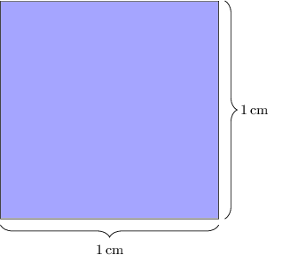
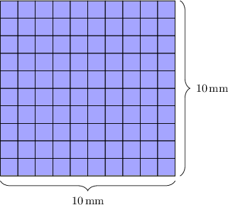

# Converting Units of Area to Smaller Units

Source: https://www.mathacademy.com/topics/2229?courseId=120
Topic ID: 2229

## Prerequisites

- [The Quotient Rule for Exponents](../../../middle-school/lessons/grade-8/1223-the-quotient-rule-for-exponents.md)
- [The Power of Product Rule for Exponents](../../../middle-school/lessons/grade-8/2012-the-power-of-product-rule-for-exponents.md)
- [Unit Conversions Using Base Units of Length](../../../high-school/traditional/lessons/algebra-i/3869-unit-conversions-using-base-units-of-length.md)
- [Units of Area and Volume](../../../elementary-school/lessons/grade-5/3872-units-of-area-and-volume.md)

## Lesson

### Introduction

We need to be extra careful when converting from one unit of area to another.

To demonstrate, suppose that a square has an area of $2\,\text{cm}^2.$ Let's use unit arguments to express this area in square millimeters.

We start by recalling the conversion table for units of length.

Since we're converting from $\text{cm}^2$ to $\text{mm}^2$, we start with the conversion between $\text{cm}$ and $\text{mm}$. According to our table, there are $10\,\text{mm}$ per $\text{cm}.$ We can write this ratio as a fraction, as follows:

$$

\dfrac{10\,\text{mm}}{\text{cm}}

$$

**Watch Out!** This is *not* the conversion factor we need. If we multiply $2\,\text{cm}^2$ by this conversion factor, we will *not* get an equivalent area!

The problem with using this conversion factor is that it does not contain area units. However, we can convert this into area units by squaring it and applying the rules of exponents as follows:

$$

\begin{aligned}(\frac{10\,mm}{cm})^{2} & =\frac{10^{2}\,mm^{2}}{cm^{2}} \\ & =\frac{100\,mm^{2}}{cm^{2}}\end{aligned}

$$

This is now the correct conversion factor. It tells us that there are $100$ square millimeters per square centimeter.

Now, multiplying $2\,\text{cm}^2$ by our conversion factor, we get

$$

\begin{aligned}2\,cm^{2} & =2\,cm^{2}⋅\frac{100\,mm^{2}}{cm^{2}} \\ & =2\,cm^{2}⋅\frac{100\,mm^{2}}{cm^{2}} \\ & =2⋅100\,mm^{2} \\ & =200\,mm^{2}.\end{aligned}

$$

Therefore, we conclude that $2\,\text{cm}^2$ is equivalent to $200\,\text{mm}^2.$

### Intuition Behind Area Scale Factors

Earlier, we calculated that $1\,\text{cm}^2$ is equivalent to $100\,\text{mm}^2.$ Let's try to understand this computation intuitively.

Consider the $1\,\text{cm}\times 1\,\text{cm}$ square shown below (magnified for purposes of illustration).

When we convert the units of length from $\text{cm}$ to $\text{mm},$ we essentially partition the length and width of this square into $10$ equal parts. Doing this, we partition the square into $10^2 = 100$ equally-sized smaller squares.

From the diagram, we see that $1\,\text{cm}^2$ is equivalent to $100\,\text{mm}^2.$

### Example: Converting Square Centimeters to Square Millimeters

#### Question

What is $3.4 \,\text{cm}^2$ measured in $\text{mm}^2?$

#### Explanation

There are $10\,\text{mm}$ per $\text{cm},$ which we can write as follows:

$$

\dfrac{10\,\text{mm}}{\text{cm}}

$$

We need to convert this into area units. So, by squaring this quantity and applying the rules of exponents, we get

$$

\begin{aligned}(\frac{10\,mm}{cm})^{2} & =\frac{10^{2}\,mm^{2}}{cm^{2}} \\ & =\frac{100\,mm^{2}}{cm^{2}}.\end{aligned}

$$

This is our conversion factor.

Now, multiplying $3.4 \, \text{cm}^2$ by our conversion factor, we get

$$

\begin{aligned}3.4\,cm^{2} & =3.4\,cm^{2}⋅\frac{100\,mm^{2}}{cm^{2}} \\ & =3.4\,cm^{2}⋅\frac{100\,mm^{2}}{cm^{2}} \\ & =3.4⋅100\,mm^{2} \\ & =340\,mm^{2}.\end{aligned}

$$

Therefore, $3.4\,\text{cm}^2$ is equivalent to $340\,\text{mm}^2.$

### Example: Converting Square Meters to Square Centimeters

#### Question

What is $0.29\,\text{m}^2$ measured in $\text{cm}^2?$

#### Explanation

There are $100\,\text{cm}$ per $\text{m},$ which we can write as follows:

$$

\dfrac{100\,\text{cm}}{\text{m}}

$$

We need to convert this into area units. So, by squaring this quantity and applying the rules of exponents, we get

$$

\begin{aligned}(\frac{100\,cm}{m})^{2} & =\frac{100^{2}\,cm^{2}}{m^{2}} \\ & =\frac{10\,000\,cm^{2}}{m^{2}}.\end{aligned}

$$

This is our conversion factor.

Now, multiplying $0.29\,\text{m}^2$ by our conversion factor, we get

$$

\begin{aligned}0.29\,m^{2} & =0.29\,m^{2}⋅\frac{10\,000\,cm^{2}}{m^{2}} \\ & =0.29\,m^{2}⋅\frac{10\,000\,cm^{2}}{m^{2}} \\ & =0.29⋅10\,000\,cm^{2} \\ & =2\,900\,cm^{2}.\end{aligned}

$$

### Example: Converting Square Kilometers to Square Meters

#### Question

What is $0.053\,\text{km}^2$ measured in $\text{m}^2?$

#### Explanation

There are $1\,000\,\text{m}$ per $\text{km},$ which we can write as follows:

$$

\dfrac{1\,000\,\textrm m}{\text{km}}

$$

We need to convert this into area units. So, by squaring this quantity and applying the rules of exponents, we get

$$

\begin{aligned}(\frac{1\,000\,m}{km})^{2} & =\frac{1\,000^{2}\,m^{2}}{km^{2}} \\ & =\frac{1\,000\,000\,m^{2}}{km^{2}}.\end{aligned}

$$

This is our conversion factor.

Now, multiplying $0.053\,\text{km}^2$ by our conversion factor, we get

$$

\begin{aligned}0.053\,km^{2} & =0.053\,km^{2}⋅\frac{1\,000\,000\,m^{2}}{km^{2}} \\ & =0.053\,km^{2}⋅\frac{1\,000\,000\,m^{2}}{km^{2}} \\ & =0.053⋅1\,000\,000\,m^{2} \\ & =53\,000\,m^{2}.\end{aligned}

$$

Therefore, $0.053\,\text{km}^2$ is equivalent to $53\,000 \,\text{m}^2.$
