# Intersections of Intervals

Source: https://www.mathacademy.com/topics/347?courseId=120
Topic ID: 347

## Prerequisites

- [Unbounded Intervals](../../../high-school/traditional/lessons/algebra-i/4028-unbounded-intervals.md)

## Lesson

### Introduction

The **intersection** of two intervals is their set of common values, and is denoted by the intersection symbol $\cap.$

For example, the intersection of the two intervals $(-\infty, 2]$ and $[-1,\infty)$ is denoted

$$

(-\infty, 2] \cap [-1,\infty)

$$

and corresponds to the set of values that are in both intervals $(-\infty, 2]$ and $[-1,\infty).$

To represent the intersection on a number line, we can start by sketching the two intervals separately:

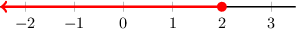

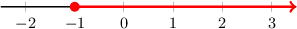

The intersection $(-\infty, 2] \cap [-1,\infty)$ represents the values that are in both intervals. So, it can be graphed by finding where the two intervals overlap:

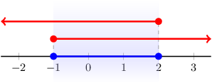

Therefore, the intersection of the intervals is ${\color{blue}[-1,2]}.$ Symbolically, we write

$$

{\color{red}(-\infty,2]} \cap {\color{red}[-1,\infty)} = {\color{blue}[-1,2]}.

$$

### Example: Finding the Intersection of Two Intervals Given Graphically

#### Question

What is the intersection of the intervals shown below, expressed as a number line?

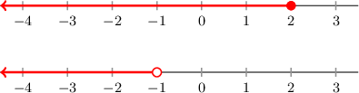

#### Explanation

The intersection of two intervals consists of the values that are in both intervals. So, it can be graphed by finding where the two intervals overlap:

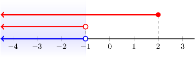

Therefore, the number line that shows the common set of values is:

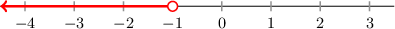

**** The point $-1$ is not included in the intersection since it does not lie in the second interval.

### Example: Finding the Intersection of Two Intervals

#### Question

Find the intersection of intervals $(-\infty, 3] \cap (0, \infty).$ Express the result as an inequality.

#### Explanation

We can start by sketching the two intervals $(-\infty, 3]$ and $(0, \infty)$ separately:

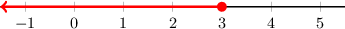

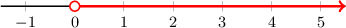

The intersection $(-\infty, 3] \cap (0, \infty)$ represents the values that are in both intervals. So, it can be graphed by finding where the two intervals overlap:

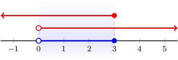

Thus, $(-\infty, 3]\cap(0, \infty)={\color{blue}(0,3]}.$ This corresponds to the inequality

$$

0 < x \leq 3.

$$

**** The point $0$ is not included in the intersection since it does not lie in the second interval. On the other hand, the point $3$ is included in the intersection because it lies in both intervals.

### Example: Finding the Intersection of Two Intervals Given as Inequalities

#### Question

Given the inequalities $x < 3$ and $x \leq -1$, express their common set of solutions as an interval.

#### Explanation

We start by sketching the solutions to the two inequalities separately:

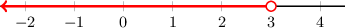

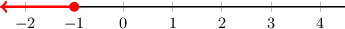

The common set of values consists of the values that are in both intervals. So, it can be graphed by finding where the two intervals overlap:

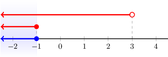

Therefore, the common set of values is ${\color{blue}(-\infty, -1]}.$

### Example: Finding the Intersection of Three Intervals

#### Question

Given the inequalities $x < 1,$ $x \geq 0,$ and $-2 < x < 4,$ express their common set of solutions as an interval.

#### Explanation

To find the common set of values, we graph the inequalities on a number line and find where they overlap:

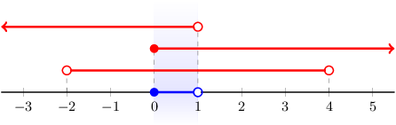

Therefore, the common set of values is ${\color{blue}\left[0, 1\right)}.$

**** The point $0$ is included in the intersection since it lies in all three intervals. On the other hand, the point $1$ is not included in the intersection because it does not lie in the first interval.
