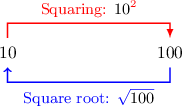

# Squaring a Square Root

Source: https://www.mathacademy.com/topics/3552?courseId=120
Topic ID: 3552

## Prerequisites

- [The Square Root of a Perfect Square](../../../middle-school/lessons/grade-8/1822-the-square-root-of-a-perfect-square.md)

## Lesson

### Introduction

Let's calculate $(\sqrt{100})^2$ by performing each operation one step at a time:

$$

(\sqrt{\color{blue}100})^2 = \left(\sqrt{{\color{red}10}^2}\right)^2 = ({\color{red}10})^2 = {\color{blue}100}

$$

Notice that the squaring the square root gives the number under the square root:

$$

\left( \sqrt{100} \right)^2 = 100

$$

This result holds in general for any non-negative number. If $\color{blue}\square$ is any positive number or zero, then

$$

(\sqrt{\color{blue}\square})^2 = {\color{blue}\square}\,.

$$

The square and the square root cancel each other out, and we're left with the number that we started with.

### Example: Finding the Square of a Square Root

#### Question

Find the value of $(\sqrt{9})^2.$

#### Explanation

The number in the square root is non-negative, so the square and the square root cancel each other out.

Therefore, we have

$$

(\sqrt{9})^2 = 9.

$$

### The Square Root of a Negative Number Squared

We must be careful when taking the square root of a negative number that's been squared.

For example, $\sqrt{(-9)^2}$ is *not* equal to $-9!$ We can write this using a **not equal to** symbol $\neq$ as

$$

\sqrt{(-9)^2} \neq -9.

$$

This is because the square root of a number can *only* be positive or zero, never negative. Let's work it out the long way:

$$

\begin{aligned}\sqrt{(−9)^{2}} & = \\ \sqrt{(−9)⋅(−9)} & = \\ \sqrt{81} & = \\ \sqrt{9^{2}} & = \\ 9 & \end{aligned}

$$

So, we conclude that

$$

\sqrt{(-9)^2}=\sqrt{9^2} = 9.

$$

For any positive perfect square, we always have exactly two numbers whose squares equal that number. Here, we have

$$

9^2=81\quad \text{and} \quad (-9)^2=81.

$$

But *by definition* the square root is always *positive* (or zero) and *cannot* be negative. So here, $\sqrt{81}=+9,$ and for any non-negative $\color{blue}\square$ we get

$$

\sqrt{\color{blue}\square} \geq 0.

$$

### Example: Finding the Square Root of a Negative Number Squared

#### Question

Calculate the value of $\sqrt{(-16)^2}.$

#### Explanation

Remember that by definition, the square root is always zero or positive, never negative.

So, the square root comes out to

$$

\sqrt{(-16)^2} = \sqrt{16^2} = 16.

$$
