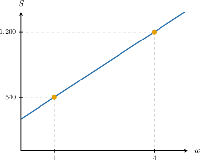
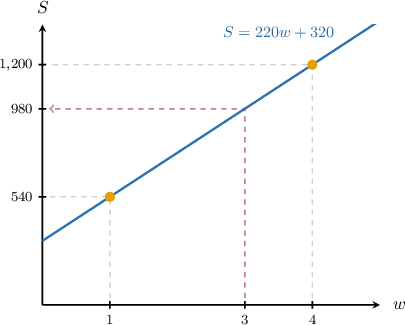

# Further Modeling With Linear Equations in Two Variables

Source: https://www.mathacademy.com/topics/3765?courseId=120
Topic ID: 3765

## Prerequisites

- [Properties of Lines Given in Slope-Intercept Form](../../../high-school/traditional/lessons/algebra-i/398-properties-of-lines-given-in-slope-intercept-form.md)
- [Analyzing and Interpreting Graphs of Linear Equations](../../../high-school/traditional/lessons/algebra-i/1588-analyzing-and-interpreting-graphs-of-linear-equations.md)

## Lesson

### Introduction

Sometimes, we can create a linear model from information in the form of a table.

The following table describes the distance $D,$ in miles, that Noah is from his house as he drives home, $n$ hours from the start of the journey.

.equal-width td {width: 10px; text-align: center;}

Notice that each hour, the distance from Noah's house decreases by $70$ miles. So, if Noah was $A$ miles away from his house when he started driving, then we can model the distance that Noah is from home using the equation

$$

D = A - 70n.

$$

Now, we substitute one of the pairs of values from the table into this equation and solve for $A.$ After $n=2$ hours, Noah was a distance of $D=190$ miles away from home. We substitute and solve for $A\mathbin{:}$

$$

\begin{aligned}𝐷 & =𝐴−70𝑛 \\ 190 & =𝐴−70(2) \\ 190 & =𝐴−140 \\ 330 & =𝐴\end{aligned}

$$

Therefore, the complete model for Noah's journey is

$$

D = 330 - 70n.

$$

### Example: Constructing a Linear Equation From a Table

#### Question

Dylan's computer is infected with a virus. The table below shows the number of files $F$ that are infected $n$ minutes after the virus took over. What was the total number of infected files at the beginning of the process?

.equal-width td {width: 10px; text-align: center;}

You may assume that the relationship between $n$ and $F$ is linear.

#### Explanation

Notice that the number of infected files is increasing by $170$ every $2$ minutes. In other words, the number of infected files is increasing by

$$

\dfrac{170}{2} = 85

$$

per minute. So, if $A$ is the number of files that were infected at the beginning, then we can model the number of infected files $F$ after $n$ minutes using the equation

$$

F = A + 85n.

$$

Now, we substitute one of the pairs of values from the table into this equation and solve for $A.$ After $n=6$ minutes, there were $F=520$ infected files. We substitute these values into the equation and solve for $A$ as follows:

$$

\begin{aligned}𝐹 & =𝐴+85𝑛 \\ 520 & =𝐴+85(6) \\ 520 & =𝐴+510 \\ 10 & =𝐴\end{aligned}

$$

So, in the beginning, there were $10$ infected files.

### Example: Interpreting a Linear Model

#### Question

A truck leaves for a journey. The amount of gas in its tank $G$, in gallons, $n$ hours after the truck starts its journey is given by the linear model

$$

G = 25 - 4 n.

$$

What does the constant $25$ mean in this context?

#### Explanation

The model is an equation of a form

$$

\text{(starting value)} + \text{(rate of change)}n.

$$

We see that the number $25$ corresponds to the starting value, which represents the initial amount of gas in the tank.

### Constructing a Linear Model Using Slope-Intercept Form

Given two data points of a linear relationship, we can construct a linear model that fits the data using our knowledge of straight lines and use our model to make predictions.

For example, suppose an online educator is tracking student interest in a new course. They notice that the number of students registering for a new course increased with the number of webinar promotions hosted, with the following observations:

- When they host $1$ promotional webinar, $540$ students register.

- When they host $4$ webinars, $1,200$ students register.

Using this data, let's construct a linear model and use our model to determine how many students would be expected to register if the educator hosted $3$ webinars.

First, we model the number of students $S$ as a linear function of the number of webinars $w$ using the equation

$$

S = mw + b,

$$

where $m$ is the slope and $b$ is the $S$-intercept. From the two observations, we are given two data points:

$$

\begin{aligned}(𝑤_{1},𝑆_{1}) & =(1,540) \\ (𝑤_{2},𝑆_{2}) & =(4,1200)\end{aligned}

$$

We can visualize the linear function we'd like to fit to our data as follows:

Using the given points, we calculate the slope $m$ using the slope formula:

$$

\begin{aligned}𝑚 & =\frac{𝑆_{2}−𝑆_{1}}{𝑤_{2}−𝑤_{1}} \\ & =\frac{1,200−540}{4−1} \\ & =\frac{660}{3} \\ & =220\end{aligned}

$$

Now we substitute this value of $m$ into the general form:

$$

\begin{aligned}𝑆 & =𝑚𝑤+𝑏 \\ & =220𝑤+𝑏\end{aligned}

$$

Next, to find the value of $b,$ we substitute one of the points, say $(1, 540),$ into this equation:

$$

\begin{aligned}540 & =220⋅1+𝑏 \\ 540 & =220+𝑏 \\ 𝑏 & =320\end{aligned}

$$

Therefore, the linear model is

$$

S = 220w + 320.

$$

Finally, we can predict how many students would be expected to register if $w = 3$ webinars were hosted by substituting this value into our model:

$$

\begin{aligned}𝑆 & =220(3)+320 \\ & =660+320 \\ & =980\end{aligned}

$$

Therefore, our model predicts that $980$ students would sign up if $3$ webinars were hosted.

The above solution can be visualized as follows:

- First, we build the straight line that passes through the points $(1,540)$ and $(4,1200).$ This is the line with equation $S=220w+320.$

- Then, we determine the vertical ($S$-coordinate) of the point that lies on the line and has the horizontal ($w$-coordinate) of $3.$

### Example: Constructing a Linear Model From Contextual Information

#### Question

The number of smart sensors installed in industrial facilities increased from $4,500$ in $2014$ to $10,500$ in $2021.$ Assuming the number of sensors increased at a constant rate, which of the following linear equations best models $S,$ the number of sensors installed $t$ years after $2014?$

- $S = 857.14t + 4,500$

- $S = 857.14t + 10,500$

- $S = -857.14t + 4,500$

- $S = 800t + 4,500$

#### Explanation

The linear function that models the number of smart sensors, $S,$ for $t$ years after $2014,$ is

$$

\begin{aligned}𝑆 & =𝑚𝑡+𝑏.\end{aligned}

$$

where $m$ is the slope, and $b$ is the $S$-intercept.

We have two known points:

$$

\begin{aligned}for 2014:\,(𝑡_{1},𝑆_{1}) & =(0,4500) \\ for 2021:\,(𝑡_{2},𝑆_{2}) & =(7,10\,500)\end{aligned}

$$

We first find the slope $m{:}$

$$

\begin{aligned}𝑚 & =\frac{𝑆_{2}−𝑆_{1}}{𝑡_{2}−𝑡_{1}} \\ & =\frac{10,500−4,500}{7−0} \\ & =\frac{6,000}{7} \\ & ≈857.14.\end{aligned}

$$

Then, since the number of sensors in $2014$ (when $t = 0$) is $4,500,$ we have $b = 4,500.$ So we get

$$

\begin{aligned}𝑆 & =𝑚𝑡+𝑏 \\ & =857.14𝑡+4,500.\end{aligned}

$$

### Example: Constructing and Solving a Linear Model

#### Question

A phone company modeled the number of minutes $M$ used by a customer each month as a linear function of the monthly charge. A customer used $1{,}200$ minutes when the monthly charge was $40,$ and $2{,}400$ minutes when the charge was $70.$ Based on this model, what monthly charge would correspond to $1{,}800$ minutes of usage?

#### Explanation

The linear equation that models the number of minutes $M,$ in minutes, as a function of the monthly charge $c,$ in dollars, is

$$

M = mc + b,

$$

where $m$ is the slope, and $b$ is the $M$-intercept.

We have two known data points:

$$

\begin{aligned}(𝑐_{1},𝑀_{1})=(40,1200) \\ (𝑐_{2},𝑀_{2})=(70,2400)\end{aligned}

$$

We first find the slope $m{:}$

$$

\begin{aligned}𝑚 & =\frac{𝑀_{2}−𝑀_{1}}{𝑐_{2}−𝑐_{1}} \\ & =\frac{2,400−1,200}{70−40} \\ & =\frac{1,200}{30} \\ & =40\end{aligned}

$$

So, the usage function is

$$

\begin{aligned}𝑀 & =𝑚𝑐+𝑏 \\ & =40𝑐+𝑏.\end{aligned}

$$

Now, we use one of the given points, say $(70, 2\,400),$ to find the value of $b{:}$

$$

\begin{aligned}2,400 & =40×70+𝑏 \\ 2,400 & =2,800+𝑏 \\ 𝑏 & =−400\end{aligned}

$$

So we have

$$

M = 40c - 400.

$$

To find the charge when $M = 1{,}800,$ we substitute and solve for $c{:}$

$$

\begin{aligned}1,800 & =40𝑐−400 \\ 1,800+400 & =40𝑐−400+400 \\ 2,200 & =40𝑐 \\ 𝑐 & =\frac{2,200}{40} \\ 𝑐 & =55.\end{aligned}

$$

Therefore, the monthly charge is $55.$
