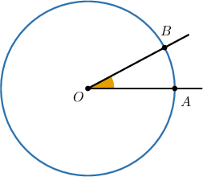
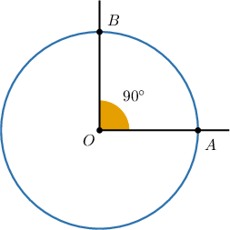
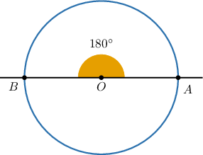
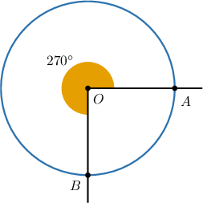
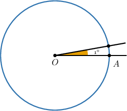
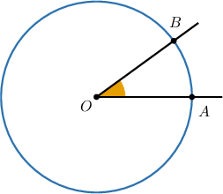
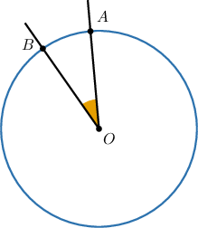
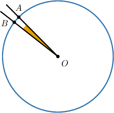

# Connecting Angles and Circles

Source: https://www.mathacademy.com/topics/3981?courseId=120
Topic ID: 3981

## Prerequisites

- [Angles and Measures of Angles](../../../elementary-school/lessons/grade-4/2172-angles-and-measures-of-angles.md)
- [Multiplying Fractions by Whole Numbers](../../../elementary-school/lessons/grade-4/2360-multiplying-fractions-by-whole-numbers.md)
- [Multi-Digit by One-Digit Division Using Partial Quotients](../../../elementary-school/lessons/grade-4/2425-multi-digit-by-one-digit-division-using-partial-quotients.md)
- [Dividing by 10, 100, and 1,000 Using the Pattern of Zeros](../../../elementary-school/lessons/grade-4/3882-dividing-by-10-100-and-1-000-using-the-pattern-of-zeros.md)
- [Writing Unit Fractions in Words](../../../elementary-school/lessons/grade-4/3951-writing-unit-fractions-in-words.md)

## Lesson

### Introduction

The measure of an angle is a number we use to describe the amount of "turn" needed to move from one side of the angle to the other.

We can also think of an angle $\angle AOB$ as measuring a fraction of a turn in a full circle, where $A$ and $B$ are points on the circle, and $O$ is the circle's center.

Some important rotations of a full circle are shown below.

- A one-quarter turn in a full circle measures $90^\circ.$

- A one-half turn measures $180^\circ.$

- A three-quarter turn measures $270^\circ.$

- A full turn measures $360^\circ.$

- Since a full turn represents $360^\circ,$ an angle of $1^\circ$ represents $\dfrac{1}{360}$ of a full turn.

**Note**: The last image is not drawn to scale. An angle measuring $1^\circ$ is much smaller than the one shown above!

### A Worked Example

Suppose that $\angle{AOB}$ shown above represents $\dfrac{1}{10}$ of a full turn. How can we find the measure of this angle?

The angle $\angle AOB$ represents one-tenth of a full turn. Since a full turn has a measure of $360^\circ,$ the measure of $\angle AOB$ is one-tenth of $360^\circ.$

Therefore, we can express the degree measure of $\angle{AOB}$ as follows:

$$

\begin{aligned}\frac{1}{10}×360^{∘} & = \\ \frac{1×360^{∘}}{10} & = \\ \frac{360^{∘}}{10} & \end{aligned}

$$

It's common to write the fraction in parentheses and place the degree symbol outside, as follows:

$$

\begin{aligned}(\frac{360}{10})^{∘}\end{aligned}

$$

Finally, we simplify this fraction by expressing it as a division.

$$

\begin{aligned}\frac{360}{10} & = \\ 360÷10 & \\ 36\,0 & \\ 36 & \end{aligned}

$$

Therefore, we conclude that the measure of $\angle AOB$ is $36^\circ.$

### Example: Expressing a Rotation Angle as an Improper Fraction

#### Question

In the diagram above, $\angle{AOB}$ is $\dfrac{1}{12}$ of a full turn. Expressed as an improper fraction, what is the degree measure of the angle?

#### Explanation

Remember that a full turn has a measure of $360^\circ.$

Therefore, the measure of $\angle{AOB}$ is

$$

\begin{aligned}\frac{1}{12}×360^{∘} & = \\ \frac{1×360^{∘}}{12} & = \\ \frac{360^{∘}}{12} & .\end{aligned}

$$

It's common to write the fraction in parentheses and place the degree symbol outside, as follows:

$$

\begin{aligned}(\frac{360}{12})^{∘}\end{aligned}

$$

### Example: Measuring Angles Using Circles

#### Question

In the diagram above, $\angle{AOB}$ is $\dfrac{1}{60}$ of a full turn. What is the degree measure of the angle?

#### Explanation

Remember that a full turn has a measure of $360^\circ.$

Therefore, the measure of $\angle{AOB}$ is

$$

\begin{aligned}\frac{1}{60}×360^{∘} & = \\ \frac{1×360^{∘}}{60} & = \\ \frac{360^{∘}}{60} & = \\ (\frac{360}{60})^{∘}. & \end{aligned}

$$

To solve this division problem, we first divide the numerator and denominator by $10{:}$

$$

\begin{aligned}\frac{360}{60} & = \\ \frac{360÷10}{60÷10} & = \\ \frac{36\,0}{6\,0} & = \\ \frac{36}{6} & \end{aligned}

$$

Now, we evaluate the fraction by expressing it as a division:

$$

\begin{aligned}\frac{36}{6} & = \\ 36÷6 & = \\ 6 & \end{aligned}

$$

Therefore, the measure of $\angle{AOB}$ is $6^\circ.$

### Example: Finding the Number of Angles in a Full Turn

#### Question

How many $8^\circ$ angles are needed to make a complete turn?

#### Explanation

Remember that a full turn has a measure of $360^\circ.$

To find the number of $8^\circ$ angles needed to make a complete turn, we need to find the value of $360 \div 8.$

We can find the value of $360 \div 8$ using a box model:

According to the box model,

$$

360 \div 8 = 40 + 5 = 45.

$$

Therefore, $45$ angles of $8^\circ$ are required to make a complete turn.
