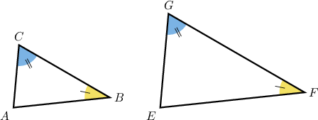
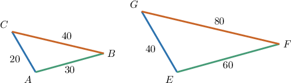
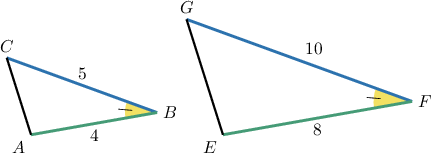
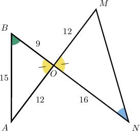
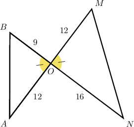
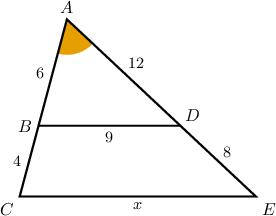
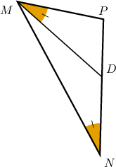
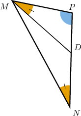
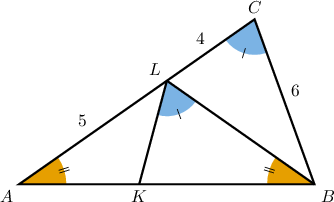

# Combining Similarity Criteria for Triangles

Source: https://www.mathacademy.com/topics/4065?courseId=120
Topic ID: 4065

## Prerequisites

- [The AA Similarity Criterion](../../../high-school/traditional/lessons/geometry/1365-the-aa-similarity-criterion.md)
- [The SAS Similarity Criterion](../../../high-school/traditional/lessons/geometry/1366-the-sas-similarity-criterion.md)
- [The SSS Similarity Criterion](../../../high-school/traditional/lessons/geometry/1919-the-sss-similarity-criterion.md)

## Lesson

### Introduction

The three similarity criteria for triangles are often needed when proving geometric results. Therefore, it's essential to identify which criterion is being applied in a particular situation.

Let's start by briefly reviewing the three criteria that we have learned.

- The **angle-angle (AA)** criterion: If two angles of one triangle are congruent to two angles of another triangle, then the two triangles are similar.

- The **side-side-side (SSS)** criterion: Two triangles are similar if the ratios of the lengths of their corresponding sides are equal.

- The **side-angle-side (SAS)** criterion: Two triangles are similar if the ratio of the lengths of two pairs of corresponding sides is the same, and the angles included by these sides are congruent.

Let's now get some practice at correctly identifying these criteria.

### Example: Identifying Similar Triangles

#### Question

By which similarity criterion does it follow that $\triangle BOA\sim \triangle MON?$

**

#### Explanation

First, let's simplify our diagram, keeping only the relevant information:

Now, let's recall the SAS similarity criterion:

**

Notice that $\triangle BOA$ and $\triangle MON$ have a pair of congruent angles:

$$

\angle BOA \cong \angle MON

$$

Let's list the sides that enclose the congruent angle for each triangle, from smallest to largest:

$$

\underbrace{({\color{blue}{9}},{\color{blue}{12}})}_{\triangle BOA}, \qquad \underbrace{({\color{red}{12}},{\color{red}{16}})}_{\triangle MON}

$$

Notice that the ratios of these lengths are in proportion:

$$

\dfrac{\color{blue}9}{\color{red}12} = \dfrac{\color{blue}12}{\color{red}16} = \dfrac34

$$

Therefore, $\triangle BOA \sim \triangle MON$ by the SAS criterion.

### Similar Triangles With Common Sides and Angles

It's important that we can identify similar triangles that share common sides and angles.

Consider the following diagram:

We can show that $\triangle{ABD}$ and $\triangle{ACE}$ are similar as follows:

- First, notice that $\angle{A}$ is common to both triangles.

- Second, note that the ratios of the sides containing the congruent angles are equal:

$$

\begin{aligned}\frac{𝐴𝐸}{𝐴𝐷} & =\frac{12+8}{12}=\frac{5}{3} \\ \frac{𝐴𝐶}{𝐴𝐵} & =\frac{6+4}{6}=\frac{5}{3}\end{aligned}

$$

Therefore, $\triangle{ABD} \sim \triangle{ACE}$ by the SAS (side-angle-side) criterion.

Let's see another example.

### Example: Identifying Similar Triangles With Common Sides and Angles

#### Question

By which similarity criterion does it follow that $\triangle PNM \sim \triangle PMD?$

#### Explanation

First, let's recall the AA similarity criterion:

**

Notice that the triangles $\triangle PNM$ and $\triangle PMD$ have a common angle $\angle P.$ Also, $m\angle PNM= m\angle PMD.$

Hence, $\triangle PNM \sim \triangle PMD$ by the AA criterion.

### Example: Diagrams Containing Many Triangles

#### Question

Which of the following statements must be true:

1. $\triangle ABC \sim \triangle AKL$

2. $\triangle ABC \sim \triangle BLC$

3. $\triangle ABC \sim \triangle BKL$

#### Explanation

Let's compare each of the given triangles to $\triangle{ABC}{:}$

- First, let's analyze whether $\triangle{ABC} \sim \triangle{AKL}$ is true: There is no similarity criterion we can apply to these triangles. Therefore, we **** conclude that $\triangle ABC \sim \triangle AKL.$

- Next, let's analyze whether $\triangle{ABC} \sim \triangle{BLC}$ is true: Note that Therefore, $\triangle{ABC} \sim \triangle{BLC}$ must be true by the SAS criterion.

- Finally, let's analyze whether $\triangle{ABC} \sim \triangle{BKL}{:}$ Note that Therefore, $\triangle{ABC} \sim \triangle{BKL}$ must be true by the AA criterion.

Therefore, the correct answer is "II and III only."
