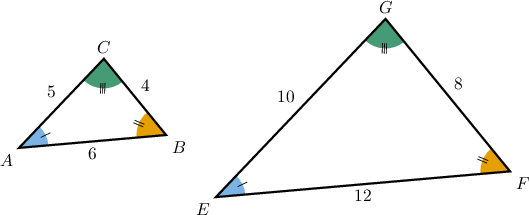
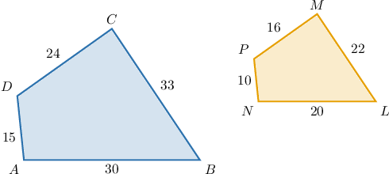
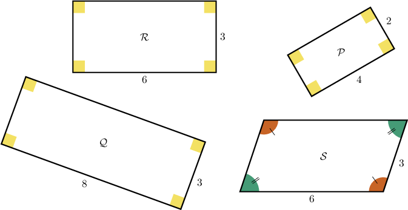
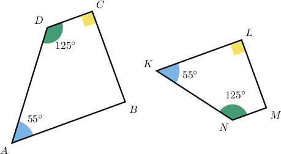

# Similarity and Similar Polygons

Source: https://www.mathacademy.com/topics/490?courseId=120
Topic ID: 490

## Prerequisites

- [Writing Ratios Using Fractions](../../../middle-school/lessons/grade-6/552-writing-ratios-using-fractions.md)
- [Interior Angles of Polygons](../../../middle-school/lessons/grade-8/1319-interior-angles-of-polygons.md)
- [Rectangles, Rhombuses, and Squares](../../../elementary-school/lessons/grade-5/3751-rectangles-rhombuses-and-squares.md)

## Lesson

### Introduction

Two polygons are **similar** if they have the same shape (though they may have different sizes).

More precisely, two polygons are similar if the following conditions hold:

1. Their corresponding angles are congruent.

2. The ratios of the lengths of their corresponding sides are all equal.

To demonstrate, let's consider the triangles $\triangle ABC$ and $\triangle EFG$ below.

From the figure above, we see that the corresponding angles are congruent:

$$

\angle A \cong \angle E, \qquad \angle B \cong \angle F, \qquad \angle C \cong \angle G.

$$

We also need to check whether the ratios of the corresponding sides are the same. That is, we have to check whether

$$

\begin{aligned}\frac{𝐴𝐵}{𝐸𝐹} & =\frac{𝐵𝐶}{𝐹𝐺}=\frac{𝐴𝐶}{𝐸𝐺}.\end{aligned}

$$

Substituting the lengths of the sides, we get the following:

$$

\begin{aligned}\frac{𝐴𝐵}{𝐸𝐹} & =\frac{6}{12}=\frac{1}{2} \\ \frac{𝐵𝐶}{𝐹𝐺} & =\frac{4}{8}=\frac{1}{2} \\ \frac{𝐴𝐶}{𝐸𝐺} & =\frac{5}{10}=\frac{1}{2}\end{aligned}

$$

The ratios are the same. Therefore, we conclude that the triangles $\triangle ABC$ and $\triangle EFG$ are similar. The common ratio of the sides, $\dfrac{1}{2},$ is called the **similarity ratio**.

To express mathematically that the triangles $\triangle ABC$ and $\triangle EFG$ are similar, we write

$$

\triangle ABC \sim \triangle EFG.

$$

### Example: Determining the Similarity Ratio Between Two Similar Polygons

#### Question

Given that the two polygons shown below are similar, determine the similarity ratio.

**

#### Explanation

Given two similar polygons, the similarity ratio is the ratio of any two corresponding sides.

Notice that, for example, $\overline{LM}$ is the longest side of $NLMP.$ Hence, it corresponds to the longest side of $ABCD,$ which is $\overline{BC}.$

Therefore, the similarity ratio is

$$

\begin{aligned}𝑘 & =\frac{𝐵𝐶}{𝐿𝑀} \\ & =\frac{33}{22} \\ & =\frac{3}{2}.\end{aligned}

$$

**** The ratio of the smaller polygon to the larger polygon would be $\dfrac{1}{\left(\dfrac{3}{2}\right)}=\dfrac{2}{3}.$

### Example: Identifying Shapes Similar to a Given Polygon

#### Question

Which of the following quadrilaterals are similar to $\mathcal{R}$ (other than $\mathcal R$ itself)?

#### Explanation

First, notice that $\mathcal{R}$ is a rectangle, meaning all the angles measure $90^\circ,$ and it has $2$ pairs of parallel congruent sides.

With that in mind, let's examine each of the given polygons.

- $\mathcal{Q}$ is ** similar to $\mathcal{R}.$ The polygon $\mathcal{Q}$ is a rectangle, and the corresponding angles are congruent, but the ratios of the lengths of the corresponding sides are not the same:

- $\mathcal{P}$ is similar to $\mathcal{R}.$ Indeed, $\mathcal{P}$ is a rectangle. Furthermore, the corresponding angles are congruent, and the ratios of the lengths of the corresponding sides are the same:

- $\mathcal{S}$ is ** similar to $\mathcal{R}$ because $\mathcal{S}$ is not a rectangle (it's a parallelogram).

Therefore, the correct answer is "$\mathcal{P}$ only."

### Correctly Writing Similarity Statements

When writing a similarity statement, corresponding vertices should appear in the same position in the statement. For example, if we're given that

$$

ABC \sim PQR

$$

for two polygons $ABC$ and $PQR,$ we can immediately deduce that

$$

\angle A \cong \angle P, \qquad \angle B \cong \angle Q, \qquad \angle C \cong \angle R.

$$

We can also deduce that

$$

k = \dfrac{AB}{PQ}= \dfrac{BC}{QR} = \dfrac{AC}{PR},

$$

where $k$ is the similarity ratio.

### Example: Determining the Correct Similarity Statement Between Two Similar Polygons

#### Question

Given that the two quadrilaterals below are similar, write down a correct similarity statement.

#### Explanation

First, let's find the measures of unknown angles. Since the sum of the measures of internal angles of a quadrilateral is $360^\circ,$ we have

$$

\begin{aligned}𝑚∠𝐴+𝑚∠𝐵+𝑚∠𝐶+𝑚∠𝐷 & =360^{∘} \\ 55^{∘}+𝑚∠𝐵+90^{∘}+125^{∘} & =360^{∘} \\ 𝑚∠𝐵+270^{∘} & =360^{∘} \\ 𝑚∠𝐵 & =90^{∘}.\end{aligned}

$$

Similarly,

$$

\begin{aligned}𝑚∠𝐾+𝑚∠𝐿+𝑚∠𝑀+𝑚∠𝑁 & =360^{∘} \\ 55^{∘}+90^{∘}+𝑚∠𝑀+125^{∘} & =360^{∘} \\ 𝑚∠𝑀+270^{∘} & =360^{∘} \\ 𝑚∠𝑀 & =90^{∘}.\end{aligned}

$$

Hence, the quadrilaterals are similar, and

$$

\begin{aligned}∠𝐴≅∠𝐾,\,∠𝐷≅∠𝑁,\,∠𝐶≅∠𝐿≅∠𝐵≅∠𝑀.\end{aligned}

$$

So far, we have that

- $A$ corresponds to $K,$ and

- $D$ corresponds to $N.$

From the angle measurements, it's unclear whether $C$ corresponds to $L$ or $M$ (these are all right angles). However, $C$ sits between a $125^\circ$ angle and a $90^\circ$ angle, and so does $M$ (whereas $L$ does not). So, we also have that

- $C$ corresponds to $M,$ and

- $B$ corresponds to $L.$

Therefore, we conclude that a correct similarity statement is

$$

ABCD \sim KLMN.

$$

### Example: Identifying Possible Lengths of Sides for a Polygon Given Dimensions of a Similar Polygon

#### Question

Given that $ABCD \sim A'B'C'D',$ $AB = 3\,\mathrm{ft},$ and $BC = 4\,\mathrm{ft},$ which of the following could be the values of $A'B'$ and $B'C'?$

1. ${A'B'} = 15\, \mathrm{ft}, \, {B'C'} = 20\, \mathrm{ft}$

2. ${A'B'} = 30\, \mathrm{ft}, \, {B'C'} = 44\, \mathrm{ft}$

3. ${A'B'} = 18\, \mathrm{ft}, \, {B'C'} = 24\, \mathrm{ft}$

#### Explanation

For similar polygons, the ratios of lengths of the corresponding sides should be the same.

- For option I, the ratios are the same: So, option I indeed gives possible values of $A'B'$ and $B'C'.$

- For option II, the ratios are different: So, option II does not give possible values of $A'B'$ and $B'C'.$

- For option III, the ratios are the same: So, option III indeed gives possible values of $A'B'$ and $B'C'.$

Therefore, the correct answer is "I and III only."
