# Distances Between Points in the Coordinate Plane

Source: https://www.mathacademy.com/topics/573?courseId=120
Topic ID: 573

## Prerequisites

- [The Cartesian Coordinate System](../../../middle-school/lessons/grade-6/92-the-cartesian-coordinate-system.md)
- [Absolute Value](../../../elementary-school/lessons/grade-5/2281-absolute-value.md)

## Lesson

### Introduction

The distance between two points in the coordinate plane is the number of units between them. Let's explore two methods for calculating the horizontal distance between two points with the points $(1,1)$ and $(5,1).$

**Method 1**

The distance between two points is the length of the line segment that connects them.

First, we plot the given points in the coordinate plane.

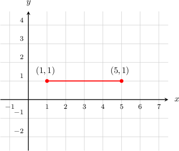

From the diagram, we see that the length of the segment is $4$ units, so the distance equals $4.$

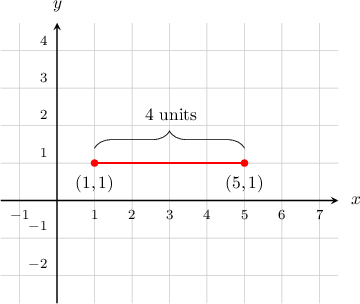

**Method 2**

We can find the distance between the two points by finding the distance of each point from the $y$-axis and then subtracting.

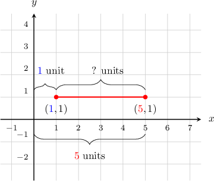

The point $({\color{blue}{1}},1)$ is at a distance of $\color{blue}{1}$ from the $y$-axis, and the point $({\color{red}{5}},1)$ is at a distance of $\color{red}{5}$ from the $y$-axis. Therefore, the distance between the two points is ${\color{red}{5}} - {\color{blue}{1}} = 4.$

### Example: Finding the Horizontal Distance Between Two Points

#### Question

What is the distance between the points $(2,4)$ and $(5,4)?$

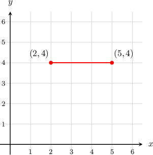

#### Explanation

****

The distance between two points is the length of the line segment that connects them.

From the diagram, we see that the length of the segment is $3$ units, so the distance equals $3.$

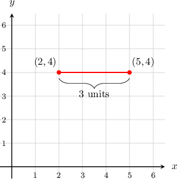

****

We can find the distance between the two points by finding the distance of each point from the $y$-axis and then subtracting.

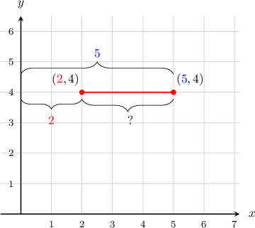

The point $({\color{blue}{5}},4)$ is at a distance of $\color{blue}{5}$ from the $y$-axis, and the point $({\color{red}{2}},4)$ is at a distance of $\color{red}{2}$ from the $y$-axis. Therefore, the distance between the two points is ${\color{blue}{5}} - {\color{red}{2}} = 3.$

### Example: Finding the Vertical Distance Between Two Points

#### Question

What is the distance between the points $(-4,-2)$ and $(-4,-5)?$

#### Explanation

****

We plot the given points in the coordinate plane.

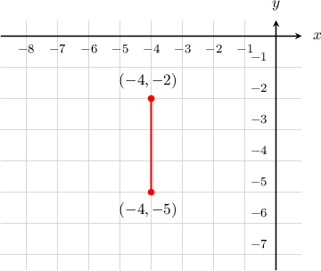

The distance between two points is the length of the line segment that connects them.

From the diagram, we see that the length of the segment is $3$ units, so the distance equals $3.$

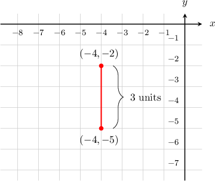

****

We can find the distance between the two points by finding the distance of each point from the $x$-axis and then subtracting.

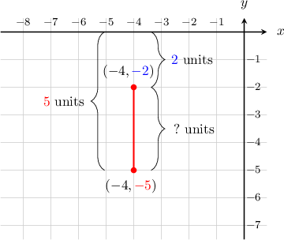

The point $(-4,{\color{red}{-5}})$ is at a distance of $\color{red}{5}$ from the $x$-axis, and the point $(-4,{\color{blue}{-2}})$ is at a distance of $\color{blue}{2}$ from the $x$-axis. Therefore, the distance between the two points is ${\color{red}{5}} - {\color{blue}{2}} = 3.$

### The Distance Between Two Points in Different Quadrants

When we want to find the distance between two points in different quadrants, method 1 works exactly the same, but method 2 is slightly different.

We can find the distance between the two points by finding the distance of each point from the $y$-axis for a horizontal distance, or $x$-axis for a vertical distance, and then *adding*.

So, what's the distance between $(-3,2)$ and $(1,2)?$

**Method 1**

We plot the given points in the coordinate plane.

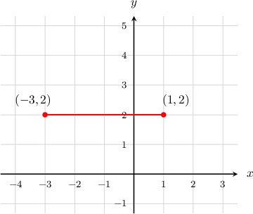

The distance between two points is the length of the line segment that connects them.

From the diagram, we see that the length of the segment is $4$ units, so the distance equals $4.$

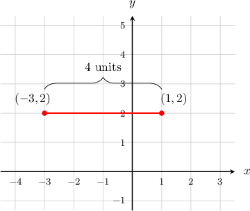

**Method 2**

We can find the distance between the two points by finding the distance of each point from the $y$-axis and then adding.

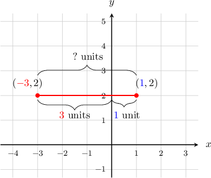

The point $({\color{blue}{1}},2)$ is at a distance of $\color{blue}{1}$ from the $y$-axis, and the point $({\color{red}{-3}},2)$ is at a distance of $\color{red}{3}$ from the $y$-axis. Therefore, the distance between the two points is ${\color{red}{3}} + {\color{blue}{1}} = 4.$

### Example: Finding the Distance Between Two Points: Crossing the Axis

#### Question

What is the distance between the points $(3,4)$ and $(3,-3)?$

#### Explanation

****

We plot the given points in the coordinate plane.

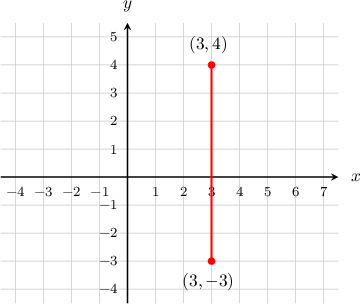

The distance between two points is the length of the line segment that connects them.

From the diagram, we see that the length of the segment is $7$ units, so the distance equals $7.$

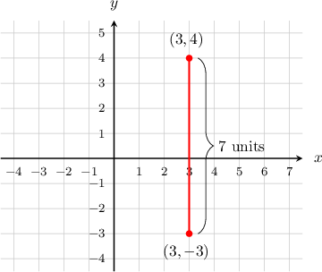

****

We can find the distance between the two points by finding the distance of each point from the $x$-axis and then adding.

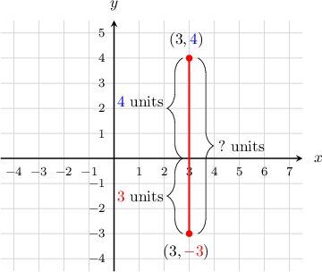

The point $(3,{\color{blue}{4}})$ is at a distance of $\color{blue}{4}$ from the $x$-axis, and the point $(3,{\color{red}{-3}})$ is at a distance of $\color{red}{3}$ from the $x$-axis. Therefore, the distance between the two points is ${\color{red}{3}} + {\color{blue}{4}} = 7.$
