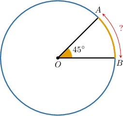
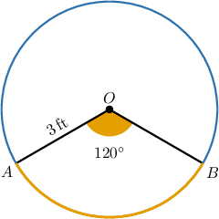
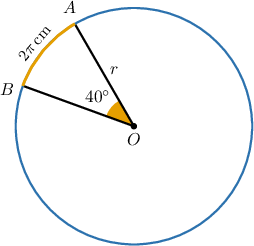
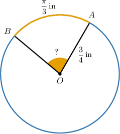
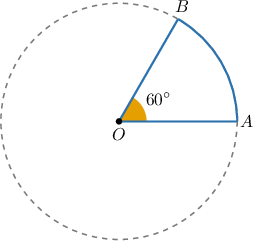

# Calculating Arc Lengths of Circular Sectors

Source: https://www.mathacademy.com/topics/597?courseId=120
Topic ID: 597

## Prerequisites

- [Fractions of Fractions](../../../middle-school/lessons/grade-7/323-fractions-of-fractions.md)
- [The Circumference of a Circle](../../../high-school/traditional/lessons/geometry/460-the-circumference-of-a-circle.md)
- [Central Angles and Arcs](../../../high-school/traditional/lessons/geometry/550-central-angles-and-arcs.md)

## Lesson

### Introduction

In the diagram below, we are given that the radius of the circle is $r=3 \,\mathrm{cm}$ and $m\angle AOB = 45^\circ.$ How can we calculate the **length of the arc** $\overset{\frown}{AB},$ in centimeters?

Let's begin with finding the portion of the circumference covered by the arc $\overset{\frown}{AB}.$ So, we find the ratio between the central angle and a full turn of $360^\circ\mathbin{:}$

$$

\dfrac{m\angle{AOB}}{360^\circ} = \dfrac{45^\circ}{360^\circ} = \dfrac{1}{8}

$$

Therefore, the arc $\overset{\frown}{AB}$ represents $\dfrac{1}{8}$ of the circumference. Using the circumference formula $C = 2 \pi r,$ we compute the length of the arc as

$$

C = 2\pi\cdot 3\,\textrm{cm} = 6\pi\,\textrm{cm}.

$$

Therefore, the length of the arc $\overset{\frown}{AB}$ must be

$$

\begin{aligned}Length(\overset{𝐴𝐵}{⌢}) & =\frac{1}{8}⋅𝐶 \\ & =\frac{1}{8}⋅6𝜋cm \\ & =\frac{3𝜋}{4} \\ & ≈2.356\,cm\end{aligned}

$$

rounded to three decimal places.

### Example: Calculating the Arc Length of a Circular Sector Given Its Radius

#### Question

Find the length of the arc $\overset{\frown}{AB}$ given that the radius $r$ of the circle is $3\,\textrm{ft}.$

#### Explanation

We first find the ratio between the central angle and a full $360^\circ$ turn:

$$

\begin{aligned}\frac{𝑚∠𝐴𝑂𝐵}{360^{∘}}=\frac{120^{∘}}{360^{∘}}=\frac{1}{3}\end{aligned}

$$

Therefore, the arc $\overset{\frown}{AB}$ represents $\dfrac{1}{3}$ of the circumference $C.$ So, its length is given by

$$

\dfrac13\cdot C

$$

and using the fact that $C=2\pi r$ and $r=3\,\textrm{ft},$ we can calculate the length of $\overset{\frown}{AB}$ as follows:

$$

\begin{aligned}\frac{1}{3}⋅𝐶 & =\frac{1}{3}⋅2𝜋𝑟 \\ & =\frac{1}{3}⋅2𝜋⋅3 \\ & =2𝜋\,ft.\end{aligned}

$$

Therefore, the length of the arc $\overset{\frown}{AB}$ is $2\pi \,\textrm{ft}.$

### Example: Calculating the Radius of a Circular Sector Given Its Arc Length

#### Question

In the circle below, the length of the arc $\overset{\frown}{AB}$ is $2\pi\,\mathrm{cm}$ and the measure of its central angle is $40^\circ.$ What is the radius of the circle?

#### Explanation

We first find the ratio between the central angle and the full turn of $360^\circ$:

$$

\begin{aligned}\frac{𝑚∠𝐴𝑂𝐵}{360^{∘}}=\frac{40^{∘}}{360^{∘}}=\frac{1}{9}.\end{aligned}

$$

Therefore, the arc $\overset{\frown}{AB}$ represents $\dfrac{1}{9}$ of the circumference. So, we have

$$

\begin{aligned}\frac{1}{9}⋅𝐶 & =2𝜋 \\ 𝐶 & =18𝜋.\end{aligned}

$$

Now, using the formula for the circumference, we have

$$

\begin{aligned}𝐶 & =2𝜋𝑟 \\ 18𝜋 & =2𝜋𝑟 \\ 𝑟 & =9\,cm.\end{aligned}

$$

Therefore, the radius of the circle is $r = 9\,\mathrm{cm}.$

### Example: Solving for an Unknown Given the Radius of a Circle

#### Question

In the figure below, the radius $r$ of the circle is $\dfrac{3}{4}\,\textrm{in}$ and the length of the arc $\overset{\frown}{AB}$ is $\dfrac{\pi}{3}\,\textrm{in}.$ Find the measure of the angle $\angle AOB.$

#### Explanation

First, let's find the circumference of the circle:

$$

C=2\pi r = 2 \pi \cdot \dfrac 34 = \dfrac{3 \pi}2 \,\textrm{in}.

$$

So, the ratio of the length of $\overset{\frown}{AB}$ to the circumference $C$ is

$$

\dfrac{m\overset{\frown}{AB}}{C} = \dfrac{\,\left(\dfrac{\pi}{3}\right)\,}{\,\left(\dfrac{3\pi}{2}\right)\,} = \dfrac{2}{9}.

$$

Therefore, the central angle $\angle{AOB}$ must also cover $\dfrac{2}{9}$ of a full turn. So, its measure is

$$

m\angle{AOB} = \dfrac{2}{9} \cdot 360^\circ = 80^\circ.

$$

### Example: Solving for an Unknown Given the Perimeter of a Sector

#### Question

The perimeter of the sector $AOB$ below is $\pi+6.$ What is the radius of the circle?

#### Explanation

The corresponding central angle of the arc $\overset{\frown}{AB}$ is $\angle{AOB},$ and the portion of a full turn that $\angle AOB$ covers is

$$

\dfrac{m\angle{AOB}}{360^\circ} = \dfrac{60^\circ}{360^\circ} = \dfrac{1}{6}.

$$

So, if $C$ is the circumference of the circle, then the length of the arc $\overset{\frown}{AB}$ is $\dfrac{C}{6}.$

The perimeter of the sector $AOB$ is given by the length of the arc plus the two radii.

Therefore, if $r$ denotes the radius of the circle, we obtain the following:

$$

\begin{aligned}\frac{𝐶}{6}+2𝑟 & =𝜋+6 \\ \frac{2𝜋𝑟}{6}+2𝑟 & =𝜋+6 \\ \frac{𝜋𝑟}{3}+2𝑟 & =𝜋+6\end{aligned}

$$

Now, we multiply both sides by $3$ to get rid of the fraction:

$$

\begin{aligned}3⋅(\frac{𝜋𝑟}{3}+2𝑟) & =3⋅(𝜋+6) \\ 𝜋𝑟+6𝑟 & =3𝜋+18\end{aligned}

$$

Finally, we factor out the linear expressions and cancel out the parentheses:

$$

\begin{aligned}𝜋𝑟+6𝑟 & =3𝜋+18 \\ 𝑟(𝜋+6) & =3(𝜋+6) \\ 𝑟(𝜋+6) & =3(𝜋+6) \\ 𝑟 & =3\end{aligned}

$$
