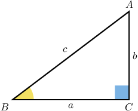
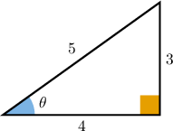
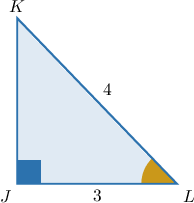
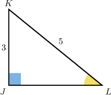

# The Reciprocal Trigonometric Ratios

Source: https://www.mathacademy.com/topics/611?courseId=120
Topic ID: 611

## Prerequisites

- [Calculating Trigonometric Ratios Using the Pythagorean Theorem](../../../high-school/traditional/lessons/geometry/633-calculating-trigonometric-ratios-using-the-pythagorean-theorem.md)

## Lesson

### Introduction

The reciprocals of sine, cosine, and tangent are given special names:

- The reciprocal of **sine** is **cosecant**, abbreviated $\csc.$

- The reciprocal of **cosine** is **secant**, abbreviated $\sec.$

- The reciprocal of **tangent** is **cotangent**, abbreviated $\cot.$

Let's write down expressions for $\csc(B),$ $\sec(B),$ and $\cot(B)$ for the triangle below.

$$

\begin{aligned} \csc(B) &= \dfrac {\text{hypotenuse}} {\text{opposite}} = \dfrac c b \\[5pt] \sec(B) &= \dfrac {\text{hypotenuse}} {\text{adjacent}} = \dfrac c a \\[5pt] \cot(B) &= \dfrac {\text{adjacent}} {\text{opposite}} = \dfrac a b \\\end{aligned}

$$

### Example: Evaluating Reciprocal Trigonometric Ratios Given a Triangle

#### Question

Find $\csc\theta,$ $\sec\theta,$ and $\cot\theta$ for the triangle below.

#### Explanation

We compute the three reciprocal trigonometric ratios as follows:

$$

\begin{aligned} \csc\theta &= \dfrac{1}{\sin\theta} = \dfrac {\text{hypotenuse}} {\text{opposite}} = \dfrac 5 3, \\[5pt] \sec\theta &= \dfrac{1}{\cos\theta} = \dfrac {\text{hypotenuse}} {\text{adjacent}} = \dfrac 5 4, \\[5pt] \cot\theta &= \dfrac{1}{\tan\theta} = \dfrac {\text{adjacent}} {\text{opposite}} = \dfrac 4 3. \end{aligned}

$$

### The Reciprocal Trigonometric Ratios and the Pythagorean Theorem

If we are given two sides of a right triangle, how can we calculate the reciprocal ratios $\sec,$ $\csc,$ or $\cot$ when we are missing one of the necessary sides in the ratio?

The trick here is the same that we use for finding $\sin,$ $\cos,$ or $\tan\mathbin{:}$ we use the Pythagorean theorem for finding the missing side.

To illustrate, let's calculate $\csc L$ in the triangle below.

Remember that $\csc$ is the reciprocal of $\sin.$ So first we need to compute sine:

$$

\sin L = \dfrac{\text{opposite}}{\text{hypotenuse}} = \dfrac{JK}{KL} = \dfrac{JK}{4}

$$

To find the length $JK,$ we can use the Pythagorean Theorem:

$$

\begin{aligned}𝐽𝐾 & =\sqrt{𝐾𝐿^{2}−𝐽𝐿^{2}} \\ & =\sqrt{4^{2}−3^{2}} \\ & =\sqrt{16−9} \\ & =\sqrt{7}\end{aligned}

$$

So we have

$$

\sin L = \dfrac{JK}{4} = \dfrac{ \sqrt{7} }{4},

$$

and therefore

$$

\begin{aligned}csc⁡𝐿 & =(\frac{\sqrt{7}}{4})^{−1} \\ & =\frac{4}{\sqrt{7}} \\ & =\frac{4⋅\sqrt{7}}{\sqrt{7}⋅\sqrt{7}} \\ & =\frac{4\sqrt{7}}{7}.\end{aligned}

$$

### Example: Evaluating a Reciprocal Trigonometric Ratio Given a Triangle Using the Pythagorean Theorem

#### Question

Find $\sec L$ for $\triangle KLJ$ (shown below).

#### Explanation

Remember that $\sec$ is the reciprocal of $\cos.$ So first we need to compute cosine:

$$

\cos L = \dfrac{\text{adjacent}}{\text{hypotenuse}} = \dfrac{JL}{KL} = \dfrac{JL}{5}

$$

To find the length $JL,$ we can use the Pythagorean Theorem:

$$

\begin{aligned}𝐽𝐿 & =\sqrt{𝐾𝐿^{2}−𝐽𝐾^{2}} \\ & =\sqrt{5^{2}−3^{2}} \\ & =\sqrt{25−9} \\ & =\sqrt{16} \\ & =4\end{aligned}

$$

So we have

$$

\cos L = \dfrac{JL}{5} = \dfrac{4}{5},

$$

and therefore

$$

\begin{aligned}sec⁡𝐿 & =(\frac{4}{5})^{−1}=\frac{5}{4}.\end{aligned}

$$
