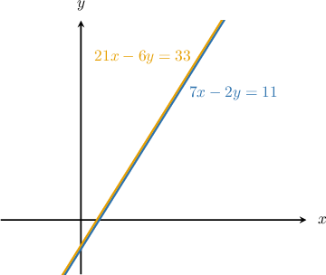
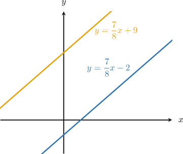

# Determining Unknown Parameters in Systems of Linear Equations

Source: https://www.mathacademy.com/topics/6173?courseId=120
Topic ID: 6173

## Prerequisites

- [Systems of Equations With No Solutions and Infinitely Many Solutions](../../../high-school/traditional/lessons/algebra-i/493-systems-of-equations-with-no-solutions-and-infinitely-many-solutions.md)
- [Systems of Linear Equations With Fractional Coefficients](../../../high-school/traditional/lessons/algebra-i/1045-systems-of-linear-equations-with-fractional-coefficients.md)
- [Manipulating Expressions and Equations](./6142-manipulating-expressions-and-equations.md)

## Lesson

### Introduction

Systems of equations sometimes contain unknown constants (called **parameters**) that affect the number of solutions to the system. In such cases, two questions we may wish to ask are:

- For what values of the parameter does the system have infinitely many solutions?

- For what values of the parameter does the system have no solutions?

The goal of this lesson is to learn how to answer these questions.

Consider the system of equations below, where $d$ is an unknown constant.

$$

\begin{aligned}7𝑥−2𝑦=11 \\ 21𝑥−6𝑦=𝑑\end{aligned}

$$

Suppose we're told that this system has *infinitely many* solutions. Given this information, what is the value of $d?$

Recall that a system of equations has infinitely many solutions when both equations represent the *same line.* Moreover, two equations represent the same line if one equation is a non-zero constant multiple of the other.

Now, if one equation is a constant multiple of the other, all the corresponding coefficients and constants must be proportional. This gives us the following equation:

$$

\dfrac{7}{21} = \left(\dfrac{-2}{-6}\right) = \dfrac{11}{d}

$$

Notice that

$$

\dfrac{7}{21} = \left(\dfrac{-2}{-6}\right) = \dfrac{1}{3}.

$$

So, to find the value of $d,$ we focus on the proportion

$$

\dfrac{1}{3} = \dfrac{11}{d}.

$$

We can solve this equation for $d$ by cross-multiplying, as follows:

$$

\begin{aligned}\frac{1}{3} & =\frac{11}{𝑑} \\ 1⋅𝑑 & =3⋅11 \\ 𝑑 & =33.\end{aligned}

$$

Therefore, if $d=33,$ the two equations describe the same line, and the system has infinitely many solutions.

A sketch of the situation is given below. Note that the two lines coincide, and the equations of the lines are indeed multiples of each other.

We can use the same idea to solve for unknown parameters given a system containing fractional coefficients. Let's see an example.

### Example: Solving for a Parameter in a System With Infinitely Many Solutions

#### Question

$$

\begin{aligned}−\frac{1}{6}𝑥+\frac{1}{4}𝑦=\frac{5}{12} \\ \frac{1}{3}𝑥+\frac{𝑡}{12}𝑦=−\frac{5}{6}\end{aligned}

$$

In the system of equations above, $t$ is a constant. If the system has infinitely many solutions, what is the value of $t?$

#### Explanation

We start by eliminating fractions from both equations to make the comparison easier. To do that, we

- multiply both sides of the first equation by $12$ (the least common multiple of $6,$ $4,$ and $12$), and

- multiply both sides of the second equation by $12$ (the least common multiple of $2,$ $6,$ and $12$).

This gives the following system:

$$

\begin{aligned}12⋅(−\frac{1}{6}𝑥+\frac{1}{4}𝑦)=12⋅\frac{5}{12} \\ 12⋅(\frac{1}{3}𝑥+\frac{𝑡}{12}𝑦)=12⋅(−\frac{5}{6})\end{aligned}

$$

A system of equations has infinitely many solutions when both equations represent the same line. The two equations represent the same line if one equation is a non-zero constant multiple of the other.

Now, if one equation is a constant multiple of the other, all the corresponding coefficients and constants must be proportional:

$$

\dfrac{-2}{4} = \dfrac{3}{t} = \dfrac{5}{-10}.

$$

Notice that $\dfrac{-2}{4} = \dfrac{5}{-10} = -\dfrac{1}{2}.$ So, to find the value of $t,$ we focus on the proportion

$$

-\dfrac{1}{2} = \dfrac{3}{t}.

$$

Solving for $t,$ we obtain the following:

$$

\begin{aligned}−\frac{1}{2} & =\frac{3}{𝑡} \\ (−1)⋅𝑡 & =2⋅3 \\ −𝑡 & =6 \\ 𝑡 & =−6\end{aligned}

$$

### Example: Solving for Multiple Parameters in a System With Infinitely Many Solutions

#### Question

$$

\begin{aligned}\frac{5}{6}𝑥−\frac{1}{3}𝑦=\frac{7}{2} \\ 𝑟𝑥−6𝑦=𝑠\end{aligned}

$$

In the system of equations above, $r$ and $s$ are constants. If the system has infinitely many solutions, what is the value of $\dfrac{r}{s}?$

#### Explanation

We start by eliminating fractions from both equations to make the comparison easier. To do that, we multiply both sides of the first equation by $6$ (the least common multiple of $2,$ $3,$ and $6$). This gives the following system:

$$

\begin{aligned}6⋅(\frac{5}{6}𝑥−\frac{1}{3}𝑦)=6⋅\frac{7}{2} \\ 𝑟𝑥−6𝑦=𝑠\end{aligned}

$$

A system of equations has infinitely many solutions when both equations represent the same line. The two equations represent the same line if one equation is a non-zero constant multiple of the other.

Now, if one equation is a constant multiple of the other, all the corresponding coefficients and constants must be proportional:

$$

\dfrac{5}{r} = \dfrac{-2}{-6} = \dfrac{21}{s}

$$

So, to find the value of $\dfrac{r}{s},$ we focus on the proportion

$$

\dfrac{5}{r} = \dfrac{21}{s}.

$$

To find the value of $\dfrac{r}{s},$ we start by cross-multiplying, which gives

$$

\begin{aligned}5𝑠 & =21𝑟.\end{aligned}

$$

Dividing both sides of the equation by $s$ gives

$$

\begin{aligned}\frac{5𝑠}{𝑠} & =\frac{21𝑟}{𝑠} \\ 5 & =\frac{21𝑟}{𝑠}.\end{aligned}

$$

Finally, dividing both sides of the equation by $21$ yields the desired quantity:

$$

\begin{aligned}5 & =\frac{21𝑟}{𝑠} \\ \frac{5}{21} & =\frac{21𝑟}{21𝑠} \\ \frac{5}{21} & =\frac{𝑟}{𝑠} \\ \frac{𝑟}{𝑠} & =\frac{5}{21}\end{aligned}

$$

### Systems With No Solutions

Let's now see how to determine an unknown parameter when a system of linear equations has no solutions.

Consider the system of equations below, where $t$ is a constant.

$$

\begin{aligned}𝑦=\frac{7}{8}𝑥−2 \\ 𝑦=14𝑡𝑥+9\end{aligned}

$$

If the system has no solution, what is the value of $t?$

Recall that a system of linear equations has no solution if the equations represent *distinct parallel lines.* This occurs when both equations have the same slope but different $y$-intercepts.

In our case, both equations are in slope-intercept form, $y = mx + b,$ where $m$ is the slope and $b$ is the $y$-intercept.

- The first equation, $y = {\color{blue}\dfrac{7}{8}}x \:{\color{red}-\: 2},$ has a slope of $\color{blue}\dfrac{7}{8}$ and the $y$-intercept is ${\color{red}-2}.$

- The second equation, $y={\color{blue}14t}x + {\color{red}9},$ has a slope of $\color{blue}14t$ and the $y$-intercept is ${\color{red}9}.$

Since the equations have different $y$-intercepts ($\color{red}-2$ and $\color{red}9$), the slopes must be equal for the system to have no solution.

Therefore, equating the slopes and solving for $t,$ we get the following:

$$

\begin{aligned}\frac{7}{8} & =14𝑡 \\ \frac{7}{8⋅14} & =𝑡 \\ \frac{7}{8⋅2⋅7} & =𝑡 \\ \frac{7}{8⋅2⋅7} & =𝑡 \\ \frac{1}{8⋅2} & =𝑡 \\ \frac{1}{16} & =𝑡 \\ 𝑡 & =\frac{1}{16}\end{aligned}

$$

Therefore, if $t=\dfrac1{16},$ the two equations describe distinct parallel lines, and the system has no solutions.

A sketch of the situation is given below.

### Example: Solving For a Parameter in a System With No Solutions

#### Question

$$

\begin{aligned}−9+4𝑦=𝑡𝑥 \\ 3𝑦+𝑥=−5𝑥+8\end{aligned}

$$

Consider the system of equations above, where $t$ is a constant. If the system has no solution, what is the value of $t?$

#### Explanation

A system of linear equations has no solution if the equations represent distinct parallel lines. This occurs when both equations have the same slope but different $y$-intercepts.

Let's start by rewriting the equations in slope-intercept form, $y = mx + b,$ where $m$ is the slope and $b$ is the $y$-intercept.

- For the first equation, we have So, the slope is $\dfrac{t}{4}$ and the $y$-intercept is $\dfrac{9}{4}.$

- For the second equation, we have So, the slope is $-2$ and the $y$-intercept is $\dfrac{8}{3}.$

Since the equations have different $y$-intercepts $\bigg(\dfrac{9}{4}\ \text{and}\ \dfrac{8}{3}\bigg),$ the slopes must be equal for the system to have no solution.

Therefore, equating the slopes and solving for $t,$ we get the following:

$$

\begin{aligned}\frac{𝑡}{4} & =−2 \\ 𝑡 & =−2⋅4 \\ 𝑡 & =−8\end{aligned}

$$

Therefore, the value of $t$ is $-8.$
