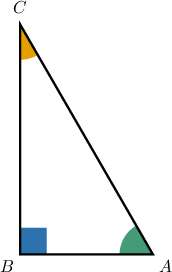
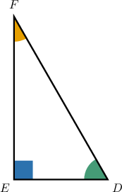
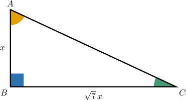
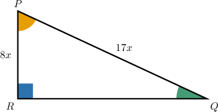
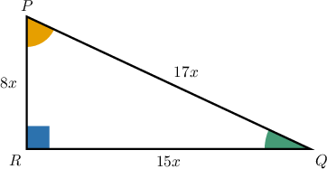

# Calculating Trigonometric Ratios From Descriptions

Source: https://www.mathacademy.com/topics/6175?courseId=120
Topic ID: 6175

## Prerequisites

- [Trigonometric Functions of Complementary Angles](../../../high-school/traditional/lessons/geometry/510-trigonometric-functions-of-complementary-angles.md)
- [The Power of Product Rule With Algebraic Expressions](../../../high-school/traditional/lessons/algebra-i/1331-the-power-of-product-rule-with-algebraic-expressions.md)
- [Using the Pythagorean Identity in the First Quadrant](../../../high-school/traditional/lessons/algebra-ii/1453-using-the-pythagorean-identity-in-the-first-quadrant.md)
- [The Square Root of a Perfect Square With Domain Restrictions](../../../high-school/traditional/lessons/algebra-i/3729-the-square-root-of-a-perfect-square-with-domain-restrictions.md)

## Lesson

### Introduction

Recall that in right triangles, trigonometric ratios such as sine and cosine describe the relationships between the sides and angles. If we know one trigonometric ratio, we can often use it to determine other ratios.

For example, consider $\triangle ABC,$ where $\angle B$ is the right angle, as shown below.

Suppose we are told that $\sin A = \dfrac{2}{3}.$ What is the value of $\cos C?$

Recall that in such a triangle,

- the sine of the acute angle $\angle A$ is given by

- the cosine of the acute angle $\angle C$ is given by

Notice that the leg that is adjacent to $\angle C$ is the same as the leg that is opposite to $\angle A{:}$

$$

{\color{blue}\text{adjacent to C}} = {\color{blue}\text{opposite to A}}

$$

Therefore, we have that

$$

\begin{aligned}cos⁡𝐶 & =\frac{adjacent to C}{hypotenuse} \\ & =\frac{opposite to A}{hypotenuse} \\ & =sin⁡𝐴 \\ & =\frac{2}{3}.\end{aligned}

$$

Let's see some more examples.

### Example: Identifying Relations Between Trigonometric Cofunctions

#### Question

In $\triangle DEF,$ where $\angle E$ is the right angle, we have that $\tan D = \dfrac{\sqrt{11}}{2}.$ What is the value of $\cot F?$

#### Explanation

Consider the right triangle $\triangle DEF$ with the right angle $\angle E$ shown above.

Recall that in such a triangle,

- the tangent of the acute angle $\angle D$ is given by

- the cotangent of the acute angle $\angle F$ is given by

Notice that the leg that is adjacent to $\angle F$ is the same as the leg that is opposite to $\angle D{:}$

$$

\text{adjacent to F} = \text{opposite to D}

$$

Also, the leg that is opposite to $\angle F$ is the same as the leg that is adjacent to $\angle D{:}$

$$

\text{opposite to F} = \text{adjacent to D}

$$

Therefore, we have that

$$

\begin{aligned}cot⁡𝐹 & =\frac{adjacent to F}{opposite to F} \\ & =\frac{opposite to D}{adjacent to D} \\ & =tan⁡𝐷 \\ & =\frac{\sqrt{11}}{2}.\end{aligned}

$$

### Example: Computing Tangent and Cotangent of Complementary Angles

#### Question

Suppose in $\triangle ABC,$ we have that $\angle B = 90^\circ.$ Given that $\tan A = \sqrt{7},$ what is the value of $\tan C?$

#### Explanation

Recall that the tangent of an acute angle in a right triangle is given by the ratio of the opposite leg to the adjacent leg. So,

$$

𝐴

$$

We're told that $\tan A = \sqrt{7}.$ So, the ratio of the opposite to $\angle A$ leg and the adjacent to $\angle A$ leg must be

$$

\sqrt{7} : 1.

$$

A sketch of $\triangle ABC$ is shown below (drawn not to scale), where $x$ denotes some positive constant.

Therefore, we have

$$

\begin{aligned}tan⁡𝐶 & =\frac{opposite to C}{adjacent to C} \\ & =\frac{𝑥}{\sqrt{7}𝑥} \\ & =\frac{1}{\sqrt{7}}.\end{aligned}

$$

### Example: Computing Sine, Cosine, Secant, and Cosecant of Complementary Angles

#### Question

Suppose in $\triangle PRQ,$ we have that $\angle R = 90^\circ.$ Given that $\cos P = \dfrac{8}{17},$ what is the value of $\cos Q?$

#### Explanation

Recall that the cosine of an acute angle in a right triangle is given by the ratio of the adjacent leg to the hypotenuse. So,

$$

𝑃

$$

We're told that $\cos P = \dfrac{8}{17}.$ So, the ratio of the adjacent to $\angle P$ leg and the hypotenuse must be

$$

8 : 17.

$$

A sketch of $\triangle PRQ$ is shown below (drawn not to scale), where $x$ denotes some positive constant.

According to the Pythagorean theorem, we have that

$$

PR^2 + RQ^2 = PQ^2.

$$

Solving this for $RQ,$ we obtain the following:

$$

\begin{aligned}𝑅𝑄 & =\sqrt{𝑃𝑄^{2}−𝑃𝑅^{2}} \\ & =\sqrt{(17𝑥)^{2}−(8𝑥)^{2}} \\ & =\sqrt{289𝑥^{2}−64𝑥^{2}} \\ & =\sqrt{225𝑥^{2}} \\ & =15𝑥\end{aligned}

$$

Let's add this to our sketch.

Therefore, we have

$$

\begin{aligned}cos⁡𝑄 & =\frac{adjacent to Q}{hypotenuse} \\ & =\frac{15𝑥}{17𝑥} \\ & =\frac{15}{17}.\end{aligned}

$$

### Example: Simplifying an Expression With Cofunction Identities

#### Question

Write an equivalent expression for the following

$$

(\sin 22^\circ)(\cos 68^\circ) + (\cos 22^\circ)(\sin 68^\circ).

$$

#### Explanation

First, notice that all the answer choices only involve trigonometric functions of $22^\circ.$ So, we need to rewrite the original expression entirely in terms of $22^\circ.$

Since $68^\circ = 90^\circ - 22^\circ,$ we can do this with the cofunction identities

$$

\sin(90^\circ - \theta) = \cos\theta, \qquad \cos(90^\circ - \theta) = \sin\theta.

$$

Replacing every instance of $68^\circ$ with $90^\circ - 22^\circ,$ we have

$$

(\sin 22^\circ)(\cos (90^\circ - 22^\circ)) + (\cos 22^\circ)(\sin (90^\circ - 22^\circ)).

$$

Applying the cofunction identities, the expression becomes

$$

(\sin 22^\circ)(\sin 22^\circ) + (\cos 22^\circ)(\cos 22^\circ)

$$

which we can write as

$$

(\sin 22^\circ)^2 + (\cos 22^\circ)^2

$$

which further simplifies to $1$ by the Pythagorean identity.
