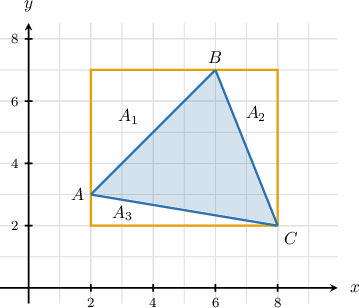
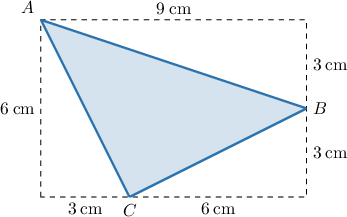
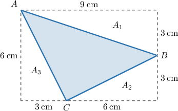
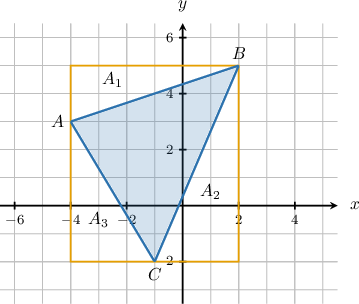

# Areas of Inscribed Triangles

Source: https://www.mathacademy.com/topics/6178?courseId=120
Topic ID: 6178

## Prerequisites

- [The Area Between Two Shapes](../../../middle-school/lessons/grade-7/1435-the-area-between-two-shapes.md)
- [Calculating Areas of Triangles and Quadrilaterals in the Plane](../../../high-school/traditional/lessons/geometry/2977-calculating-areas-of-triangles-and-quadrilaterals-in-the-plane.md)

## Lesson

### Introduction

In this lesson, we'll explore how to find the area of an arbitrary triangle in the coordinate plane.

Consider $\triangle ABC$ with vertices

$$

A(2,3), \qquad B(6,7), \qquad C(8,2),

$$

as shown below.

Finding the area of this triangle using the usual methods is tricky because it's not easy to determine the length of the perpendicular height to a given base. So instead, we will proceed using an indirect method.

First, we notice that we can **inscribe** our triangle within the rectangle shown in the diagram below.

Inscribing a triangle in a rectangle means drawing a rectangle around the triangle in such a way that the triangle lies completely inside the rectangle and each of the triangles vertices touches the rectangle.

We have the rectangle, whose area we denote by $A_{\square},$ and four triangles:

- $\triangle ABC,$ whose area $A_{\triangle}$ we're required to determine,

- the right triangle with hypotenuse $\overline{AB}$ and area that we denote by $A_1,$

- the right triangle with hypotenuse $\overline{BC}$ and area that we denote by $A_2,$

- the right triangle with hypotenuse $\overline{AC}$ and area that we denote by $A_3.$

Recall that the area of a figure consisting of several smaller non-overlapping parts is equal to the sum of the areas of those parts. So, we have

$$

A_{\square} = A_{\triangle} + A_1 + A_2 + A_3

$$

which means that

$$

A_{\triangle} = A_{\square} - A_1 - A_2 - A_3.

$$

In other words, the area of the required (blue) triangle equals the area of the orange rectangle minus the areas of the three triangles with areas $A_1, A_2,$ and $A_3.$ Notice that it's much easier to find the areas of these three triangles compared to the blue triangle, since their bases and heights are easily determined from the diagram.

Let's now compute all the areas on the right-hand side of this equation.

- For the area of the rectangle, we have

- For the area of the right triangle with hypotenuse $\overline{AB},$ we have

- For the area of the right triangle with hypotenuse $\overline{BC},$ we have

- For the area of the right triangle with hypotenuse $\overline{AC},$ we have

Therefore, the area of $\triangle ABC$ is

$$

A_{\triangle} = 30 - 8 - 5 - 3 = 14

$$

square units.

### Example: Finding the Area of a Triangle Inscribed in a Rectangle

#### Question

The triangle $\triangle ABC$ is inscribed in a rectangle as depicted on the diagram above. Find the area of $\triangle ABC.$

#### Explanation

We have the rectangle, whose area we denote by $A_{\square},$ and four triangles:

- $\triangle ABC,$ whose area $A_{\triangle}$ we're required to determine,

- the right triangle with hypotenuse $\overline{AB}$ and area $A_1,$

- the right triangle with hypotenuse $\overline{BC}$ and area $A_2,$

- the right triangle with hypotenuse $\overline{AC}$ and area $A_3.$

Recall that the area of a figure consisting of several smaller non-overlapping parts is equal to the sum of the areas of those parts. So, we have

$$

A_{\square} = A_{\triangle} + A_1 + A_2 + A_3

$$

which means that

$$

A_{\triangle} = A_{\square} - A_1 - A_2 - A_3.

$$

Let's now compute all the areas on the right-hand side of this equation.

- For the area of the rectangle, we have

- For the area of the right triangle with hypotenuse $\overline{AB},$ we have

- For the area of the right triangle with hypotenuse $\overline{BC},$ we have

- For the area of the right triangle with hypotenuse $\overline{AC},$ we have

Therefore, the area of $\triangle ABC$ is

$$

A_{\triangle} = 54 - 13.5 - 9 - 9 = 22.5 \: \text{cm}^2.

$$

### Example: Finding the Area of a Triangle in the Coordinate Plane

#### Question

Find the area of the triangle with vertices $(-4,3),$ $(2,5),$ and $(-1,-2).$

#### Explanation

First, note that we can inscribe our triangle within the rectangle shown in the diagram below.

We have the rectangle, whose area we denote by $A_{\square},$ and four triangles:

- $\triangle ABC,$ whose area $A_{\triangle}$ we're required to determine,

- the right triangle with hypotenuse $\overline{AB}$ and area $A_1,$

- the right triangle with hypotenuse $\overline{BC}$ and area $A_2,$

- the right triangle with hypotenuse $\overline{AC}$ and area $A_3.$

Recall that the area of a figure consisting of several smaller non-overlapping parts is equal to the sum of the areas of those parts. So, we have

$$

A_{\square} = A_{\triangle} + A_1 + A_2 + A_3

$$

which means that

$$

A_{\triangle} = A_{\square} - A_1 - A_2 - A_3.

$$

Let's now compute all the areas on the right-hand side of this equation.

- For the area of the rectangle, we have

- For the area of the right triangle with hypotenuse $\overline{AB},$ we have

- For the area of the right triangle with hypotenuse $\overline{BC},$ we have

- For the area of the right triangle with hypotenuse $\overline{AC},$ we have

Therefore, the area of $\triangle ABC$ is

$$

A_{\triangle} = 42 - 6 - 10.5 - 7.5 = 18

$$

square units.
