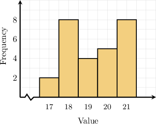
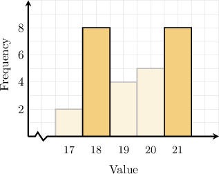
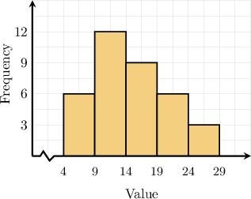
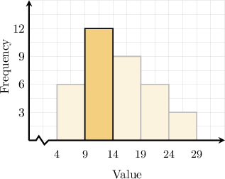
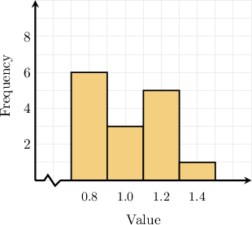
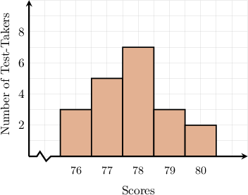
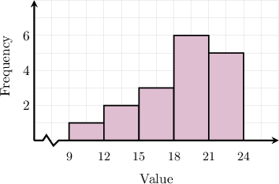
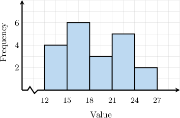

# Calculating Modes and Medians From Histograms

Source: https://www.mathacademy.com/topics/6190?courseId=120
Topic ID: 6190

## Prerequisites

- [Histograms](../../../middle-school/lessons/grade-6/2510-histograms.md)
- [Calculating Medians From Frequency Tables](../../../middle-school/lessons/grade-7/6177-calculating-medians-from-frequency-tables.md)
- [Calculating Modes From Frequency Tables](../../../middle-school/lessons/grade-7/6186-calculating-modes-from-frequency-tables.md)

## Lesson

### Introduction

In this lesson, we'll learn how to determine the mean, median, and mode from a histogram.

Let's begin with the mode. For example, what is the mode of the dataset represented by the histogram below?

The mode is the value or values that appear most frequently in a dataset.

From a histogram, we can directly compare the heights of each bar to see how often each value occurs.

In this case, the tallest bars correspond to the values $18$ and $21,$ which both appear in the dataset $8$ times. Since both of these values occur most frequently and with equal frequency, the dataset is **bimodal** (i.e., it has two modes). Therefore, the modes are $18$ and $21.$

Let's now examine an example involving grouped data.

### Example: Determining Modes From Histograms

#### Question

The histogram above shows how many values from a dataset fall into each group. What is the modal group of the dataset?

#### Explanation

When data is grouped into intervals, the modal group is the group with the highest frequency.

From a histogram, we can directly compare the bar heights to see how often values from each group occurs.

In our case, the tallest bar corresponds to the group $9-14,$ which has a frequency of $12,$ more than any other group.

Therefore, the modal group of the dataset is $9-14.$

### Calculating Medians

What is the median of the dataset given by the histogram below?

To find the median from a histogram, we first convert the histogram into a *cumulative frequency* table.

In our case, the cumulative frequency table corresponding to this histogram is given below.

Thus, the total number of values in our data set equals $15.$ Since this is an odd number, the median is the value in the following position:

$$

\begin{aligned}\frac{15+1}{2}=\frac{16}{2}=8th\end{aligned}

$$

Now we determine where the $8$th value falls. Looking at the cumulative frequency column in our table, we see the following:

- The first row of the table covers the first $6$ positions.

- Up to the second row, the table covers $9$ positions in total.

So, the $8$th value falls in the second row and corresponds to the value $1.0.$ Therefore, the median is

$$

\begin{aligned}Median=1.0\end{aligned}

$$

### Example: Calculating Medians From Histograms

#### Question

A teacher recorded the scores earned by students on a test. The histogram above shows the number of students who earned each score. What was the median score?

#### Explanation

To find the median from the histogram, we first organize the data in a frequency table.

The horizontal axis shows the test scores, and the vertical axis shows the number of students who earned each score.

In our case, we build the frequency table below and compute cumulative frequencies.

Thus, the total number of values is Since is even, the median is the average of the values in positions Thus, we need the and values.

Looking at the cumulative frequency column in our table, we see the following:

- Up to the second row, the table covers positions in total.

- Up to the third row, the table covers positions in total.

So, the th and th positions both fall in the third row and correspond to the value Therefore, the median is

### Estimating Medians When the Data Is Grouped

When *grouped* data is displayed in a histogram, we can only *estimate* the median. This is because we don't know the exact values that make up our data set.

To estimate the median in such cases, we create a cumulative frequency table as before, and then find the *group* in which the median lies.

Let’s see how this works with an example. In which group does the median of the following dataset lie?

The cumulative frequency table corresponding to this histogram is as follows:

Thus, the total number of values is

$$

1+2+3+6+5=17.

$$

Since $17$ is an odd number, the median is in the following position:

$$

\dfrac{17+1}{2}=\dfrac{18}{2}=9\text{th}

$$

Now we determine where the $9$th value falls. Looking at the cumulative frequency column in our table, we see the following:

- Up to the third row, the table covers $6$ positions in total.

- Up to the fourth row, the table covers $12$ positions in total.

Therefore, the $9$th value falls in the fourth interval, which is

$$

18-21.

$$

So, the true median lies somewhere between $18$ and $21.$

### Example: Estimating Medians From Histograms

#### Question

The histogram above shows how many values from a dataset fall into each group. Which of the following values could be the median of the dataset?

1. $17.5$

2. $20$

3. $22$

#### Explanation

To estimate the median from a histogram, we first convert the histogram into a frequency table.

On a histogram with groups, the horizontal axis shows the value groups, and the vertical axis tells us how many values fall into each group.

In our case, we build the frequency table below and compute cumulative frequencies.

There are $20$ total values in the dataset. Since this is an even number, the median is the average of the values in positions

$$

\dfrac{20}{2} = 10 \qquad \text{and} \qquad 10 + 1 = 11.

$$

Now we determine where the $10$th and $11$th values fall. Looking at the cumulative frequency column in our table, we see the following:

- Up to the second row, the table covers $10$ positions in total.

- Up to the third row, the table covers $13$ positions in total.

So, we have that

- the $10$th value falls in the second row corresponding to the group $15-18,$ while

- the $11$th value falls in the third row corresponding to the group $18-21.$

The median could fall in either of these groups. Of the given options:

- Option I, $17.5,$ ** within the group $15-18,$ so ** the median.

- Option II, $20,$ ** within the group $18-21,$ so ** the median.

- Option III, $22,$ ** within either group $15-18$ or $18-21,$ so ** the median.

Therefore, the correct answer is "I and II only".
