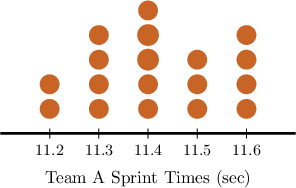
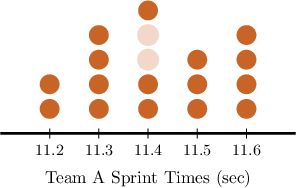
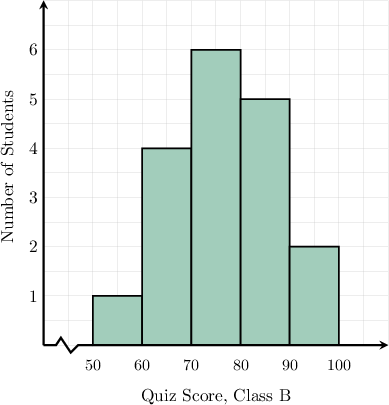

# Comparing Medians

Source: https://www.mathacademy.com/topics/6192?courseId=120
Topic ID: 6192

## Prerequisites

- [Box Plots](../../../middle-school/lessons/grade-6/2482-box-plots.md)
- [Measuring Centrality From Dot Plots](../../../middle-school/lessons/grade-6/2500-measuring-centrality-from-dot-plots.md)
- [Calculating Modes and Medians From Histograms](../../../middle-school/lessons/grade-7/6190-calculating-modes-and-medians-from-histograms.md)

## Lesson

### Introduction

We often want a single number that gives us a sense of the "typical" or "average" value in a data set. This is where measures of central tendency, such as the median, become especially useful.

The median identifies the *middle value* in a data set when the numbers are arranged in order. This makes the median a powerful tool for comparing two groups, especially when extreme values (outliers) might distort the mean.

For example, suppose a nutrition study compared the number of servings of fruits and vegetables eaten per week by participants in two different communities. Let's assume we know that participants in community A had a median of $7.0$ servings per week, and the results for participants in community B are as follows:

$$

4,\quad 5,\quad 6,\quad 6,\quad 8,\quad 10,\quad 10

$$

By comparing the median values of communities A and B, what can we say about their relative fruit and vegetable consumption?

Let's start by computing the median of community B's results. Since there are $7$ data points, the median is the middle value:

$$

4,\quad 5,\quad 6,\quad {\color{blue}6},\quad 8,\quad 10,\quad 10

$$

Therefore, the median of community B is

$$

\textrm{Median}(B) = 6

$$

Since $7 > 6,$ community A's median is higher, which *suggests* that participants in community A consumed more fruits and vegetables overall.

Note the following:

- It's crucial to recognize that there are various methods for comparing two data sets. Comparing the medians is only one way.

- Examining multiple measures together provides a more comprehensive view of the data.

- In the example above, while comparing the medians might *suggest* that community A consumed more, we would need to gather more evidence—by considering the mean, mode, and the overall spread of values—to draw a fairer conclusion.

### Example: Comparing Medians

#### Question

Pam and Barbara both drive to work every day. Over the past week, Pam spent the following amount of money each day on gas:

$$

13, \quad 15, \quad 18, \quad 20, \quad 20, \quad 21

$$

If Barbara spent a median of $25$ per day on gas, which of the following statement are true?

1. Pam's median daily fuel expense is $19$.

2. Barbara's median daily fuel expense is greater than Pam's.

3. A comparison of the medians suggests that Pam spends more money on gas per day than Barbara.

#### Explanation

Let's examine the statements one by one.

- Statement I is true. Notice that Pam's data set is already arranged from smallest to greatest. Since the data set has an even number of data points ($6$), the median is the mean of the two middle numbers: The median of the data set is Therefore, Pam's median daily fuel expense is $19.$

- Statement II is true. Indeed, Barbara and Pam's median daily fuel expenses are $25$ and $19$, respectively.

- Statement III is false. Since Pam's median is smaller, there is no suggestion that Pam spends more on gas per day than Barbara.

Therefore, the correct answer is "I and II only."

### Example: Comparing Medians From Frequency Tables

#### Question

Two grocery stores, store $A$ and store $B,$ recorded how many items customers purchased in a day. The cumulative frequency tables above summarize the data from each store, where the data from store $A$ is on the left, and store $B$'s data is on the right. Which store has the smaller median?

#### Explanation

Let's compute the medians for the datasets in turn.

- The total number of values for store $A$ is $20.$ Since our data set has an even number of data points, the median is the average of the two middle values in the positions Now, let’s determine where the $10$th and $11$th values fall. Looking at the cumulative frequency column in the left table, we see the following: Up to the second row, the table covers $7$ positions in total. Up to the third row, the table covers $11$ positions in total. So, the $10$th and $11$th values both fall into the third row corresponding to the value $35$ (items purchased). Therefore, the median is

- The total number of values for store $B$ is $27.$ Since our data set has an odd number of data points, the median is the value in position Now, let’s determine where the $14$th value falls. Looking at the cumulative frequency column in the right table, we see the following: Up to the second row, the table covers $8$ positions. Up to the third row, the table covers $23$ positions. So, the $14$th value falls into the third row corresponding to the value $38$ (items purchased). Therefore, the median is

As a result, we conclude that the median of store A is smaller than the median of store B.

### Example: Comparing Medians From Box Plots or Dot Plots

#### Question

Team B had a median sprint time of seconds. The dot plot above shows Team A's sprint times. A comparison of the medians suggests which team was faster overall?

#### Explanation

The median is the middle value in an ordered data set. It separates the lower half from the upper half.

To find the median for Team A, notice that the number of data points () is even. This means the median is the average of the two middle values: the th and th positions.

From the cumulative counts, the th and th data points both fall at so the median is

Since Team A’s median sprint time is smaller than Team B’s.

Therefore, based on the median values, Team A was faster overall.

### Example: Comparing Medians From Histograms

#### Question

Two different classes took the same 100-point quiz. The median score in Class A was $67$ points. The histogram above shows the distribution of scores in Class B. Based on the median values, which class performed better on the quiz?

#### Explanation

The median is the middle value in an ordered data set. It separates the lower half from the upper half.

On a histogram with groups, the horizontal axis shows the value groups, and the vertical axis tells us how many values fall into each group.

To find the median for Class B, we build the frequency table below and compute cumulative frequencies.

Class B has a total of $18$ students. Since $18$ is even, the median is the average of the $9$th and $10$th values in the ordered data set.

Both the $9$th and $10$th values fall in the group $70-80.$

So, the median score in Class B lies in the group ${70-80}.$

Since every score in the group $70-80$ is greater than $67,$ the median score in Class B is greater than the median score in Class A.

Based on the median values, students in Class B performed better on the quiz.
