# Equilateral Triangles Inscribed in Circles

Source: https://www.mathacademy.com/topics/6212?courseId=120
Topic ID: 6212

## Prerequisites

- [The Circumference of a Circle](../../../high-school/traditional/lessons/geometry/460-the-circumference-of-a-circle.md)
- [The SSS Congruence Criterion](../../../high-school/traditional/lessons/geometry/531-the-sss-congruence-criterion.md)
- [Areas of Circles](../../../high-school/traditional/lessons/geometry/1745-areas-of-circles.md)
- [The Area of an Equilateral Triangle](../../../high-school/traditional/lessons/geometry/2886-the-area-of-an-equilateral-triangle.md)

## Lesson

### Introduction

An equilateral triangle is **inscribed** in a circle if all three of the triangle's vertices touch the circle, as shown in the diagram below.

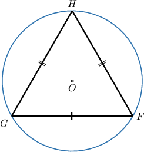

In this lesson, we'll learn how to solve problems involving equilateral triangles inscribed in circles. Solving these kinds of problems often involves deducing key information from this diagram using our knowledge of 30-60-90 triangles.

Let's see how we can create a 30-60-90 triangle from this setup.

First, notice that we can draw three radii, $\overline{OF}, \overline{OG},$ and $\overline{OH},$ from the center of the circle to each of the triangle's vertices, as shown below.

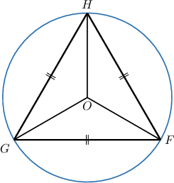

By the SSS congruence criterion, we now have three congruent isosceles triangles, $\triangle{FOG},$ $\triangle{GOH},$ and $\triangle{FOG},$ each with a central angle of $360\div 3 = 120^\circ.$

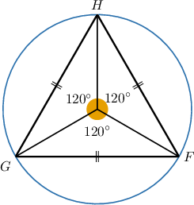

Finally, suppose we draw the altitude $\overline{OK}$ in $\triangle{GOH}$ from the center of the circle to the opposite side. This divides the triangle into two right triangles, $\triangle{GKO}$ and $\triangle{HKO},$ with angles $30^\circ,$ $60^\circ,$ and $90^\circ.$ The 30-60-90 triangle $\triangle GOK$ is shown below.

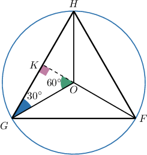

In order to successfully solve problems involving equilateral triangles inscribed in circles, it's important to effortlessly understand how to construct these 30-60-90 triangles. So, let's get some more practice at this in a similar situation.

### Example: Identifying Properties of Equilateral Triangles Inscribed in Circles

#### Question

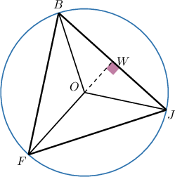

The equilateral triangle $\triangle BFJ$ is inscribed in a circle with center $O,$ as shown above.

Which of the following statements are true?

- $\overline{OJ}$ is the radius of the circle.

- $\triangle{BOJ}$ is an isosceles triangle.

- $\angle{FOB}$ has a measure of $120^\circ.$

- $\triangle{WOJ}$ is a $30$-$60$-$90$ triangle.

- $\angle{OJW}$ has a measure of $30^\circ.$

#### Explanation

The radii, drawn from the center of the circle to each of the triangle’s vertices, form three identical isosceles triangles, each with a central angle of $120^\circ,$ as shown below.

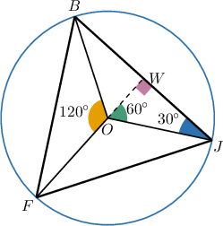

We have the altitude $\overline{OW}$ drawn in one of these isosceles triangles from the center of the circle to the opposite side. This divides the triangle into two right triangles with angles $30^\circ,$ $60^\circ,$ and $90^\circ.$

Therefore, a possible answer could be as follows:

- $\overline{OJ}$ is the radius of the circle.

- $\triangle{BOJ}$ is an isosceles triangle.

- $\angle{FOB}$ has a measure of $120^\circ.$

- $\triangle{WOJ}$ is a $30$-$60$-$90$ triangle.

- $\angle{OJW}$ has a measure of $30^\circ.$

Therefore, all the statements are true.

### Using Properties of 30-60-90 Triangles

We can use the properties of inscribed equilateral triangles discussed earlier to solve problems.

For example, suppose an equilateral triangle is inscribed in a circle, as shown below. What is the side length of the triangle if the radius of the circle is $11$ centimeters?

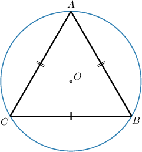

To find the side length of the triangle, we draw radii from the center to each of the triangle’s vertices. This forms three identical isosceles triangles, each with a central angle of $120^\circ,$ as shown below.

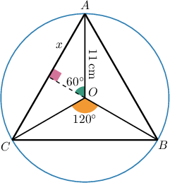

Now, we take one of these isosceles triangles and draw an altitude from the center to the opposite side. This divides the triangle into two right triangles with angles $30^\circ$, $60^\circ$, and $90^\circ.$

In each $30$-$60$-$90$ triangle:

- Let the longer leg, which is opposite the $60^\circ$ angle, be $x.$ Notice that its length is half the length of our equilateral triangle's side length.

- The hypotenuse is a radius of the circle and has length $r = 11\:\text{cm}.$

Recall that, in any $30$-$60$-$90$ triangle, the longer leg is $\dfrac{\sqrt{3}}{2}$ times the hypotenuse. Therefore, we have

$$

\begin{aligned}𝑥 & =𝑟⋅\frac{\sqrt{3}}{2} \\ & =11⋅\frac{\sqrt{3}}{2} \\ & =\frac{11\sqrt{3}}{2}.\end{aligned}

$$

Therefore, our equilateral triangle's side length is

$$

2x = 2 \cdot \frac{11\sqrt{3}}{2} = 11 \sqrt{3} \: \text{cm}.

$$

Let's now consider an example where we need to calculate the area of the equilateral triangle.

### Example: Solving for Triangle Parameters

#### Question

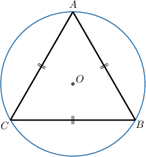

An equilateral triangle is inscribed in a circle, as shown above. What is the area of the triangle if the radius of the circle is $6$ meters?

#### Explanation

To find the area of the triangle, we draw radii from the center to each of the triangle’s vertices. This forms three identical isosceles triangles, each with a central angle of $120^\circ,$ as shown below.

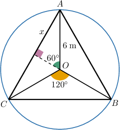

Now, we take one of these isosceles triangles and draw an altitude from the center to the opposite side. This divides the triangle into two right triangles with angles $30^\circ$, $60^\circ$, and $90^\circ.$

In each $30$-$60$-$90$ triangle:

- Let the longer leg, which is opposite the $60^\circ$ angle, be $x.$ Notice that it is half of our equilateral triangle's side length.

- The hypotenuse is a radius of the circle and has a length $r = 6\:\text{m}.$

Next, in the $30$-$60$-$90$ triangle, the longer leg is $\dfrac{\sqrt{3}}{2}$ times the hypotenuse:

$$

\begin{aligned}𝑥 & =𝑟⋅\frac{\sqrt{3}}{2} \\ & =6⋅\frac{\sqrt{3}}{2} \\ & =3\sqrt{3}\end{aligned}

$$

Therefore, our equilateral triangle's side length is

$$

s = 2x = 2 \cdot 3 \sqrt{3} = 6 \sqrt{3} \: \text{m},

$$

and the corresponding area of the triangle is

$$

\begin{aligned}A & =\frac{\sqrt{3}}{4}𝑠^{2} \\ & =\frac{\sqrt{3}}{4}(6\sqrt{3})^{2} \\ & =\frac{\sqrt{3}}{4}⋅108 \\ & =27\sqrt{3}\,m^{2}.\end{aligned}

$$

### Example: Solving for Circle Parameters

#### Question

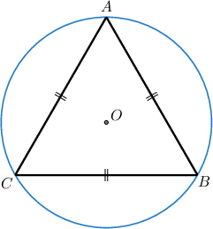

The side of an equilateral triangle is $27$ feet. The three vertices of the triangle lie on a circle, as depicted above. What is the radius of the circle?

#### Explanation

To find the radius of the circle, we draw radii from the center to each of the triangle’s vertices. This forms three identical isosceles triangles, each with a central angle of $120^\circ,$ as shown below.

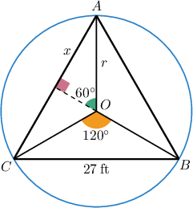

Now, we take one of these isosceles triangles and draw an altitude from the center to the opposite side. This divides the triangle into two right triangles with angles $30^\circ$, $60^\circ$, and $90^\circ.$

In each $30$-$60$-$90$ triangle:

- The length of the longer leg $x,$ which is opposite the $60^\circ$ angle, is half of our equilateral triangle's side length:

- The length of the hypotenuse is the radius $r$ of the circle.

Finally, in a $30$-$60$-$90$ triangle, the longer leg is $\dfrac{\sqrt{3}}{2}$ times the length of the hypotenuse:

$$

\begin{aligned}𝑥 & =𝑟⋅\frac{\sqrt{3}}{2} \\ 13.5 & =𝑟⋅\frac{\sqrt{3}}{2} \\ 𝑟 & =\frac{2}{\sqrt{3}}⋅13.5 \\ & =\frac{27}{\sqrt{3}} \\ & =\frac{27}{\sqrt{3}}⋅\frac{\sqrt{3}}{\sqrt{3}} \\ & =\frac{27\sqrt{3}}{3} \\ & =9\sqrt{3}.\end{aligned}

$$

Therefore, the radius of the circle is $9 \sqrt{3} \: \text{ft}.$
