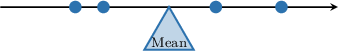
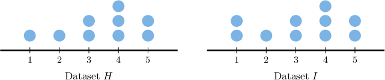
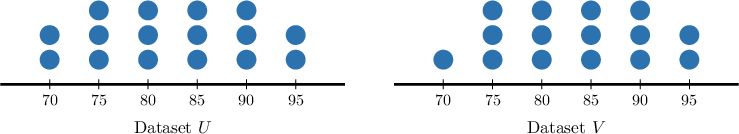
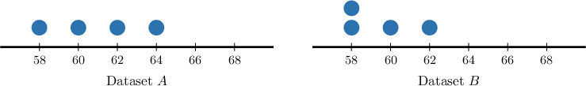
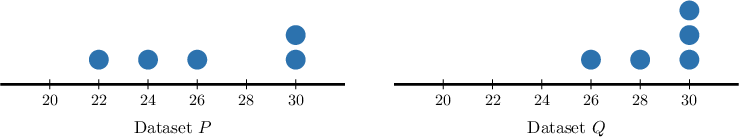
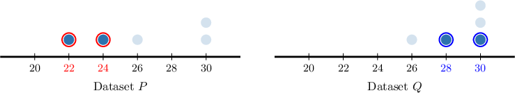

# Effects of Data Change on the Mean

Source: https://www.mathacademy.com/topics/6221?courseId=120
Topic ID: 6221

## Prerequisites

- [Symmetry, Skew, and Outliers](../../../middle-school/lessons/grade-6/2502-symmetry-skew-and-outliers.md)
- [Comparing Means](../../../middle-school/lessons/grade-7/6191-comparing-means.md)

## Lesson

### Introduction

In this lesson, we'll explore how changes to a dataset affect its mean.

In general, whenever a new data point is added to a data set, the mean of the dataset moves *toward* that new data point:

- If the new value is *less* than the current mean, the overall mean *decreases.*

- If the new value is *greater* than the current mean, the overall mean *increases.*

Intuitively, the mean acts like a “balance point” of the data.

When we add a new value, that balance shifts slightly in the direction of the new point. If the new value is smaller than the current mean, then the balance must move down to account for it, pulling the mean to a lower value.

Similarly, whenever we add a new point that's greater than the current mean, the balance shifts upward.

**Note**: If the new data point equals the mean of the previous data set, then the mean does not change!

### A Concrete Example

Suppose we have the following dataset:

$$

30, \; 30, \; 30, \; 30

$$

Note that the mean of this data set is $30{:}$

$$

\begin{aligned}mean & =\frac{30+30+30+30}{4} \\ & =\frac{4⋅30}{4} \\ & =30\end{aligned}

$$

Now, suppose a new data point with a value of $\color{blue}24$ is added to create a new dataset.

$$

{\color{blue}{24}}, \; 30, \; 30, \; 30, \; 30

$$

In this example, the new value $({{\color{blue}{24}}})$ is *less than* the original mean ($30$). As a result, the mean will *decrease* when this data point is included. Therefore, the mean of the new dataset is *smaller* than the mean of the original dataset.

We can convince ourselves that this is true by calculating the mean of the second data set and showing that it's smaller than $30{:}$

$$

\begin{aligned}mean(new) & =\frac{24+30+30+30+30}{5} \\ & =28.8 \\ & <30\end{aligned}

$$

Indeed, the mean of the new dataset *is* smaller than that of the original, as predicted!

### Another Example

Now, consider two new datasets, $H$ and $I,$ represented by the dot plots below. How do their means compare?

First, note that the datasets are nearly identical. The difference is that dataset $I$ has an additional data point with a value $1.$

Therefore, we can use the same method as before to determine the direction in which the mean shifts. Remember, when a new data point is added, the mean of the dataset moves *toward* that new data point:

- If the new value is *less* than the current mean, the overall mean decreases.

- If the new value is *greater* than the current mean, the overall mean increases.

By examining the dot plot, we estimate that the mean of dataset $H$ is *approximately* $3.5.$

The new value of $1$ is less than the mean of dataset $H.$ As a result, the overall mean will *decrease* when this data point is included.

Therefore, we conclude that

$$

\text{mean}(H) > \text{mean}(I).

$$

### Example: Comparing Means of Datasets That Differ By Adding One Data Point

#### Question

The table below shows the daily water usage (in liters) for five households.

A sixth household uses $12$ liters, and this value is added to the original dataset of five households to create a new dataset. Which dataset has a greater mean?

#### Explanation

When a new data point is added, the mean of the dataset moves ** that new data point:

- If the new value is ** than the current mean, the overall mean decreases.

- If the new value is ** than the current mean, the overall mean increases.

The values in the original dataset range from $18$ to $22.$ So, the mean of the original dataset lies somewhere in this range, around $20$ (calculating, the mean is actually $20$).

The new value of $12$ must be less than the original mean, as it lies below the range. As a result, the overall mean will ** when this data point is included.

Therefore, the mean of the original dataset is ** because the new value is less than the mean of the original dataset.

### Removing a Data Point

When we *remove* a data point from a dataset to create a new dataset, the mean of the dataset moves *away from* that data point.

This means:

- If the removed value is *less* than the current mean, the overall mean *increases.*

- If the removed value is *greater* than the current mean, the overall mean *decreases.*

Let's see an example.

### Example: Comparing Means of Datasets That Differ By Removing One Data Point

#### Question

The two dot plots above show the distributions of datasets $U$ and $V,$ where dataset $V$ is formed by removing a single data point from dataset $U.$ Which dataset has the greater mean?

#### Explanation

First, notice that dataset $V$ is the result of removing a data point with a value of $70$ from dataset $U.$

When a new data point is removed, the mean of the dataset moves ** that data point:

- If the removed value is ** than the current mean, the overall mean **

- If the removed value is ** than the current mean, the overall mean **

By examining the dot plot, we estimate that the mean of dataset $U$ is ** $82.5.$

The removed value of $70$ is less than the approximate mean of dataset $U.$ As a result, the overall mean will ** when this data point is removed.

Therefore, the mean of dataset $U$ is less than the mean of dataset $V$ because the data point with a value of $70$ in dataset $U$ is less than the mean of dataset $U.$

Therefore, dataset $V$ has the greater mean.

### Comparing the Net Change

Suppose we have a dataset, and we *change* some of its values to create a new dataset. How can we determine how the change in values affects the mean?

When some data points are changed, the mean of the new dataset moves *in the same direction* as the **net change** in the values, where the net change is given by

$$

\text{net change} = \text{sum of new values} - \text{sum of old values}.

$$

In general:

- If there is a net increase, the overall mean increases.

- If there is a net decrease, the overall mean decreases.

- If there is no net change, the overall mean stays the same.

For example, consider the dot plots for the datasets $A$ and $B$ shown below, where dataset $B$ is formed by changing one of the values in dataset $A.$

Note the following:

- The data point in dataset $A$ but not in dataset $B$ (old data point) has a value of ${\color{red}64}.$

- Similarly, the data point in dataset $B$ but not in dataset $A$ (new data point) has a value of ${\color{blue}58}.$

Hence, the net change in the values is

$$

\text{sum of new values} - \text{sum of old values} = ({\color{blue}58}) - ({\color{red}64}) = -6.

$$

Since the net change is *negative*, there is an overall net *decrease.* As a result, the overall mean will *decrease* when the data point’s value is changed. This means that the mean of dataset $B$ is smaller than the mean of dataset $A.$

Let's now consider an example where two data values are changed to form a new data set.

### Example: Comparing Data Sets That Differ by One or More Data Points

#### Question

The two dot plots above show the distributions of datasets $P$ and $Q.$ Compare the means and medians of both data sets.

#### Explanation

First, notice that dataset $Q$ is the result of changing the value of several data points from dataset $P.$

When some data points are changed, the mean of the dataset moves ** as the net change in the values:

- If there is a net increase, the overall mean increases.

- If there is a net decrease, the overall mean decreases.

- If there is no net change, the overall mean stays the same.

Note the following:

- The data points in dataset $P$ but not in dataset $Q$ (old data points) have values ${\color{red}22}$ and ${\color{red}24}.$

- Similarly, the data points in dataset $Q$ but not in dataset $P$ (new data points) have values ${\color{blue}28}$ and ${\color{blue}30}.$

Hence, the net change in the values is

$$

\begin{aligned}sum of new values−sum of old values & =(28+30)−(22+24) \\ & =58−46 \\ & =12.\end{aligned}

$$

Since the net change is positive, there is an overall net increase. As a result, the overall mean will ** when the data points' values are changed.

Therefore, the mean of dataset P is $\boxed{\text{less than}}$ the mean of dataset $Q$ because there is a $\boxed{\text{net increase}}$ in the values from dataset $P$ to dataset $Q.$

### Recovering a Sum From the Mean

Recall that the sum of the values in a dataset is the product of the mean and the number of values.

For example, if a dataset has $12$ data points and its mean is $52,$ then the sum $S$ of the data points equals

$$

S = 52 \cdot 12 = 624.

$$

We can use this idea to determine the value of an added or removed data point when we know the means and number of data points for two data sets. Let's see an example.

### Example: Finding the Value of a Data Point Given the Means of Two Datasets

#### Question

A battery test involved $18$ devices. The mean battery life measured per device was $9.5$ hours. After one device is removed from the dataset, the mean for the remaining devices drops to $9.2$ hours. How many hours of battery life did the removed device have?

#### Explanation

The sum of the values in a dataset is the product of the mean and the number of values.

Let $S_{\text{orig}}$ be the total hours for all $18$ devices, and let $S_{\text{new}}$ be the total for the remaining $17$ devices. So, the sums are:

$$

\begin{aligned}𝑆_{orig} & =18⋅9.5=171.0 \\ 𝑆_{new} & =17⋅9.2=156.4.\end{aligned}

$$

The removed device’s battery life is the difference between these totals:

$$

S_{\text{orig}} - S_{\text{new}} = 171.0 - 156.4 = 14.6.

$$

Therefore, the removed device had $14.6$ hours of battery life.
