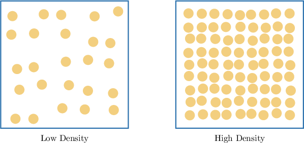

# Density

Source: https://www.mathacademy.com/topics/6234?courseId=120
Topic ID: 6234

## Prerequisites

- [Volumes of Cubes](../../../high-school/traditional/lessons/geometry/1467-volumes-of-cubes.md)
- [Selecting Units for Rates of Change](../../../high-school/traditional/lessons/algebra-i/2231-selecting-units-for-rates-of-change.md)

## Lesson

### Introduction

Suppose two objects $A$ and $B$ have equal size and volume, yet object $B$ "feels heavier" than object $A.$

When we discuss how "heavy" or "light" an object feels compared to another of the same size, we are actually describing its **density**. Density is a unit rate that measures the amount of mass packed into a given volume.

The density $\rho$ of an object is defined by the formula

$$

\rho = \dfrac{m}{V},

$$

where

- $m$ is the mass, and

- $V$ is the volume.

For example, suppose a wooden crate has a mass of $20$ pounds and a volume of $2.5$ cubic feet. What is the density, in pounds per cubic foot, of the crate?

In this problem,

- the mass is $m = 20$ pounds, and

- the volume is $V = 2.5$ cubic feet.

Substituting these values into the density formula, we get

$$

\rho = \frac{20}{2.5} = 8.

$$

Therefore, the density of the crate is $8$ pounds per cubic foot.

### Example: Computing Density Given Mass and Volume

#### Question

A sugar cube has a mass of $216$ grams and each edge has a length of $6$ centimeters. What is the density, in grams per cubic centimeter, of the cube?

#### Explanation

Density is defined as the ratio of mass to volume:

$$

\rho = \dfrac{m}{V}

$$

Since the object is a cube, its volume is given by

$$

V = s^3,

$$

where $s$ is the length of an edge.

In this problem,

- the mass is $m = 216$ grams, and

- the edge length is $s = 6$ centimeters, so the volume is

Substituting these values into the formula, we get

$$

\rho = \frac{216}{216} = 1.

$$

Therefore, the density is $1$ gram per cubic centimeter.

### Example: Computing Mass Given Density and Volume

#### Question

A concrete block has a density of $8$ pounds per cubic foot and a volume of $7$ cubic feet. What is the mass, in pounds, of the block?

#### Explanation

Density is defined as the ratio of mass to volume:

$$

\rho = \dfrac{m}{V}

$$

Here, we want to find the mass $m{:}$

$$

m = \rho \cdot V

$$

In this problem,

- the density is $\rho = 8$ pounds per cubic foot, and

- the volume is $V = 7$ cubic feet.

Substituting these values into the formula, we get

$$

m = 8 \cdot 7 = 56.

$$

Therefore, the mass is $56$ pounds.

### Example: Computing Volume Given Mass and Density

#### Question

A large tank has a mass of $200$ pounds and a density of $25$ pounds per cubic foot. What is the volume, in cubic feet, of the tank?

#### Explanation

Density is defined as the ratio of mass to volume:

$$

\rho = \dfrac{m}{V}

$$

Here, we want to find the volume $V{:}$

$$

V = \dfrac{m}{\rho}

$$

In this problem,

- the mass is $m = 200$ pounds, and

- the density is $\rho = 25$ pounds per cubic foot.

Substituting these values into the formula, we get

$$

V = \dfrac{200}{25} = 8.

$$

Therefore, the volume is $8$ cubic feet.
