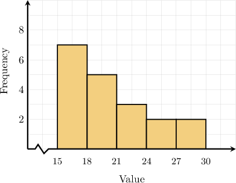
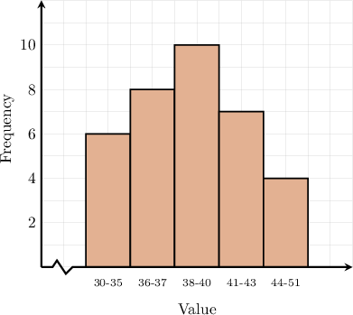
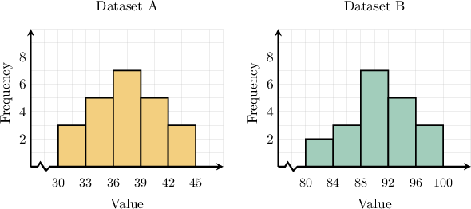
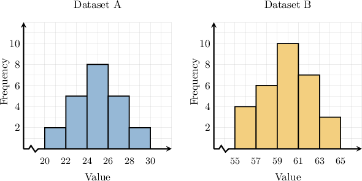

# Bounding Statistics for Grouped Data

Source: https://www.mathacademy.com/topics/6276?courseId=120
Topic ID: 6276

## Prerequisites

- [Function Composition](../../../high-school/traditional/lessons/algebra-i/1985-function-composition.md)
- [Symmetry, Skew, and Outliers](../../../middle-school/lessons/grade-6/2502-symmetry-skew-and-outliers.md)
- [Comparing Means](../../../middle-school/lessons/grade-7/6191-comparing-means.md)
- [Comparing Medians](../../../middle-school/lessons/grade-7/6192-comparing-medians.md)
- [Optimizing Sums, Differences, Products, and Quotients](./6287-optimizing-sums-differences-products-and-quotients.md)

## Lesson

### Introduction

When data is grouped into intervals, it is not possible to determine the median exactly. However, we can *estimate* it. We saw how to estimate the median for grouped data in a previous lesson.

When we estimate the median, its actual value might be higher or lower than our estimate. In this lesson, we'll learn how to *bound* the median, which means determining its maximum or minimum possible values.

Let's consider an example. The frequency table below shows the number of values in a dataset that fall into each group.

Let's determine the *smallest and largest possible values* of the median.

To estimate the median from grouped data, we first compute cumulative frequencies.

Thus, the total number of values is $21.$ Since this is an odd number, the median is the value in the following position:

$$

\dfrac{21+1}{2}=\dfrac{22}{2}=11\text{th}.

$$

Now, we determine where the $11$th value falls. Looking at the cumulative frequency column in our table, we see the following:

- Up to the third row, the table covers $9$ positions in total.

- Up to the fourth row, the table covers $12$ positions in total.

Therefore, the $11$th value falls in the fourth interval, which is

$$

32 - 36

$$

as shown below.

Therefore,

- the *smallest possible value* of the median is $32,$ and

- the *largest possible value* of the median is $36.$

### Example: Finding a Lower or Upper Bound for the Median

#### Question

The histogram above shows the number of values in a dataset that fall into each group. What is the smallest possible value of the median?

#### Explanation

To estimate the median from a histogram, we first convert the histogram into a frequency table.

On a histogram with groups, the horizontal axis shows the value groups, and the vertical axis tells us how many values fall into each group.

In our case, we build the frequency table below and compute cumulative frequencies.

Thus, the total number of values is $7+5+3+2+2=19.$ Since this is an odd number, the median is the value in position

$$

\dfrac{19+1}{2}=\dfrac{20}{2}=10.

$$

Now we determine where the $10$th value falls. Looking at the cumulative frequency column in our table, we see the following:

- Up to the first row, the table covers $7$ positions in total.

- Up to the second row, the table covers $12$ positions in total.

Therefore, the $10$th value falls in the second interval, which is

$$

18 - 21

$$

as shown below.

Therefore, the smallest possible value of the median is $18.$

### Bounding the Mean

OK, so we know how to find the maximum and minimum possible values for the median of a grouped data set. But what about the mean?

The frequency table below shows the number of values in a dataset that fall into each group. Let's determine the *smallest possible value* of the mean for this data set.

The process for determining the smallest possible value for the mean is similar to how we estimate the mean. However, instead of using the middle value for each group, we use the *smallest possible value* of $x$ for each group.

So, we begin by recording $x_{\text{min}},$ the smallest possible value of $x$ for each group.

Then, we calculate $f\cdot x_{\text{min}}$ for each row.

Therefore, the smallest possible value of the mean is

$$

\begin{aligned}smallest possible mean & =\frac{40+42+90+44+156}{4+3+5+2+6} \\ & =\frac{372}{20} \\ & =18.6.\end{aligned}

$$

The procedure for calculating the *maximum* possible value of the mean is similar. The only difference is that we multiply the *maximum* value of the categorical variable $x$ in each row by its respective frequency. Let's see an example.

### Example: Finding a Lower or Upper Bound for the Mean

#### Question

The frequency table above shows the number of values in a dataset that fall into each group. Rounded to one decimal place, what is the largest possible value of the mean?

#### Explanation

To estimate the mean from grouped data, we first use the frequency table.

Since we wish to find the ** of the mean, we record $x_{\text{max}},$ the largest possible value of $x$ for each group.

Then, we calculate $f\cdot x_{\text{max}}$ for each row.

Therefore, the largest possible value of the mean is

$$

\begin{aligned}largest possible mean & =\frac{100+196+62+170+111}{4+7+2+5+3} \\ & =\frac{639}{21} \\ & ≈30.4\end{aligned}

$$

rounded to one decimal place.

### Example: Finding a Lower or Upper Bound for the Range

#### Question

The histogram above shows the number of values in a dataset that fall into each group. What is the smallest possible value of the range?

#### Explanation

To calculate the smallest possible range, we take the smallest possible maximum value and subtract the largest possible minimum value.

Let's start by turning our histogram into a frequency table.

Looking at the table,

- the smallest possible maximum value is $44,$ and

- the largest possible minimum value is $35.$

Therefore, the smallest possible range is

$$

44 - 35 = 9.

$$

### Bounding the Difference Between Two Statistics

Finally, we'll discuss how to bound the *difference* between two statistics. This is often useful when comparing two data sets, and we want to see how large or small differences in their metrics could be.

The histograms above show the distribution of two datasets. What is the *largest possible difference* between the **mean** of dataset $B$ and the **median** of dataset $A$? We can write this symbolically as follows.

$$

\max\left(\text{mean}(B) - \text{median}(A)\right)

$$

To find the *largest possible difference* between the mean of $B$ and the median of $A,$ we must find the difference between

- the *largest* possible mean of dataset $B,$ and

- the *smallest* possible median of dataset $A.$

The difference we wish to find can be written as follows:

$$

\max\left(\text{mean}(B)\right) - \min\left(\text{median}(A)\right)

$$

Let's compute each of these values in turn.

- First, we find the largest possible mean of dataset $B.$ We start by writing down our data set as a frequency table. Since we wish to find the *largest possible value* of the mean, we record $x_{\text{max}},$ the *largest* possible value of $x$ for each group. Then, we calculate $f\cdot x_{\text{max}}$ for each row. The results are shown below. Value $(x)$ Frequency $(f)$ $x_{\text{max}}$ $f\cdot x_{\text{max}}$ $80-84$ $2$ $84$ $2\cdot 84 = 168$ $84-88$ $3$ $88$ $3\cdot 88 = 264$ $88-92$ $7$ $92$ $7\cdot 92 = 644$ $92-96$ $5$ $96$ $5\cdot 96 = 480$ $96-100$ $3$ $100$ $3\cdot 100 = 300$ Therefore, the largest possible value of the mean is

- Next, we compute the smallest possible median of $A{:}$ Since the histogram for dataset $A$ is symmetric, the median must lie in the group $36 - 39.$ Therefore, the *smallest* possible value of the median is

Finally, we conclude that the largest possible difference between the mean of $B$ and the median of $A$ is

$$

\begin{aligned}max(mean(𝐵))−min(median(𝐴)) & =92.8−36 \\ & =56.8.\end{aligned}

$$

### Example: Finding the Largest or Smallest Possible Difference Between Two Statistics

#### Question

The histograms above show the distribution of two datasets. Rounded to one decimal place, what is the **** between the **** of dataset $B$ and the **** of dataset $A?$

#### Explanation

To find the ** between the mean of $B$ and the median of $A,$ we must find the difference between

- the ** possible mean of dataset $B,$ and

- the ** possible median of dataset $A.$

The difference we wish to find can be written as follows:

$$

\min\left(\text{mean}(B)\right) - \max\left(\text{median}(A)\right)

$$

Let's compute each of these values in turn.

- First, we find the smallest possible mean of dataset $B.$ We start by writing down our dataset as a frequency table. Since we wish to find the ** of the mean, we record $x_{\text{min}},$ the ** possible value of $x$ for each group. Then, we calculate $f \cdot x_{\text{min}}$ for each row. The results are shown below. Value $(x)$ Frequency $(f)$ $x_{\text{min}}$ $f \cdot x_{\text{min}}$ $55-57$ $4$ $55$ $4\cdot 55 = 220$ $57-59$ $6$ $57$ $6\cdot 57 = 342$ $59-61$ $10$ $59$ $10\cdot 59= 590$ $61-63$ $7$ $61$ $7\cdot 61 = 427$ $63-65$ $3$ $63$ $3\cdot 63 = 189$ Therefore, the smallest possible value of the mean is rounded to three decimal places.

- Next, we compute the largest possible median of $A{:}$ Since the histogram for dataset $A$ is symmetric, the median must lie in the group $24-26$. Therefore, the smallest possible value of the median is

Finally, we conclude that the smallest possible difference between the mean of $B$ and the median of $A$ is

$$

\begin{aligned}min(mean(𝐵))−max(median(𝐴)) & =58.933−26.0 \\ & ≈32.9\end{aligned}

$$

rounded to one decimal place.
