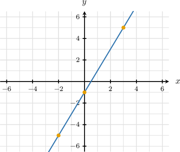

# Linear Functions in Tabular Form

Source: https://www.mathacademy.com/topics/6279?courseId=120
Topic ID: 6279

## Prerequisites

- [Equations of Lines in Standard Form](../../../high-school/traditional/lessons/algebra-i/839-equations-of-lines-in-standard-form.md)
- [Modeling With Linear Functions](../../../high-school/traditional/lessons/algebra-i/2220-modeling-with-linear-functions.md)
- [Graphs of Functions](../../../high-school/traditional/lessons/algebra-i/3821-graphs-of-functions.md)

## Lesson

### Introduction

In this lesson, we want to practice connecting tables of values to linear functions, building on what we know about equations and graphs of lines so we can move smoothly between all three representations.

Let’s see an example, where we are given the graph of a function and use it to fill in a table of values that lie on the line.

The diagram above shows the graph of $y=f(x)$ in the coordinate plane, where $f$ is a linear function. Let's fill in the missing values in the table below for points that lie on the line.

From the graph, we can see that the points $(-2, -5),$ $(0, -1),$ and $(3, 5)$ lie on the line.

Now, we’ll analyze each of these points in turn:

- For $(-2, -5){:}$ the function value is $-5$ when $x=-2.$

- For $(0, -1){:}$ when $x=0,$ the corresponding function value is $-1.$

- For $(3, 5){:}$ when $x=3,$ the corresponding function value is $5.$

Therefore, the filled-in table is the following:

### Example: Identifying a Table Corresponding to a Linear Function

#### Question

For the linear function $f(x) = 7x + 1,$ complete the table below with the corresponding $f(x)$ values for the given $x$-values.

#### Explanation

To find the missing values in the table, we substitute each $x$ into $f(x) = 7x + 1.$

For $x = -1{:}$

$$

\begin{aligned}𝑓(−1) & =7(−1)+1 \\ & =−7+1 \\ & =−6\end{aligned}

$$

For $x = 1{:}$

$$

\begin{aligned}𝑓(1) & =7(1)+1 \\ & =7+1 \\ & =8\end{aligned}

$$

For $x = 2{:}$

$$

\begin{aligned}𝑓(2) & =7(2)+1 \\ & =14+1 \\ & =15\end{aligned}

$$

Therefore, the filled-in table is the following:

### Example: Identifying a Table Corresponding to a Linear Function in Standard Form

#### Question

For the linear relationship $4x + 2y = 12$, complete the table below with the corresponding $y$-values for the given $x$-values.

#### Explanation

Notice that each table gives function values at $x=-2,0,$ and $2.$

To determine which table is correct, we first express $y$ in terms of $x{:}$

$$

\begin{aligned}4𝑥+2𝑦 & =12 \\ 2𝑦 & =12−4𝑥 \\ 𝑦 & =6−2𝑥\end{aligned}

$$

Now, we’ll analyze each of the given values of $x$ in turn.

- For $x = -2{:}$

- For $x = 0{:}$

- For $x = 2{:}$

Therefore, the filled-in table is the following:

### Identifying Linear Functions Corresponding to Tables

Now, let’s look at the case where we are given a table of values from a line and work backwards to determine the equation of the linear function.

Some values of $x$ and the corresponding values of $y$ are shown in the table above. There is a linear relationship between $x$ and $y.$ Which of the following equations defines this relationship?

Since the relationship is linear, we know it must be of the form

$$

y = mx + c

$$

where

- $m$ is the slope, and

- $c$ is the $y$-intercept.

First, we find the slope using two points. For $(x_1, y_1) = (-1, -10)$ and $(x_2, y_2) = (2, 2),$ we have

$$

\begin{aligned}𝑚 & =\frac{𝑦_{2}−𝑦_{1}}{𝑥_{2}−𝑥_{1}} \\ & =\frac{2−(−10)}{2−(−1)} \\ & =\frac{12}{3} \\ & =4.\end{aligned}

$$

So, the slope is $4.$

Next, we find the $y$-intercept using one point. For $(x_2, y_2) = (2,2),$ we have

$$

\begin{aligned}𝑦 & =4𝑥+𝑐 \\ 2 & =4(2)+𝑐 \\ 2 & =8+𝑐 \\ 𝑐 & =−6.\end{aligned}

$$

So, the equation is $y = 4x - 6.$

### Example: Identifying a Linear Function Given a Corresponding Table

#### Question

Some values of $x$ and the corresponding values of $y$ are shown in the table above. There is a linear relationship between $x$ and $y.$ Find this relationship, and express it in standard form.

#### Explanation

Since the relationship is linear, we know it must be of the form

$$

y = mx + c

$$

where

- $m$ is the slope, and

- $c$ is the $y$-intercept.

First, we find the slope using two points. For $(x_1, y_1) = (-2, -5)$ and $(x_2, y_2) = (1, 1),$ we have

$$

\begin{aligned}𝑚 & =\frac{𝑦_{2}−𝑦_{1}}{𝑥_{2}−𝑥_{1}} \\ & =\frac{1−(−5)}{1−(−2)} \\ & =\frac{6}{3} \\ & =2.\end{aligned}

$$

So, the slope is $2.$

Next, we find the $y$-intercept using one point. For $(x_2, y_2) = (1, 1),$ we have

$$

\begin{aligned}𝑦 & =2𝑥+𝑐 \\ 1 & =2(1)+𝑐 \\ 1 & =2+𝑐 \\ 𝑐 & =−1.\end{aligned}

$$

So, the equation is $y = 2x - 1.$ Finally, rearranging into standard form, we get

$$

\begin{aligned}𝑦 & =2𝑥−1 \\ −2𝑥+𝑦 & =−1 \\ 2𝑥−𝑦 & =1.\end{aligned}

$$

### Example: Identifying Linear Functions in Tabular Form: Word Problems

#### Question

An engineer tracks the linear relationship between rope length, $\ell,$ and the weight supported, $w,$ in kilograms, of a particular load-balancing machine. Which equation represents the linear relationship between $\ell$ and $w?$ Express your answer in standard form.

#### Explanation

Since the relationship is linear, it can be written as

$$

w = m\ell + c

$$

where

- $m$ is the slope, and

- $c$ is the $y$-intercept.

First, we find the slope $m$ using the points $(\ell_1, w_1) = (4,22)$ and $(\ell_2, w_2) = (8,33){:}$

$$

\begin{aligned}𝑚 & =\frac{𝑤_{2}−𝑤_{1}}{ℓ_{2}−ℓ_{1}} \\ & =\frac{33−22}{8−4} \\ & =\frac{11}{4}\end{aligned}

$$

Then, we find the $w$-intercept using the point $(\ell_1, w_1) = (4,22){:}$

$$

\begin{aligned}𝑤 & =\frac{11}{4}ℓ+𝑐 \\ 22 & =\frac{11}{4}(4)+𝑐 \\ 22 & =11+𝑐 \\ 𝑐 & =11\end{aligned}

$$

Therefore, the equation is $w = \dfrac{11}{4}\ell + 11.$ Finally, rearranging into standard form, we get

$$

\begin{aligned}𝑤 & =\frac{11}{4}ℓ+11 \\ 4𝑤 & =4(\frac{11}{4}ℓ+11) \\ 4𝑤 & =11ℓ+44 \\ 4𝑤−11ℓ & =44.\end{aligned}

$$
