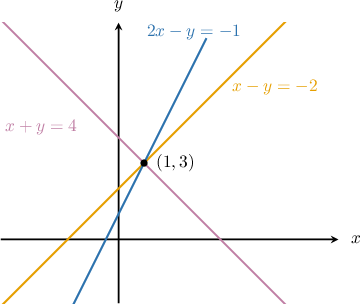
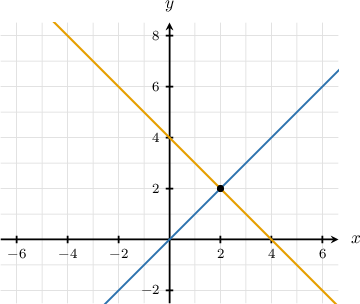

# Larger Systems of Equations

Source: https://www.mathacademy.com/topics/6282?courseId=120
Topic ID: 6282

## Prerequisites

- [Solving Systems of Nonlinear Equations Using Graphs](../../../high-school/traditional/lessons/algebra-i/101-solving-systems-of-nonlinear-equations-using-graphs.md)
- [Systems of Equations With No Solutions and Infinitely Many Solutions](../../../high-school/traditional/lessons/algebra-i/493-systems-of-equations-with-no-solutions-and-infinitely-many-solutions.md)

## Lesson

### Introduction

When working with a system of equations, we may already know how many solutions it has (for example, exactly one, infinitely many, or none). If we then add another equation to the system, the number of solutions may change.

To determine how many solutions the new system has, we check whether the solutions of the original system also satisfy the additional equation.

For example, consider the following systems of equations:

$$

\begin{aligned}𝑥−𝑦=−2 \\ 𝑥+𝑦=4\end{aligned}

$$

We can use the substitution or elimination methods to show that the unique solution to this system is $(1,3).$

Now, suppose we create a *new* system by adding the equation ${\color{blue}{2x-y}}={\color{blue}{-1}}$ to the original.

$$

\begin{aligned}𝑥−𝑦=−2 \\ 𝑥+𝑦=4 \\ 2𝑥−𝑦=−1\end{aligned}

$$

How many solutions will the resulting system of three equations have?

First, note that since $(x,y)=(1,3)$ is the unique solution of the *original* system of two equations, this point satisfies both equations of the original system.

But a solution $(x,y)$ of the new system must satisfy *all three equations*. Thus, we must also check that $(1,3)$ satisfies the third equation for it to be a solution of the new system.

Let's check this by substituting $x=1$ and $y=3$ into the third equation ${\color{blue}{2x-y}}={\color{blue}{-1}}.$

$$

\begin{aligned}2𝑥−𝑦 & =−1 \\ 2(1)−3 & =−1 \\ −1 & =−1\,✓\end{aligned}

$$

So, $(1,3)$ satisfies the additional equation, meaning it's a solution to the new system. No other values simultaneously satisfy the original equations, so no other solutions exist.

Therefore, the new system has *exactly one solution.*

### Example: Determining the Number of Solutions to a System of Three Equations

#### Question

The unique solution to a system of two equations is $(x,y)=(0,-1).$ A new system is created by adding the equation $x-y^{2}=4.$ How many solutions will the resulting system of three equations have?

#### Explanation

We are told that $(x,y)=(0,-1)$ is the unique solution of the original system of two equations. So, this point satisfies both equations of the original system.

A solution $(x,y)$ of the new system must satisfy all three equations. Thus, $(0,-1)$ is a solution of the new system if it satisfies the third equation. Let's check this by substituting $x=0$ and $y=-1$ into it:

$$

\begin{aligned}𝑥−𝑦^{2} & =4 \\ 0−(−1)^{2} & =4 \\ −1 & =4\,×\end{aligned}

$$

So, $(0,-1)$ does not satisfy the additional equation, meaning it's not a solution to the new system.

Therefore, the new system has no solution.

### Example: Determining the Number of Solutions to a System of Three Equations (Graphical)

#### Question

If a new system of three equations is created using the system of equations represented by the graph above and the equation $x+2y=6,$ how many solutions will the resulting system of three equations have?

#### Explanation

The solution to the system represented by the given graph corresponds to the point where the two lines intersect. Here, the lines intersect at the point $(x,y)=(2,2).$ So, this point satisfies both equations of the original system.

A solution $(x,y)$ of the new system must satisfy all three equations. Thus, $(2,2)$ is a solution of the new system if it satisfies the third equation. Let's check this by substituting $x=2$ and $y=2$ into it:

$$

\begin{aligned}𝑥+2𝑦 & =6 \\ 2+2(2) & =6 \\ 6 & =6\,✓\end{aligned}

$$

So, $(2,2)$ satisfies the additional equation, meaning it's a solution to the new system.

Therefore, the new system has exactly one solution.

### Example: Calculating the Number of Solutions to a System of Three Equations in Simple Cases

#### Question

$$

\begin{aligned}𝑥=4 \\ 𝑦=−2 \\ 3𝑥−𝑦=14\end{aligned}

$$

How many solutions does the system of three equations above have?

#### Explanation

Notice that the first and the second equations are solved for $x$ and $y.$ So, $(x,y)=(4,-2)$ is the solution to the system consisting of the first two equations.

A solution $(x,y)$ of the original system must satisfy all three equations. Thus, $(4,-2)$ is a solution of the original system if it satisfies the third equation. Let's check this by substituting $x=4$ and $y=-2$ into it:

$$

\begin{aligned}3𝑥−𝑦 & =14 \\ 3(4)−(−2) & =14 \\ 14 & =14\,✓\end{aligned}

$$

So, $(4,-2)$ satisfies the additional equation, meaning it's a solution to the original system.

Therefore, the new system has exactly one solution.

### Example: Calculating the Number of Solutions to a System of Three Equations

#### Question

$$

\begin{aligned}2𝑥−𝑦=4 \\ 4𝑥−𝑦=6 \\ \frac{𝑦}{𝑥^{2}}=−2\end{aligned}

$$

How many solutions does the system of three equations above have?

#### Explanation

Notice that the first and the second equations are linear. Let's solve the system consisting only of these two equations first:

$$

\begin{aligned}2𝑥−𝑦=4 \\ 4𝑥−𝑦=6\end{aligned}

$$

From the first equation, we have

$$

\begin{aligned}2𝑥−𝑦 & =4 \\ −𝑦 & =4−2𝑥 \\ 𝑦 & =2𝑥−4.\end{aligned}

$$

Substituting this into the second equation, we get the following:

$$

\begin{aligned}4𝑥−𝑦 & =6 \\ 4𝑥−(2𝑥−4) & =6 \\ 4𝑥−2𝑥+4 & =6 \\ 2𝑥+4 & =6 \\ 2𝑥 & =2 \\ 𝑥 & =1.\end{aligned}

$$

So, we have

$$

\begin{aligned}𝑦 & =2𝑥−4 \\ & =2(1)−4 \\ & =−2,\end{aligned}

$$

and $(x,y)=(1,-2)$ is the solution to our system of two equations.

A solution $(x,y)$ of the original system must satisfy all three equations. Thus, $(1, -2)$ is a solution of the original system if it satisfies the third equation. Let's check this by substituting $x=1$ and $y=-2$ into it:

$$

\begin{aligned}\frac{𝑦}{𝑥^{2}} & =−2 \\ \frac{−2}{1^{2}} & =−2 \\ −2 & =−2\,✓\end{aligned}

$$

So, $(1,-2)$ satisfies the additional equation, meaning it's a solution to the original system.

Therefore, the new system has exactly one solution.
