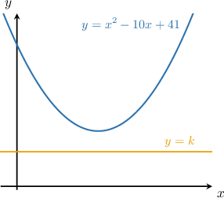
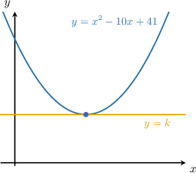

# Determining Unknown Parameters in Quadratic Systems With One Intersection Point

Source: https://www.mathacademy.com/topics/6291?courseId=120
Topic ID: 6291

## Prerequisites

- [Determining Unknown Parameters in Quadratic Equations With One Real Solution](../../../high-school/traditional/lessons/algebra-i/6266-determining-unknown-parameters-in-quadratic-equations-with-one-real-solution.md)
- [Finding Intersections of Lines and Quadratic Functions](../../../high-school/traditional/lessons/algebra-i/6341-finding-intersections-of-lines-and-quadratic-functions.md)

## Lesson

### Introduction

Consider the parabola $y=x^2-10+41$ and the horizontal line $y = k$ where $k$ is a real parameter. For *some* values of $k,$ the parabola and line will *not* intersect, as shown in the diagram below.

Now, it's easy to see that if we *increase* $k,$ there will be a single value in which the parabola and line intersect at *exactly one* point.

What is the value of $k$ in this case?

If the line $y=k$ intersects the parabola $y=x^2 - 10x + 41,$ we must have

$$

x^2 - 10x + 41 = k.

$$

So, our initial geometric problem can now be reduced to a pure algebraic form. We need to determine the value of $k$ such that the above equation has exactly one real solution.

Recall that a quadratic equation has exactly one real root if the discriminant is zero:

$$

\mathcal{D} = 0

$$

First, we rewrite the equation in standard quadratic form:

$$

\begin{aligned}𝑥^{2}−10𝑥+41 & =𝑘 \\ 𝑥^{2}−10𝑥+41−𝑘 & =0 \\ 𝑥^{2}−10𝑥+(41−𝑘) & =0\end{aligned}

$$

The coefficients of our quadratic equation are the following:

$$

a = 1, \qquad b = -10, \qquad c = 41-k

$$

So, computing the discriminant, we get

$$

\begin{aligned}D & =𝑏^{2}−4𝑎𝑐 \\ & =(−10)^{2}−4(1)(41−𝑘) \\ & =100−164+4𝑘 \\ & =4𝑘−64.\end{aligned}

$$

To have exactly one real solution, we need $\mathcal{D} = 0{:}$

$$

\begin{aligned}4𝑘−64 & =0 \\ 4𝑘 & =64 \\ 𝑘 & =\frac{64}{4} \\ 𝑘 & =16\end{aligned}

$$

Therefore, we conclude that the line $y = k$ and the parabola $y = x^2-10x+41$ intersect at precisely one point if $k=16.$

### Example: Quadratic Systems With Horizontal Lines

#### Question

$$

\begin{aligned}𝑦=−2𝑥^{2}+20𝑥−60 \\ 𝑦=𝑘\end{aligned}

$$

If the graphs of the equations given in the system of equations above, where $k$ is a constant, intersect at exactly one point in the $xy$-plane, what is the value of $k?$

#### Explanation

The line $y=k$ intersects the parabola $y=-2x^2 + 20x - 60$ where

$$

-2x^2 + 20x - 60 = k.

$$

We need to determine the value of $k$ such that this equation has one real solution.

A quadratic equation has exactly one real root if the discriminant is zero: $\mathcal{D} = 0.$

First, rewrite the equation in standard quadratic form:

$$

\begin{aligned}−2𝑥^{2}+20𝑥−60 & =𝑘 \\ −2𝑥^{2}+20𝑥+(−60−𝑘) & =0\end{aligned}

$$

The coefficients of our quadratic equation are the following:

$$

a = -2, \qquad b = 20, \qquad c = -60 - k

$$

So, computing the discriminant, we get

$$

\begin{aligned}D & =𝑏^{2}−4𝑎𝑐 \\ & =(20)^{2}−4(−2)(−60−𝑘) \\ & =400+8(−60−𝑘) \\ & =400−480−8𝑘 \\ & =−80−8𝑘.\end{aligned}

$$

To have exactly one real solution, we need $\mathcal{D} = 0{:}$

$$

\begin{aligned}−80−8𝑘 & =0 \\ −8𝑘 & =80 \\ 𝑘 & =−\frac{80}{8} \\ 𝑘 & =−10\end{aligned}

$$

Thus, the equation of the line is $y=-10.$

### Example: Quadratic Systems With Sloped Lines

#### Question

$$

\begin{aligned}𝑦=−5𝑥^{2}+10𝑥−1 \\ 𝑦=4𝑥−𝑘\end{aligned}

$$

The graphs of the equations given in the system of equations above, where $k$ is a constant, intersect at exactly one point in the $xy$-plane. Find the point of intersection.

#### Explanation

The line $y=4x - k$ intersects the parabola $y=-5x^2 + 10x - 1$ where

$$

-5x^2 + 10x - 1 = 4x - k.

$$

We need to determine the value of $k$ such that this equation has one real solution.

A quadratic equation has exactly one real root if the discriminant is zero: $\mathcal{D} = 0.$

First, rewrite the equation in standard quadratic form:

$$

\begin{aligned}−5𝑥^{2}+10𝑥−1 & =4𝑥−𝑘 \\ −5𝑥^{2}+10𝑥−1−4𝑥+𝑘 & =0 \\ −5𝑥^{2}+6𝑥+(𝑘−1) & =0\end{aligned}

$$

The coefficients of our quadratic equation are the following:

$$

a = -5, \qquad b = 6, \qquad c = k-1

$$

So, computing the discriminant, we get

$$

\begin{aligned}D & =𝑏^{2}−4𝑎𝑐 \\ & =6^{2}−4(−5)(𝑘−1) \\ & =36+20(𝑘−1) \\ & =36+20𝑘−20 \\ & =16+20𝑘.\end{aligned}

$$

To have exactly one real solution, we need $\mathcal{D} = 0{:}$

$$

\begin{aligned}16+20𝑘 & =0 \\ 20𝑘 & =−16 \\ 𝑘 & =−\frac{16}{20} \\ 𝑘 & =−\frac{4}{5}\end{aligned}

$$

Thus, the equation of the line is

$$

y=4x-\left(-\dfrac{4}{5}\right)=4x+\dfrac{4}{5}.

$$

To find the $x$-coordinate, we solve the original quadratic equation, as follows:

$$

\begin{aligned}−5𝑥^{2}+6𝑥+(−\frac{4}{5}−1) & =0 \\ −5𝑥^{2}+6𝑥−\frac{9}{5} & =0 \\ −25𝑥^{2}+30𝑥−9 & =0 \\ −(25𝑥^{2}−30𝑥+9) & =0 \\ −(5𝑥−3)^{2} & =0 \\ 5𝑥−3 & =0 \\ 𝑥 & =\frac{3}{5}\end{aligned}

$$

Finally, we find the $y$-coordinate by substituting $x=\dfrac{3}{5}$ into one of the two equations and solving:

$$

\begin{aligned}𝑦 & =4\,(\frac{3}{5})+\frac{4}{5} \\ & =\frac{12}{5}+\frac{4}{5} \\ & =\frac{16}{5}\end{aligned}

$$

Therefore, the point of intersection is $\Big(\dfrac{3}{5},\dfrac{16}{5}\Big).$
