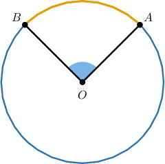
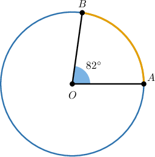
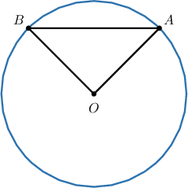
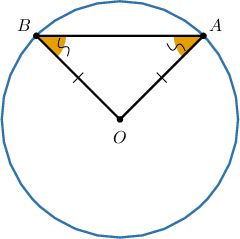
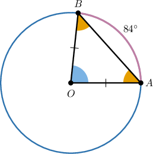
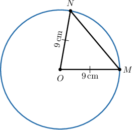
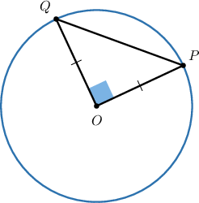

# Isosceles Triangles in Circles

Source: https://www.mathacademy.com/topics/6299?courseId=120
Topic ID: 6299

## Prerequisites

- [The Distance Formula](../../../high-school/traditional/lessons/geometry/459-the-distance-formula.md)
- [Central Angles and Arcs](../../../high-school/traditional/lessons/geometry/550-central-angles-and-arcs.md)
- [The Perimeter of a Polygon](../../../middle-school/lessons/grade-7/1386-the-perimeter-of-a-polygon.md)
- [The Isosceles Triangle Theorem](../../../middle-school/lessons/grade-8/1403-the-isosceles-triangle-theorem.md)

## Lesson

### Introduction

Suppose we draw a circle with center $O,$ and place any two distinct points $A$ and $B$ on the circle. If we connect points $A$ and $B$ to the center $O,$ then we create a central angle $\angle{AOB}$ and an arc $\overset{\frown}{AB}.$

Notice that the central angle $\angle{AOB}$ *subtends* the arc $\overset{\frown}{AB},$ and since the measure of a central angle is equal to the measure of its intercepted arc, their measures must be equal: $m\angle{AOB} = m\overset{\frown}{AB}.$

### Example: Determining the Central Angle Corresponding to an Arc and Vice Versa

#### Question

Point $O$ is the center of a circle, and points $A$ and $B$ lie on the circumference. The measure of angle $\angle AOB$ is $82^\circ.$ What is the measure, in degrees, of its associated arc $\overset{\frown}{AB}?$

#### Explanation

The central angle $\angle AOB$ subtends arc $\overset{\frown}{AB},$ and since the measure of a central angle is equal to the measure of its intercepted arc, we have

$$

m \overset{\frown}{AB} = 82\,^\circ.

$$

### Isosceles Triangles in Circles

Consider again our circle with center $O$ connected to any two distinct points $A$ and $B$ on the circle. If we also connect the points $A$ and $B,$ then we create the triangle $\triangle{OAB},$ as shown below.

Notice that $\overline{OA}$ and $\overline{OB}$ are both radii of the circle, so must have equal measures: $OA=OB.$ As a result, we immediately see that *triangle $\triangle{OAB}$ is isoceles*.

Furthermore, by the Isosceles Triangle Theorem, *the two non-central angles are congruent*: $m\angle{OAB} = m\angle{ABO}.$

This simple observation—that connecting two points on a circle to the circle’s center creates an isosceles triangle—is used frequently in circle geometry. Let's see how in the next example.

### Example: Determining Base Angles of Central Triangles

#### Question

A circle has center $O,$ and points $A$ and $B$ lie on the circle. The measure of arc $\overset{\frown}{AB}$ is $84^\circ.$ What is the measure of $\angle OAB,$ in degrees?

#### Explanation

Since $\overline{OA}$ and $\overline{OB}$ are both radii of the circle, triangle $OAB$ is isosceles with $OA = OB.$ Thus, the base angles $\angle OAB$ and $\angle OBA$ are congruent.

In $\triangle OAB,$ the measures of the interior angles sum to $180^\circ{:}$

$$

m\angle OAB + m\angle OBA + m\angle AOB = 180^\circ

$$

We are given that $m\overset{\frown}{AB} = 84^\circ.$ Since $\angle AOB$ is the central angle corresponding to arc $\overset{\frown}{AB},$ we have

$$

m\angle AOB = 84^\circ.

$$

Now, since $m\angle OAB = m\angle OBA,$ we let each equal $x.$ Substituting, we solve for $x{:}$

$$

\begin{aligned}𝑥+𝑥+84^{∘} & =180^{∘} \\ 2𝑥+84^{∘} & =180^{∘} \\ 2𝑥 & =96^{∘} \\ 𝑥 & =48^{∘}\end{aligned}

$$

Therefore, the measure of $\angle OAB$ is

$$

m\angle OAB = 48^\circ.

$$

### Example: Determining Base Lengths of Central Triangles

#### Question

Points $M$ and $N$ lie on a circle with center $O.$ The radius of the circle is $9\,\mathrm{cm}.$ Triangle $OMN$ has a perimeter of $29 \: \text{cm}.$ What is the length, in centimeters, of $MN?$

#### Explanation

The triangle $OMN$ is formed by connecting the center $O$ to two points on the circle, $M$ and $N.$ In this triangle, the segments $\overline{OM}$ and $\overline{ON}$ are both radii of the circle, which means

$$

OM = ON = 9 \: \text{cm}.

$$

Now, the perimeter of triangle $OMN$ is given by

$$

p = OM + ON + MN.

$$

Therefore, since the perimeter of $\triangle OMN$ is $29,$ we can solve for MN the follwoing eqaution:

$$

\begin{aligned}𝑝 & =𝑂𝑀+𝑂𝑁+𝑀𝑁 \\ 29 & =9+9+𝑀𝑁 \\ 29 & =18+𝑀𝑁 \\ 𝑀𝑁 & =29−18 \\ & =11\,cm\end{aligned}

$$

### Example: Determining Base Angles of Central Triangles Using the Distance Formula

#### Question

In the $xy$-plane, a circle has center $O$ with coordinates $(a, b).$ Points $P$ and $Q$ lie on the circle. Point $P$ has coordinates $(a+4, b+\sqrt{18}),$ and $\angle{POQ}$ is a right angle. What is the length of $\overline{PQ}?$

#### Explanation

We are given that $O$ is the center of the circle, and $P$ and $Q$ lie on the circle. Therefore, $\overline{OP}$ and $\overline{OQ}$ are radii of the circle. Hence, $OP = OQ.$

We know that the coordinates of $O$ and $P$ are $(a, b)$ and $(a+4, b+\sqrt{18}),$ respectively. Hence, we can calculate $OP$ using the distance formula:

$$

\begin{aligned}𝑂𝑃 & =\sqrt{√(𝑥_{2}−𝑥_{1})^{2}+(𝑦_{2}−𝑦_{1})^{2}} \\ & =\sqrt{√(𝑎+4−𝑎)^{2}+(𝑏+\sqrt{√18}−𝑏)^{2}} \\ & =\sqrt{√4^{2}+(\sqrt{√18})^{2}} \\ & =\sqrt{√16+18} \\ & =\sqrt{√34}\end{aligned}

$$

Thus, $OQ = OP = \sqrt{34}.$

Finally, $\triangle{POQ}$ is a right triangle because $\angle{POQ}$ is a right angle. Therefore, applying the Pythagorean theorem, we have

$$

\begin{aligned}𝑃𝑄^{2} & =𝑂𝑃^{2}+𝑂𝑄^{2} \\ & =𝑂𝑃^{2}+𝑂𝑃^{2} \\ & =2𝑂𝑃^{2} \\ & =2(\sqrt{√34})^{2} \\ & =2(34) \\ & =68.\end{aligned}

$$

Consequently,

$$

\begin{aligned}𝑃𝑄 & =\sqrt{√68} \\ & =\sqrt{√4⋅17} \\ & =\sqrt{√4}⋅\sqrt{√17} \\ & =2\sqrt{√17}.\end{aligned}

$$
