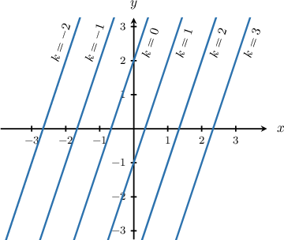

# Linear Functions in Tabular Form Containing Unknown Parameters

Source: https://www.mathacademy.com/topics/6302?courseId=120
Topic ID: 6302

## Prerequisites

- [Solving Many-Variable Equations](../../../high-school/traditional/lessons/algebra-i/354-solving-many-variable-equations.md)
- [Parallel Lines in the Coordinate Plane](../../../high-school/traditional/lessons/algebra-i/837-parallel-lines-in-the-coordinate-plane.md)
- [Analyzing Linear Functions in Tabular Form](./6303-analyzing-linear-functions-in-tabular-form.md)

## Lesson

### Introduction

Sometimes, we may be given a linear function in tabular form and the table itself contains some unknown constants (often called **parameters**). In this lesson, we will learn how to construct the relationship representing the table data.

The table shows two points on a line in the $xy$-plane and their corresponding values of $y,$ where $k$ is a constant. Let's find the equation that represents the line.

Since the points are on a line, we use two points to find the slope and set up the equation.

First, we find the slope using the points $(x_1, y_1)=(k,2)$ and $(x_2, y_2)=(k-1,-1){:}$

$$

\begin{aligned}𝑚 & =\frac{𝑦_{2}−𝑦_{1}}{𝑥_{2}−𝑥_{1}} \\ & =\frac{−1−2}{(𝑘−1)−𝑘} \\ & =\frac{−3}{−1} \\ & =3\end{aligned}

$$

Next, we write the line in point-slope form using the point $(k, 2){:}$

$$

\begin{aligned}𝑦−2 & =𝑚(𝑥−𝑘) \\ 𝑦−2 & =3(𝑥−𝑘)\end{aligned}

$$

Then, we rearrange to write the equation in standard form:

$$

\begin{aligned}𝑦−2 & =3(𝑥−𝑘) \\ 𝑦−2 & =3𝑥−3𝑘 \\ 3𝑘−2 & =3𝑥−𝑦 \\ 3𝑥−𝑦 & =3𝑘−2\end{aligned}

$$

Therefore, the equation of the line is $3x - y = 3k - 2.$

### Interpreting the Result

So, we found that the equation of the linear relationship represented by the data given in the table above is

$$

\begin{aligned}3𝑥−𝑦 & =3𝑘−2\end{aligned}

$$

Notice that the line is expressed in terms of $k.$ The idea is that for each possible value of $k,$ we get a new line. Let's pick a few values of $k,$ determine the corresponding line, and then plot these in the plane.

- If $k=0,$ our line is which simplifies as

- If $k=1,$ our line is which simplifies as

- If $k=2,$ our line is

And so on. We can see that each value of $k$ gives a new line, and in this case, all lines are parallel (since they each have a slope of $3$).

### Example: Expressing a Linear Function in Tabular Form in Terms of an Unknown Parameter

#### Question

The table shows three points on a line in the $yz$-plane and their corresponding values of $z,$ where $b$ is a nonzero constant. Which equation represents the line?

#### Explanation

Since the points lie on a line, we use two points to find the slope and set up the equation.

First, we find the slope using the points $(x_1, y_1)=(-3b, -5)$ and $(x_2, y_2)=(2b, 15){:}$

$$

\begin{aligned}𝑚 & =\frac{𝑦_{2}−𝑦_{1}}{𝑥_{2}−𝑥_{1}} \\ & =\frac{15−(−5)}{\,2𝑏−(−3𝑏)\,} \\ & =\frac{20}{5𝑏} \\ & =\frac{4}{𝑏}\end{aligned}

$$

Next, we write the line in point-slope form using the point $(2b, 15){:}$

$$

\begin{aligned}𝑧−15 & =\frac{4}{𝑏}(𝑦−2𝑏)\end{aligned}

$$

Then, we rearrange to write the equation in standard form:

$$

\begin{aligned}𝑏(𝑧−15) & =4(𝑦−2𝑏) \\ 𝑏𝑧−15𝑏 & =4𝑦−8𝑏 \\ 𝑏𝑧−4𝑦 & =15𝑏−8𝑏 \\ 𝑏𝑧−4𝑦 & =7𝑏\end{aligned}

$$

Therefore, the equation is $bz - 4y = 7b.$

### Determining Unknown Parameters

Earlier, we found that the equation of the linear relationship represented by the data given in the table above is

$$

\begin{aligned}3𝑥−𝑦 & =3𝑘−2\end{aligned}

$$

Our equation is expressed in terms of the parameter $k.$ However, if we're given some more information about the line, we can use this to determine the specific value for $k$ that fits the extra data point.

For example, suppose we know that the $y$-intercept of this line is $10.$ This means that the line must pass through the point $(0,10).$ So, substituting $x=0$ and $y =10$ into our line and solving for $k,$ we have

$$

\begin{aligned}3𝑥−𝑦 & =3𝑘−2 \\ 3(0)−10 & =3𝑘−2 \\ 0−10 & =3𝑘−2 \\ −10 & =3𝑘−2 \\ −8 & =3𝑘 \\ −\frac{8}{3} & =𝑘 \\ 𝑘 & =−\frac{8}{3}.\end{aligned}

$$

Therefore, we must have $k=-\dfrac83,$ and the equation of our line is

$$

3x - y = 3\left(-\dfrac83\right) - 2

$$

which simplifies as

$$

3x - y = -10.

$$

### Example: Using a Third Point to Determine an Unknown Parameter

#### Question

The table shows two points on a line in the $xy$-plane, where $k$ is a nonzero constant. Find the equation that represents the line in terms of $x$ and $y$ only.

#### Explanation

Since the points lie on a line, we use two points to find the slope and set up the equation.

First, we find the slope using the points $(x_1, y_1)=(6k, -5)$ and $(x_2, y_2)=(9k, 1){:}$

$$

\begin{aligned}𝑚 & =\frac{𝑦_{2}−𝑦_{1}}{𝑥_{2}−𝑥_{1}} \\ & =\frac{1−(−5)}{\,9𝑘−6𝑘\,} \\ & =\frac{6}{3𝑘} \\ & =\frac{2}{𝑘}.\end{aligned}

$$

Next, we write the line in point-slope form using the point $(6k, -5){:}$

$$

\begin{aligned}𝑦−(−5) & =𝑚(𝑥−6𝑘) \\ 𝑦+5 & =\frac{2}{𝑘}(𝑥−6𝑘).\end{aligned}

$$

Then, we rearrange to write the equation in standard form:

$$

\begin{aligned}𝑦+5 & =\frac{2}{𝑘}(𝑥−6𝑘) \\ 𝑘(𝑦+5) & =2(𝑥−6𝑘) \\ 𝑘𝑦+5𝑘 & =2𝑥−12𝑘 \\ 2𝑥−𝑘𝑦 & =17𝑘.\end{aligned}

$$

Substituting $(10,-7)$ into the equation of the line and solving for $k,$ we get

$$

\begin{aligned}2(10)−𝑘(−7) & =17𝑘 \\ 20+7𝑘 & =17𝑘 \\ 20 & =10𝑘 \\ 2 & =𝑘 \\ 𝑘 & =2.\end{aligned}

$$

Therefore, the equation is

$$

\begin{aligned}2𝑥−(2)𝑦 & =17(2) \\ 2𝑥−2𝑦 & =34 \\ 𝑥−𝑦 & =17.\end{aligned}

$$
