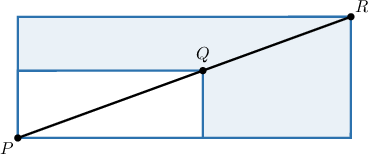
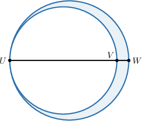

# Working With Descriptions of Similar Shapes

Source: https://www.mathacademy.com/topics/6309?courseId=120
Topic ID: 6309

## Prerequisites

- [Circles](../../../high-school/traditional/lessons/geometry/1404-circles.md)
- [The Area Between Two Shapes](../../../middle-school/lessons/grade-7/1435-the-area-between-two-shapes.md)
- [Working With Areas of Similar Polygons](../../../high-school/traditional/lessons/geometry/2941-working-with-areas-of-similar-polygons.md)

## Lesson

### Introduction

Recall that if two shapes are similar with scale factor $k,$ then the ratio of the two areas is equal to $k^2.$

We can use this to determine properties of similar shapes from a description, without any diagrams!

For example, suppose we're given the following information:

- Triangles $JKL$ and $MNO$ are similar.

- The length of each side of $\triangle MNO$ is $6$ times the length of the corresponding side of $\triangle JKL.$

- The area of $\triangle JKL$ is $10\,\textrm{ft}^2.$

Let's use this information to find the area of $\triangle MNO.$

Since the length of each side of triangle $MNO$ is $6$ times the length of the corresponding side of triangle $JKL,$ triangle $MNO$ is larger than triangle $JKL,$ and we have

$$

k=6.

$$

Therefore, the ratio of the areas is

$$

k^2 = 6^2 = 36,

$$

and we have

$$

\dfrac{\mathcal{A}_{MNO}}{\mathcal{A}_{JKL}} = 36.

$$

Solving for $\mathcal{A}_{MNO}$ and substituting in $\mathcal{A}_{JKL} = 10\,\textrm{ft}^2,$ we get

$$

\begin{aligned}A_{𝑀𝑁𝑂} & =36⋅A_{𝐽𝐾𝐿} \\ & =36⋅10\,ft^{2} \\ & =360\,ft^{2}.\end{aligned}

$$

Let's see some more examples.

### Important Similar Shapes

Before we move on, we should note the following important results.

- All circles are similar.

- By extension, all half-circles are similar, and all quarter-circles are similar.

- All squares are similar.

- All equilateral triangles are similar.

### Example: Determining Areas of Similar Shapes

#### Question

Circle $R$ has a radius of $4t$ and circle $S$ has a radius of $28t,$ where $t$ is a positive constant. The area of circle $S$ is how many times the area of circle $R?$

#### Explanation

Recall that all circles are similar.

If two shapes are similar with scale factor $k,$ then the ratio of the two areas is equal to $k^2.$

Here, circle $S$ is similar to circle $R$ with a scale factor of

$$

k = \dfrac{28t}{4t} = 7.

$$

Therefore, the area of $S$ is

$$

k^2 = 7^2 = 49

$$

times larger than the area of $R.$

### Example: Working With Scale Models

#### Question

A teacher builds a scale foam model of a classroom. The actual classroom has an area of $1{,}120\,\textrm{ft}^2.$ The length of each side of the model classroom is $\dfrac{1}{20}$ times the length of the corresponding side of the actual classroom. What is the area of the model classroom?

#### Explanation

If two shapes are similar with scale factor $k,$ then the ratio of the two areas is equal to $k^2.$

The length of each side of the model classroom is $\dfrac{1}{20}$ times the length of the corresponding side of the actual classroom.

So, the length of each side of the actual classroom is $20$ times the length of the corresponding side of the model classroom, and we have $k=20.$

Therefore, the ratio of the areas is $k^2 = (20)^2=400,$ and we have

$$

\dfrac{\mathcal{A}_{\text{actual}}}{\mathcal{A}_{\text{model}}}=400.

$$

Solving for $\mathcal{A}_{\text{model}}$ and substituting in $\mathcal{A}_{\text{actual}}=1{,}120\,\textrm{ft}^2,$ we get

$$

\begin{aligned}A_{model} & =\frac{A_{actual}}{400} \\ & =\frac{1,120\,ft^{2}}{400} \\ & =2.8\,ft^{2}.\end{aligned}

$$

### The Area Between Two Similar Shapes

Consider the diagram above, which shows two similar rectangles, where point $Q$ lies on $\overline{PR},$ and the ratio of $PQ$ to $QR$ is $5\mathbin{:}4.$ If the area of the smaller rectangle is $100$ square units, let's use this to find the area of the shaded region.

First, notice that $\overline{PQ}$ and $\overline{PR}$ are diagonals of the smaller and larger rectangles, respectively.

Given that $PQ \mathbin{:} QR = 5 \mathbin{:} 4,$ we can let $PQ = 5x$ and $QR = 4x$ for some value $x.$ Then, the larger rectangle is similar to the smaller rectangle with a scale factor of

$$

\begin{aligned}𝑘 & =\frac{𝑃𝑅}{𝑃𝑄} \\ & =\frac{𝑃𝑄+𝑄𝑅}{𝑃𝑄} \\ & =\frac{5𝑥+4𝑥}{5𝑥} \\ & =\frac{9𝑥}{5𝑥} \\ & =\frac{9}{5}.\end{aligned}

$$

Thus, the ratio of the areas is

$$

k^2 = \left(\dfrac95\right)^2 = \dfrac{81}{25},

$$

and we have

$$

\dfrac{\mathcal{A}_{\text{larger}}}{\mathcal{A}_{\text{smaller}}} = \dfrac{81}{25}.

$$

Solving for $\mathcal{A}_{\text{larger}}$ and substituting in $\mathcal{A}_{\text{smaller}} = 100,$ we get

$$

\begin{aligned}A_{larger} & =\frac{81}{25}⋅A_{smaller} \\ & =\frac{81}{25}⋅100 \\ & =324.\end{aligned}

$$

Therefore, the area of the *shaded* region is

$$

\begin{aligned}A_{shaded} & =A_{larger}−A_{smaller} \\ & =324−100 \\ & =224.\end{aligned}

$$

### Example: Determining Areas Between Similar Shapes

#### Question

The diagram above shows two circles, where point $V$ and the center of each circle lie on $\overline{UW}.$ The ratio of $UV$ to $VW$ is $9\mathbin{:}1.$ If the area of the smaller circle is $81\,\textrm{cm}^2,$ what is the area of the shaded region?

#### Explanation

Recall that all circles are similar.

If two shapes are similar with scale factor $k,$ then the ratio of the two areas is equal to $k^2.$

First, since $\overline{UW}$ joins two points on the larger circle and passes through its center, it is a diameter. Similarly, since $\overline{UV}$ joins two points on the smaller circle and passes through its center, it is a diameter.

Given that $UV \mathbin{:} VW = 9 \mathbin{:} 1,$ we can let $UV = 9x$ and $VW = x$ for some value $x.$ Then, the larger circle is similar to the smaller circle with a scale factor of

$$

\begin{aligned}𝑘 & =\frac{𝑈𝑊}{𝑈𝑉} \\ & =\frac{𝑈𝑉+𝑉𝑊}{𝑈𝑉} \\ & =\frac{9𝑥+𝑥}{9𝑥} \\ & =\frac{10𝑥}{9𝑥} \\ & =\frac{10}{9}.\end{aligned}

$$

Thus, the ratio of the areas is $k^2 = \left(\dfrac{10}{9}\right)^2 = \dfrac{100}{81},$ and we have

$$

\dfrac{\mathcal{A}_{\text{larger}}}{\mathcal{A}_{\text{smaller}}} = \dfrac{100}{81}.

$$

Solving for $\mathcal{A}_{\text{larger}}$ and substituting in $\mathcal{A}_{\text{smaller}} = 81\,\textrm{cm}^2,$ we get

$$

\begin{aligned}A_{larger} & =\frac{100}{81}⋅A_{smaller} \\ & =\frac{100}{81}⋅81\,cm^{2} \\ & =100\,cm^{2}.\end{aligned}

$$

Therefore, the area of the shaded region is

$$

\begin{aligned}A_{shaded} & =A_{larger}−A_{smaller} \\ & =100−81 \\ & =19\,cm^{2}.\end{aligned}

$$
