# Reasoning About Congruent Triangles

Source: https://www.mathacademy.com/topics/6310?courseId=120
Topic ID: 6310

## Prerequisites

- [Combining Congruence Criteria for Triangles](../../../high-school/traditional/lessons/geometry/966-combining-congruence-criteria-for-triangles.md)
- [Solving Problems Describing Congruent Triangles](./6300-solving-problems-describing-congruent-triangles.md)

## Lesson

### Introduction

In this topic, we'll learn how to determine when we have sufficient information to conclude that two triangles are congruent. We *cannot* conclude that two triangles are congruent if we have insufficient information.

There are five congruence criteria we can use to determine whether two triangles are congruent. Let's go through each of them, stating which information is sufficient to prove congruence.

- The SSS (Side-Side-Side) criterion. We have sufficient information to prove (or disprove) congruence using SSS if we know the lengths of *all* corresponding sides in *both* triangles.

- The SAS (Side-Angle-Side) criterion. We have sufficient information to prove (or disprove) congruence using SAS if we know the measures of two corresponding sides and the *included* angle in *both* triangles.

- The ASA (Angle-Side-Angle) criterion. We have sufficient information to prove (or disprove) congruence using ASA if we know the measures of two corresponding angles and the *included* side in *both* triangles.

- The AAS (Angle-Angle-Side) criterion. We have sufficient information to prove (or disprove) congruence using AAS if we know the measures of two corresponding angles and a corresponding, *non-included* side in *both* triangles.

- The HL (Hypotenuse-Leg) criterion. We have sufficient information to prove congruence using HL if both triangles are right triangles and a corresponding leg and the hypotenuse are equal.

It's important to recognize we need the corresponding information in *both* triangles in all five cases.

### Example: Identifying Information Needed to Prove Triangle Congruency From a Diagram

#### Question

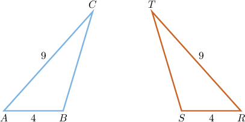

Triangles $ABC$ and $RST$ each have a side measuring $4$ and a side measuring $9,$ as shown above. Which of the following additional pieces of information is sufficient to prove that these triangles are congruent?

1. The measure of $\angle{T}$ is $20^\circ.$

2. The measures of $\angle B$ and $\angle S$ are equal.

3. The measures of $\angle A$ and $\angle R$ are equal.

4. No additional information is needed.

**

#### Explanation

To prove ** between two triangles, we can use any of the following congruence criteria:

- ****: all three pairs of corresponding sides are equal

- ****: two pairs of corresponding sides and the included angle are equal

- ****: two pairs of corresponding angles and the included side are equal

- ****: two pairs of corresponding angles and a non-included side are equal

- ****: In right triangles, the hypotenuse and one leg are equal

In the triangles $\triangle ABC$ and $\triangle RST,$ there are two pairs of congruent sides:

- $AB = RS = 4$

- $AC = RT = 9$

Thus, we have two pairs of equal corresponding sides. This alone is not enough to prove congruency.

With that in mind, let’s analyze each piece of additional information in turn.

- Consider option I (The measure of $\angle{T}$ is $20^\circ$). Knowing the measure of a single angle only in one triangle is insufficient to determine congruence between two triangles. ${\color{red}\times}$

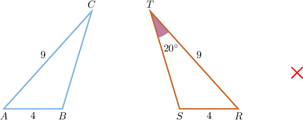

- Consider option II (The measures of $\angle B$ and $\angle S$ are equal). Knowing that two sides and a non-included angle of two triangles have equal measures is insufficient to conclude that the triangles are congruent. In other words, there is no Side-Side-Angle criterion for congruent triangles. ${\color{red}\times}$

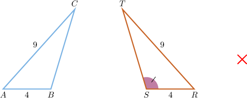

- Consider option III (The measures of $\angle A$ and $\angle R$ are equal). These are corresponding angles in the two triangles. If they are equal in measures, the triangles must be congruent by the Side-Angle-Side (SAS) criterion. ${\color{green}\checkmark}$

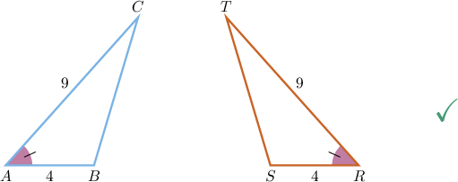

Therefore, the correct answer is "III only".

### Example: Identifying Information Needed to Prove Triangle Congruency

#### Question

In triangles $ABC$ and $GHI,$ sides $\overline{BC}$ and $\overline{HI}$ each have length $6,$ and angles $\angle{A}$ and $\angle{G}$ each have measure $90^\circ.$ Which additional piece of information is sufficient to prove that triangle $ABC$ is congruent to triangle $GHI?$

1. The lengths of $\overline{AB}$ and $\overline{GH}$ are equal.

2. The length of $\overline{AB}.$

3. The measure of $\angle{I}.$

4. No additional information is needed.

#### Explanation

To prove ** between two triangles, we can use any of the following congruence criteria:

- ****: all three pairs of corresponding sides are equal

- ****: two pairs of corresponding sides and the included angle are equal

- ****: two pairs of corresponding angles and the included side are equal

- ****: two pairs of corresponding angles and a non-included side are equal

- ****: In right triangles, the hypotenuse and one leg are equal

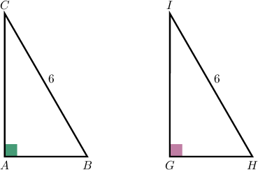

In the triangles $\triangle ABC$ and $\triangle GHI,$ there is one pair of congruent angles and one pair of congruent sides:

- $m\angle A = m\angle G = 90^\circ$

- $BC = HI = 25$

Thus, we have a pair of congruent corresponding angles and a pair of congruent corresponding sides. This alone is not enough to prove congruency.

With that in mind, let’s analyze each piece of additional information in turn.

- Consider option I (The lengths of $\overline{AB}$ and $\overline{GH}$ are equal). Then the triangles ** be congruent by the Hypotenuse-Leg (HL) criterion. ${\color{green}\checkmark}$

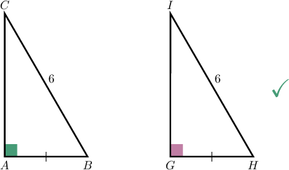

- Consider option II (The length of $\overline{AB}$). Knowing the length of a single side only in one triangle is insufficient to determine congruence between two triangles. ${\color{red}\times}$

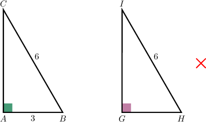

- Consider option III (The measure of $\angle{I}$). Knowing the measure of a single angle only in one triangle is insufficient to determine congruence between two triangles. ${\color{red}\times}$

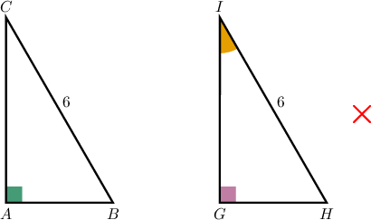

Therefore, the correct answer is "I only".

### Example: Identifying Criteria Applicable to Prove Triangle Congruency

#### Question

Consider $\triangle AON$ and $\triangle BOM$ below. Which of the following statements are true?

1. The triangles are congruent by SSS

2. The triangles are congruent by SAS

3. The triangles are congruent by ASA

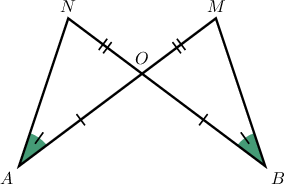

#### Explanation

Let's examine each of the statements in turn.

- Statement I is false. The triangles are ** congruent by SSS since we do not have three pairs of congruent sides.

- Statement II is true. Notice that $\angle{NOA} \cong \angle{MOB}$ since these two angles are vertical. Also, $\overline{NO} \cong \overline{OM}$ and $\overline{AO} \cong \overline{OB}.$ As a result, the triangles are congruent by SAS.

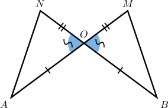

- Statement III is true. Again, $\angle{NOA} \cong \angle{BOM}$ since these two angles are vertical. Also, $\angle{A} \cong \angle{B}$ and $\overline{OA} \cong \overline{OB}.$ As a result, the triangles are congruent by ASA.

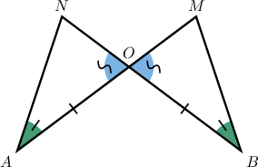

Therefore, the correct answer is "II and III only."
