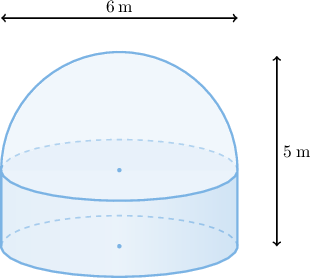
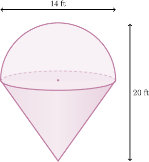
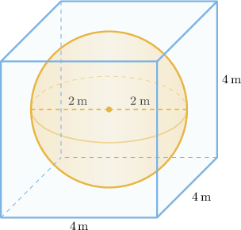

# Composite Solids

Source: https://www.mathacademy.com/topics/6312?courseId=120
Topic ID: 6312

## Prerequisites

- [Volumes of Cylinders](../../../high-school/traditional/lessons/geometry/1144-volumes-of-cylinders.md)
- [Volumes of Right Cones](../../../high-school/traditional/lessons/geometry/1145-volumes-of-right-cones.md)
- [Volumes of Spheres](../../../high-school/traditional/lessons/geometry/1146-volumes-of-spheres.md)
- [Volumes of Rectangular Solids](../../../high-school/traditional/lessons/geometry/1753-volumes-of-rectangular-solids.md)

## Lesson

### Introduction

A **composite solid** is a three-dimensional figure formed by combining two or more basic solids, such as cylinders, cones, spheres, hemispheres, etc. These shapes are joined together to create a more complex structure.

To find the total volume of a composite solid, we calculate the volume of each part and then add them together. This method allows us to break down complicated figures into manageable pieces.

Let’s walk through an example to see how this works in practice.

This diagram above shows a hemisphere and a cylinder that have circular bases of equal circumference and have been connected at their bases. Suppose the diameter of the base of the hemisphere is $6$ meters, and the total height of the combined solid is $5$ meters. Let's find the total volume of the combined solid.

We first calculate the volume of the hemisphere using the formula

$$

\begin{aligned}𝑉_{hemisphere} & =\frac{1}{2}𝑉_{sphere} \\ & =\frac{1}{2}⋅\frac{4}{3}𝜋𝑟^{3} \\ & =\frac{2}{3}𝜋𝑟^{3}\end{aligned}

$$

where $r$ is the radius of the sphere.

Since the diameter of the hemisphere is $6,$ its radius is $r=\dfrac{6}{2}=3.$ Substituting $r = 3,$ we get

$$

\begin{aligned}𝑉_{hemisphere} & =\frac{2}{3}𝜋(3)^{3} \\ & =\frac{2}{3}𝜋(27) \\ & =18𝜋.\end{aligned}

$$

Next, we compute the volume of the cylinder using the formula

$$

V_{\text{cylinder}} = \pi r^2 h

$$

where $r$ is the radius of the base and $h$ is the height of the cylinder.

Since the total height of the combined solid is $5,$ the height of the cylinder is $h=5-3=2.$ Substituting $r = 3$ and $h=2,$ we have

$$

\begin{aligned}𝑉_{cylinder} & =𝜋(3)^{2}(2) \\ & =𝜋(9)(2) \\ & =18𝜋.\end{aligned}

$$

To find the volume of the combined solid, we add the volume of the hemisphere and the volume of the cylinder:

$$

\begin{aligned}𝑉_{combined} & =𝑉_{hemisphere}+𝑉_{cylinder} \\ & =18𝜋+18𝜋 \\ & =36𝜋\end{aligned}

$$

Therefore, the combined solid volume is $36\pi$ cubic meters.

### Example: Finding the Volume of a Composite Solid

#### Question

#### Explanation

We first calculate the volume of the hemisphere using the formula

$$

V_{\text{hemisphere}} = \dfrac{1}{2} V_{\text{sphere}} = \dfrac{2}{3} \pi r^3

$$

where $r$ is the radius of the sphere.

Since the diameter of the hemisphere is $14,$ its radius is $r=\dfrac{14}{2}=7.$ Substituting $r = 7,$ we get

$$

\begin{aligned}𝑉_{hemisphere} & =\frac{2}{3}𝜋(7)^{3} \\ & =\frac{2}{3}𝜋(343) \\ & =\frac{686}{3}𝜋.\end{aligned}

$$

Next, we compute the volume of the cone using the formula

$$

V_{\text{cone}} = \dfrac{1}{3} \pi r^2 h

$$

where $r$ is the radius of the base and $h$ is the height of the cone.

Since the total height of the combined solid is $20,$ the height of the cone is $h=20-7=13.$ Substituting $r = 7$ and $h=13,$ we have

$$

\begin{aligned}𝑉_{cone} & =\frac{1}{3}𝜋(7)^{2}(13) \\ & =\frac{1}{3}𝜋(49)(13) \\ & =\frac{637}{3}𝜋.\end{aligned}

$$

To find the volume of the combined solid, we add the volume of the hemisphere and the volume of the cone:

$$

\begin{aligned}𝑉_{combined} & =𝑉_{hemisphere}+𝑉_{cone} \\ & =\frac{686}{3}𝜋+\frac{637}{3}𝜋 \\ & =\frac{1323}{3}𝜋 \\ & =441𝜋\end{aligned}

$$

Therefore, the combined solid volume is $441\pi$ cubic feet.

### Solids Inside Other Solids

Now, suppose that a solid sphere with a radius of $2$ meters is placed exactly in the center of a cube with an edge length of $4$ meters so that it touches the center of each face of the cube, as shown below.

Let's find the volume of the space in the cube that is *not* occupied by the sphere.

We first calculate the volume of the cube using the formula

$$

V_{\text{cube}} = s^3

$$

where $s$ is the side length of the cube. Substituting $s = 4,$ we have

$$

V_{\text{cube}} = 4^3 = 64.

$$

Next, we compute the volume of the sphere using the formula

$$

V_{\text{sphere}} = \dfrac{4}{3} \pi r^3

$$

where $r$ is the radius of the sphere. Since the side length of the cube is $s=4,$ we must have $r=2.$ Substituting $r = 2,$ we get

$$

\begin{aligned}𝑉_{sphere} & =\frac{4}{3}𝜋(2)^{3} \\ & =\frac{4}{3}𝜋(8) \\ & =\frac{32}{3}𝜋.\end{aligned}

$$

To find the volume of the unoccupied space, we subtract the volume of the sphere from the volume of the cube:

$$

\begin{aligned}𝑉_{empty} & =𝑉_{cube}−𝑉_{sphere} \\ & =64−\frac{32}{3}𝜋 \\ & =64−33.510… \\ & ≈30\end{aligned}

$$

rounded to the nearest integer.

Therefore, to the nearest cubic meter, the unoccupied volume is $30.$

### Example: Finding a Volume of a Solid Obtained by Carving Out Another Solid

#### Question

A solid sphere with a radius of $6$ meters is placed exactly in the center of a cylinder with a base radius of $6$ meters and a height of $12$ meters so that it touches the center of each base of the cylinder. What is the volume of the space in the cylinder that is not occupied by the sphere?

#### Explanation

We first calculate the volume of the cylinder using the formula

$$

V_{\text{cylinder}} = \pi r^2 h

$$

where $r$ is the radius of the base and $h$ is the height of the cylinder. Substituting $r = 6$ and $h=12,$ we have

$$

\begin{aligned}𝑉_{cylinder} & =𝜋(6)^{2}(12) \\ & =𝜋(36)(12) \\ & =432𝜋.\end{aligned}

$$

Next, we compute the volume of the sphere using the formula

$$

V_{\text{sphere}} = \dfrac{4}{3} \pi r^3

$$

where $r$ is the radius of the sphere. Substituting $r = 6,$ we get

$$

\begin{aligned}𝑉_{sphere} & =\frac{4}{3}𝜋(6)^{3} \\ & =\frac{4}{3}𝜋(216) \\ & =288𝜋.\end{aligned}

$$

To find the volume of the unoccupied space, we subtract the volume of the sphere from the volume of the cylinder:

$$

\begin{aligned}𝑉_{empty} & =𝑉_{cylinder}−𝑉_{sphere} \\ & =432𝜋−288𝜋 \\ & =144𝜋.\end{aligned}

$$

Therefore, the unoccupied volume is $144\pi$ cubic meters.
