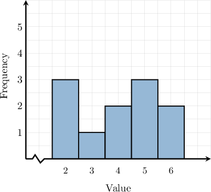
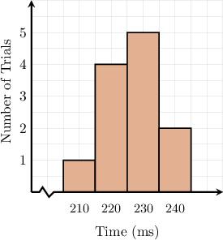
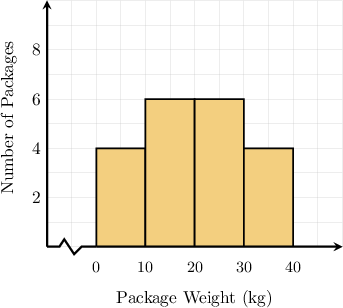

# Calculating Means From Histograms

Source: https://www.mathacademy.com/topics/6313?courseId=120
Topic ID: 6313

## Prerequisites

- [Histograms](../../../middle-school/lessons/grade-6/2510-histograms.md)
- [Calculating Means From Frequency Tables](../../../middle-school/lessons/grade-7/6176-calculating-means-from-frequency-tables.md)

## Lesson

### Introduction

In this lesson, we'll learn how to calculate the mean of a data set from a histogram.

For example, what is the mean of the dataset represented by the histogram below?

To find the mean of a dataset from a histogram, we first convert it into a frequency table.

On a histogram, the horizontal axis represents the values in the dataset, and the vertical axis indicates the frequency of each value in the dataset.

In our case, placing the data from the given histogram in a frequency table, we obtain the following.

To calculate the mean of a dataset from a frequency table, we multiply each value by its frequency, add the results, and divide by the total frequency.

So, we now extend the table to include a third column for the product of the values and their corresponding frequencies:

Therefore, the mean of the dataset is

$$

\begin{aligned}Mean & =\frac{6+3+8+15+12}{3+1+2+3+2} \\ & =\frac{44}{11} \\ & =4.\end{aligned}

$$

Let's see some more examples.

### Example: Calculating Means From Histograms

#### Question

A psychology lab is investigating human reaction speeds. In a controlled test, participants were asked to press a key as soon as they saw a visual stimulus on a computer screen. Each trial produced one reading, and the histogram below summarizes the reaction times from the trials. What was the mean reaction time measured across all trials? Round your answer to the nearest integer.

#### Explanation

To find the mean of a dataset from a histogram, we first convert it into a frequency table.

On a histogram, the horizontal axis shows the values in the dataset, and the vertical axis tells us how many times each value appears in the dataset.

In our case, placing the data from the given histogram in a frequency table, we obtain the following.

To calculate the mean of a dataset from a frequency table, we multiply each value by its frequency, add the results, and divide by the total frequency.

So, we now extend the table to include a third column for the product of the values and their corresponding frequencies:

Therefore, the mean reaction time, in milliseconds, is

$$

\begin{aligned}Mean & =\frac{210+880+1150+480}{1+4+5+2} \\ & =\frac{2720}{12} \\ & ≈227.\end{aligned}

$$

### Example: Estimating Means From Histograms for Grouped Data

#### Question

A warehouse recorded the weights (in kilograms) of packages shipped in a day. The histogram above summarizes how many packages fell into each weight interval. Estimate the mean package weight.

#### Explanation

To estimate the mean from a histogram, we first convert the histogram into a frequency table.

On a histogram with groups, the horizontal axis shows the value groups, and the vertical axis tells us how many values fall into each group.

In our case, we build the frequency table below and record $x_{\text{mid}},$ the middle value of $x$ for each group. Then, we calculate $f\cdot x_{\text{mid}}$ for each row.

Therefore, our estimate of the mean is

$$

\begin{aligned}Mean & =\frac{20+90+150+140}{4+6+6+4} \\ & =\frac{400}{20} \\ & =20.\end{aligned}

$$
