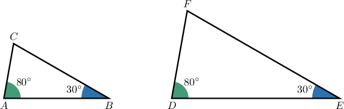
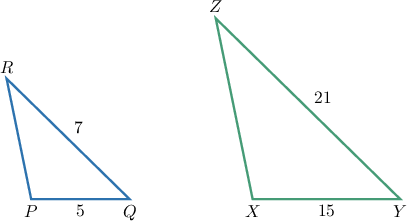
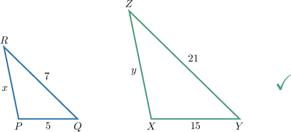
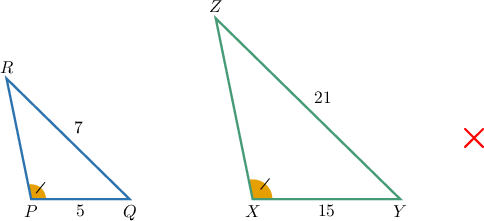
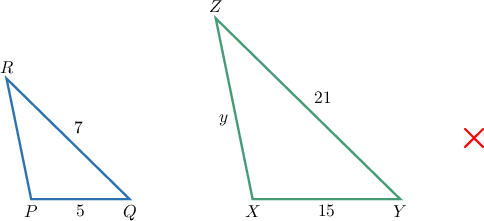

# Reasoning About Similar Triangles

Source: https://www.mathacademy.com/topics/6317?courseId=120
Topic ID: 6317

## Prerequisites

- [Combining Similarity Criteria for Triangles](../../../high-school/traditional/lessons/geometry/4065-combining-similarity-criteria-for-triangles.md)
- [Solving Angle Problems From Descriptions of Similar Triangles](./6331-solving-angle-problems-from-descriptions-of-similar-triangles.md)

## Lesson

### Introduction

In this topic, we'll learn how to determine when we have sufficient information to conclude that two triangles are similar. We *cannot* conclude that two triangles are similar if we have insufficient information.

There are three criteria we can use to determine whether two triangles are similar. Let's go through each of them, stating which information is sufficient to prove similarity.

- The AA (Angle-Angle) criterion. We have sufficient information to prove (or disprove) similarity using AA if we know the measures of two corresponding angles in *both* triangles.

- The SSS (Side-Side-Side) criterion. We have sufficient information to prove (or disprove) similarity using SSS if we know the lengths of *all* corresponding sides in *both* triangles.

- The SAS (Side-Angle-Side) criterion. We have sufficient information to prove (or disprove) similarity using SAS if we know the measures of two corresponding sides and the *included* angle in *both* triangles.

It's important to recognize we need the corresponding information in *both* triangles in all three cases.

### Example: Identifying Information Needed to Prove Triangle Similarity From a Diagram

#### Question

Consider the triangles above. Which of the following additional pieces of information is sufficient to determine whether these triangles are similar?

1. The length of the side $\overline{AB}.$

2. The measure of $\angle{C}.$

3. The measure of $\angle{C}$ and the length of the side $\overline{AB}.$

4. No additional information is needed.

**

#### Explanation

To prove similarity between two triangles, we can use any of the following similarity criteria:

- ****: two pairs of corresponding angles are equal

- ****: two pairs of proportional sides with equal included angles

- ****: all three pairs of sides are proportional

We are given that two pairs of corresponding angles match:

$$

m\angle A = m\angle D = 80^\circ, \qquad m\angle B = m\angle E = 30^\circ.

$$

This means we have two pairs of congruent corresponding angles. Therefore, the triangles are similar by the AA criterion. So, no further information is needed to deduce that the triangles are similar.

Therefore, the correct answer is "IV only."

### Example: Identifying Information Needed to Prove Triangle Similarity

#### Question

Triangles $PQR$ and $XYZ$ are such that

$$

PQ=5,\quad QR = 7, \quad\text{and}\quad XY=15,\quad YZ=21.

$$

Which of the following additional pieces of information is sufficient to determine whether these triangles are similar?

1. The lengths of the sides $\overline{PR}$ and $\overline{XZ}.$

2. $m\angle{P} = m\angle{X}.$

3. The length of the side $\overline{XZ}.$

4. No additional information is needed.

#### Explanation

To prove **** between two triangles, we can use any of the following similarity criteria:

- ****: two pairs of corresponding angles are equal

- ****: two pairs of proportional sides with equal included angles

- ****: all three pairs of sides are proportional

In triangles $\triangle PQR$ and $\triangle XYZ,$ we are given two side lengths from each triangle:

$$

\frac{PQ}{XY} = \dfrac{5}{15} = \dfrac{1}{3}, \qquad \frac{QR}{YZ} = \dfrac{7}{21}=\dfrac{1}{3},

$$

as shown below.

So, the known pairs of sides are already in proportion. However, this information by itself is not enough to conclude similarity.

With that in mind, let’s analyse each of the pieces of additional information in turn.

- Consider option I (the lengths of the sides $\overline{PR}$ and $\overline{XZ}$). If we know $PR$ and $XZ,$ then we can check all three pairs of side ratios. If all three match, then the triangles are similar by the SSS criterion. Hence, this information is sufficient. ${\color{green}\checkmark}$

- Consider option II ($m\angle{P} = m\angle{X}).$ If we only know the measures of one pair of corresponding angles that are not the included angles, then this gives an SSA configuration, which does not guarantee similarity. Hence, this information is not sufficient. ${\color{red}\times}$

- Consider option III (The length of the side $\overline{XZ}$). If we only know one additional side from a single triangle, then we cannot form a pair of corresponding sides. Hence, this information is not sufficient. ${\color{red}\times}$

Therefore, the correct answer is "I only."
