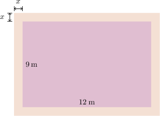
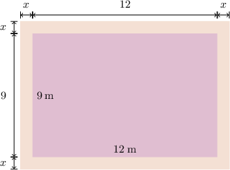
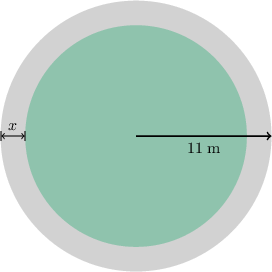
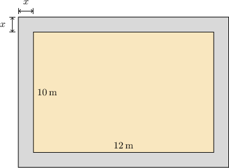
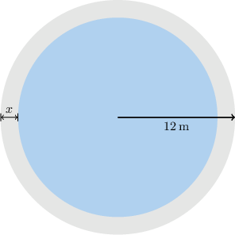

# Border Problems

Source: https://www.mathacademy.com/topics/6322?courseId=120
Topic ID: 6322

## Prerequisites

- [The Quadratic Formula](../../../high-school/traditional/lessons/algebra-i/422-the-quadratic-formula.md)
- [The Area Between Two Shapes](../../../middle-school/lessons/grade-7/1435-the-area-between-two-shapes.md)
- [Constructing Functions Representing Properties of 2D Shapes](./6270-constructing-functions-representing-properties-of-2d-shapes.md)

## Lesson

### Introduction

In this topic, we'll learn how to solve problems involving areas with borders. This modeling skill occurs often in real-world layouts, such as frames, patios, and walkways, where we must account for added or removed border areas.

For example, the figure below (not drawn to scale) represents a rectangular flower bed that measures $12$ meters by $9$ meters and is surrounded by a gravel border of uniform width $x$ meters.

If the combined area of the flower bed and the border is $208$ square meters, let's find the value of $x.$

First, we write down the dimensions of the flower bed, including the border:

- the length is given by $2x+12$ meters, and

- the width is given by $2x + 9$ meters

as shown below.

Therefore, the area of the flower bed and the border is given by the product of the length and width:

$$

A = (2x+12)(2x+9)

$$

We're told that the area of the flowerbed with the border is $208\,\text{m}^2.$ Therefore, we have the following equation:

$$

\begin{aligned}(2𝑥+12)(2𝑥+9) & =208 \\ 4𝑥^{2}+24𝑥+18𝑥+108 & =208 \\ 4𝑥^{2}+42𝑥+108 & =208 \\ 4𝑥^{2}+42𝑥−100 & =0 \\ 2(2𝑥^{2}+21𝑥−50) & =0 \\ 2𝑥^{2}+21𝑥−50 & =0\end{aligned}

$$

We can solve this equation using the quadratic formula

$$

x = \dfrac{-b \pm \sqrt{b^2-4ac}}{2a}.

$$

Here, we have

$$

a = 2, \qquad b = 21, \qquad c = -50.

$$

Substituting these values into the formula, we get

$$

\begin{aligned}𝑥 & =\frac{−21±\sqrt{21^{2}−4⋅2⋅(−50)}}{2⋅2} \\ & =\frac{−21±\sqrt{441+499}}{4} \\ & =\frac{−21±\sqrt{841}}{4} \\ & =\frac{−21±29}{4},\end{aligned}

$$

which gives $x=-12.5$ or $x=2.$ We disregard the negative solution since the width of the border must be positive. Therefore, the width of the border is $2$ meters.

Let's see another example with a circular border.

### Example: Constructing an Equation Defining an Unknown Border Width

#### Question

The figure above (not drawn to scale) represents a circular patio surrounded by a ring-shaped border of uniform width $x$ meters. The patio with the border has a radius of $11$ meters. If the area of the patio without the border is $49\pi$ square meters, write an equation that defines the value of $x.$

#### Explanation

First, we notice that the radius of the patio without the border is $11 - x$ meters.

Thus, the area of the patio without the border is

$$

\begin{aligned}𝐴 & =𝜋(11−𝑥)^{2}.\end{aligned}

$$

Now, we equate this expression to $49\pi$ and obtain the following equation:

$$

\begin{aligned}𝜋(11−𝑥)^{2} & =49𝜋 \\ (11−𝑥)^{2} & =49 \\ 121−22𝑥+𝑥^{2} & =49 \\ 𝑥^{2}−22𝑥+72 & =0\end{aligned}

$$

### Example: Calculating an Unknown Border Width

#### Question

The figure above (drawn not to scale) represents a rectangular courtyard with a length of $12$ meters and a width of $10$ meters that is surrounded by a border with a uniform width of $x$ meters. If the combined area of the courtyard and the border is $168$ square meters, what is the value of $x?$

#### Explanation

First, we write down the dimensions of the courtyard, including the border:

- the length is given by $2x+12$ meters, and

- the width is given by $2x+10$ meters.

Thus, the area of the courtyard with the border is

$$

\begin{aligned}𝐴 & =length⋅width \\ & =(2𝑥+12)(2𝑥+10).\end{aligned}

$$

Now, we equate this expression to (168) and obtain the following equation:

$$

\begin{aligned}(2𝑥+12)(2𝑥+10) & =168 \\ 4𝑥^{2}+24𝑥+20𝑥+120 & =168 \\ 4𝑥^{2}+44𝑥+120 & =168 \\ 4𝑥^{2}+44𝑥−48 & =0 \\ 𝑥^{2}+11𝑥−12 & =0.\end{aligned}

$$

Finally, we solve the obtained equation using the quadratic formula

$$

x = \dfrac{-b \pm \sqrt{b^2 - 4ac}}{2a}.

$$

Here,

$$

a=1,\qquad b=11,\qquad c=-12.

$$

Substituting into the formula, we get

$$

\begin{aligned}𝑥 & =\frac{−11±\sqrt{11^{2}−4⋅1⋅(−12)}}{2⋅1} \\ & =\frac{−11±\sqrt{121+48}}{2} \\ & =\frac{−11±\sqrt{169}}{2} \\ & =\frac{−11±13}{2}.\end{aligned}

$$

So, $x=-12$ or $x=1.$ We disregard the negative solution since the width of the border must be positive.

Therefore, $x=1$ meter.

### Example: Finding an Unknown Border Width by Discarding One Positive Solution

#### Question

The figure above (not drawn to scale) represents a circular fountain surrounded by a border with a uniform width of $x$ meters. The fountain with the border has a radius of $12$ meters. If the area of the fountain without the border is $25\pi$ square meters, what is the value of $x?$

#### Explanation

First, we notice that the radius of the fountain, without the border, is $12-x$ meters.

Thus, the area of the fountain without the border is

$$

A=\pi(12-x)^2.

$$

Now, we equate this expression to $25\pi$ and obtain the following equation:

$$

\begin{aligned}𝜋(12−𝑥)^{2} & =25𝜋 \\ (12−𝑥)^{2} & =25\end{aligned}

$$

Since we have a perfect square on the left-hand side, we can solve this equation as follows:

$$

\begin{aligned}(12−𝑥)^{2} & =25 \\ \sqrt{(12−𝑥)^{2}} & =\sqrt{25} \\ |12−𝑥| & =5\end{aligned}

$$

which gives

$$

12-x = 5\quad\text{or}\quad 12-x = -5.

$$

So, $x=7$ or $x=17.$ We disregard $x=17$ since then the inner radius is

$$

\begin{aligned}radius & =12−𝑥 \\ & =12−17 \\ & =−5<0,\end{aligned}

$$

which is impossible.

Therefore, $x=7$ meters.
