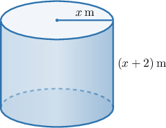

# Constructing Functions Representing Volumes of Cylinders, Cones, and Pyramids

Source: https://www.mathacademy.com/topics/6333?courseId=120
Topic ID: 6333

## Prerequisites

- [Volumes of Pyramids](../../../high-school/traditional/lessons/geometry/1035-volumes-of-pyramids.md)
- [Volumes of Cylinders](../../../high-school/traditional/lessons/geometry/1144-volumes-of-cylinders.md)
- [Volumes of Right Cones](../../../high-school/traditional/lessons/geometry/1145-volumes-of-right-cones.md)

## Lesson

### Introduction

In this lesson, we'll learn how to construct functions that represent the volume of three-dimensional shapes, like cylinders, cones, and pyramids. This allows us to translate geometric descriptions into algebraic expressions that we can analyze and use to solve real-world problems.

For example, suppose a right circular cylinder has a base radius of $x$ meters. The height of the cylinder is $2$ meters more than the radius. What is a function $V$ that gives the volume of the cylinder in terms of its radius?

First, recall that the volume $V$ of a right circular cylinder is given by

$$

V = \pi r^2 h

$$

where $r$ is the radius of the base and $h$ is the height of the cylinder.

From the description, our right circular cylinder has the following measurements:

- The radius is $r = x$ meters.

- The height is $h = x + 2$ meters ($2$ meters more than the radius).

The corresponding cylinder looks as shown below.

Therefore, the volume of the cylinder, in cubic meters, is

$$

\begin{aligned}𝑉(𝑥) & =𝜋𝑟^{2}ℎ \\ & =𝜋⋅𝑥^{2}⋅(𝑥+2) \\ & =𝜋𝑥^{2}(𝑥+2).\end{aligned}

$$

Let's see some more examples.

### Example: Constructing Functions Representing the Volume

#### Question

A right cone has a height of $x$ meters. The radius of the cone's base is $2$ meters more than the height. What is the function $V$ that gives the volume of the cone, in cubic meters, in terms of the height of the cone?

#### Explanation

From the description, our right cone has the following measurements:

- The height is $h = x$ meters.

- The radius of the base is $r = x+2$ meters ($2$ meters more than the height).

Therefore, the volume of the cone is given by

$$

\begin{aligned}𝑉(𝑥) & =\frac{1}{3}𝜋𝑟^{2}ℎ \\ & =\frac{1}{3}𝜋⋅(𝑥+2)^{2}⋅𝑥 \\ & =\frac{1}{3}𝜋𝑥(𝑥+2)^{2}.\end{aligned}

$$

### Correctly Interpreting Problem Statements

Sometimes the phrasing used in geometric descriptions can be confusing or misleading. In such cases, it's important to read the descriptions *very carefully*, write down the appropriate equations, and *rearrange them using algebra if necessary!*

Let's consider the following description:

A right circular cylinder has a base radius of $x$ centimeters, which is $7$ centimeters less than the height. Which function $V(x)$ gives the volume of the cylinder, in cubic centimeters, in terms of the radius of the cylinder?

This question is asking us to construct a function representing the volume $V$ of a cylinder, which requires us to make use of the formula

$$

V = \pi r^2 h

$$

where $r$ is the base radius of the cylinder and $h$ is its height. Since we need to find the volume $V$ as a function of $x,$ we need to express $r$ and $h$ in terms of $x.$

From the description, our prism has the following measurements:

- The radius is $r = x$ centimeters.

- And here is the tricky part! We are told that the radius of the cylinder is $7$ centimeters *less* than the radius. This can be written as Now, since $r = x,$ we have Solving for $h,$ we get In other words, the height of the prism is $7$ centimeters *more* than its base radius.

Therefore, the volume of the prism is given by

$$

\begin{aligned}𝑉(𝑥) & =𝜋𝑟^{2}ℎ \\ & =𝜋⋅𝑥^{2}⋅(𝑥+7) \\ & =𝜋𝑥^{2}(𝑥+7).\end{aligned}

$$

**Watch out!** In problems like these, a common mistake would be to write the volume as $\pi x^2(x \, {\color{red}-} \, 7).$

### Example: Constructing Functions Representing the Volume: Harder Cases

#### Question

A right cone has a radius of the base equal to $x$ centimeters, which is $4$ centimeters less than one-third the height. Find the function $V$ that gives the volume of the cone, in cubic centimeters, in terms of the length of the cone's base radius.

#### Explanation

From the description, our right cone has the following measurements:

- The radius of the base is $r = x$ centimeters.

- Let's denote the height by $h.$ We're told that the base radius is $4$ centimeters less than one-third the height. So, we have Solving for $h,$ we have

Therefore, the volume of the cone is given by

$$

\begin{aligned}𝑉(𝑥) & =\frac{1}{3}𝜋𝑟^{2}ℎ \\ & =\frac{1}{3}𝜋⋅𝑥^{2}⋅3(𝑥+4) \\ & =𝜋𝑥^{2}(𝑥+4).\end{aligned}

$$

### Example: Interpreting Functions Representing Volume

#### Question

$$

V = \pi \cdot (4r - 12) \cdot r^2

$$

A cylindrical can has a height that is $12$ centimeters less than four times its radius $r$ of the base. The function $V,$ given above, models the volume of the can, in cubic centimeters. Which expression represents the height, in centimeters, of the can, where $r > 3?$

#### Explanation

The volume of a cylinder is given by

$$

V = \pi \cdot \text{height} \cdot \text{radius}^2.

$$

Here, we have

$$

V = \pi \cdot (4r-12) \cdot r^2

$$

where $r$ is the radius of the base.

Therefore, comparing the two expressions, we conclude that the height must be

$$

4r-12.

$$
