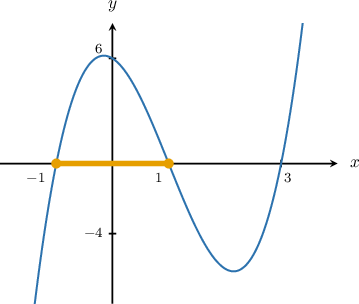
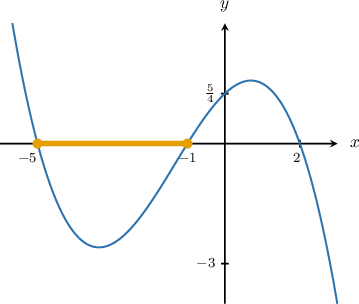
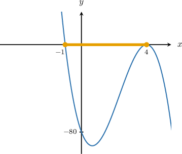
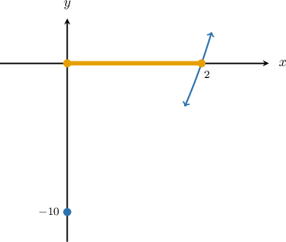

# Identifying Valid Outputs of Factored Polynomials

Source: https://www.mathacademy.com/topics/6336?courseId=120
Topic ID: 6336

## Prerequisites

- [Graphing Cubic Curves Containing One Distinct Real Root](../../../high-school/traditional/lessons/algebra-ii/2084-graphing-cubic-curves-containing-one-distinct-real-root.md)

## Lesson

### Introduction

In this topic, we'll learn how to determine which values of a polynomial $p(x)$ are possible over a specified $x$-interval without needing to compute exact outputs or plot the full graph.

For example, in the $xy$-plane, the graph of the equation

$$

y=2(x+1)(x-1)(x-3)

$$

contains the point $(a,b),$ where $-1 \leq a \leq 1.$ What can we say about the possible values of $b$ on this interval?

First, we sketch the graph of the cubic. From the equation, we conclude the following:

- The graph has $x$-intercepts at $x=-1,1,3.$

- Since the leading coefficient is positive, we have:

- The $y$-intercept is

The corresponding graph (not drawn to scale) is shown below.

We are interested in the points $(a,b)$ whose $x$-coordinate $a$ satisfies

$$

-1 \leq a \leq 1.

$$

This interval is highlighted on the graph.

Notice that on this interval, the graph of the cubic lies on or above the $x$-axis (it meets the axis at $x=-1$ and $x=1$ and is positive in between). So, we must have

$$

b \ge 0.

$$

Therefore, $b$ can't be negative.

### Example: Identifying Valid Outputs for Cubic Curves With Three Distinct Real Roots

#### Question

$$

y=\dfrac{1}{8}(2-x)(x+1)(x+5)

$$

In the $xy$-plane, the graph of the equation above contains the point $(a,b).$ If $-5 \leq a \leq -1,$ which of the following is **** a possible value of $b?$

1. $-3$

2. $0$

3. $1$

#### Explanation

First, notice that we can take out a factor of $-1$ from the factor $(2-x),$ as follows:

$$

\begin{aligned}𝑦 & =\frac{1}{8}(2−𝑥)(𝑥+1)(𝑥+5) \\ & =−\frac{1}{8}(𝑥−2)(𝑥+1)(𝑥+5).\end{aligned}

$$

Now, we sketch the graph of the cubic. From the equation, we conclude the following:

- The graph has $x$-intercepts at $x=-5,-1,2.$

- $y \to -\infty$ as $x \to \infty$ and $y \to \infty$ as $x \to -\infty.$

- The $y$-intercept is The corresponding graph (not drawn to scale) is shown below.

We are interested in the points $(a,b)$ whose $x$-coordinate $a$ satisfies $-5 \leq a \leq -1.$ The corresponding interval on the $x$-axis is highlighted on the graph. Notice that in this interval, the graph of the cubic lies below the $x$-axis. So, we must have

$$

b \leq 0.

$$

Among the given options, only option III does **** satisfy this condition.

### Example: Identifying Valid Outputs for Cubic Curves With a Double Root

#### Question

$$

y= -5(x+1)(x-4)^2

$$

In the $xy$-plane, the graph of the equation above contains the point $(a,b).$ If $-1 \leq a \leq 4,$ which of the following is **** a possible value of $b?$

1. $-1$

2. $0$

3. $1$

#### Explanation

First, we sketch the graph of the cubic. From the equation, we conclude the following:

- The graph has $x$-intercepts at $x=-1,4,$ where $x=4$ is a "double root."

- $y \to -\infty$ as $x \to \infty$ and $y \to \infty$ as $x \to -\infty.$

- The $y$-intercept is

The corresponding graph (not drawn to scale) is shown below.

We are interested in the points $(a,b)$ whose $x$-coordinate $a$ satisfies $-1 \leq a \leq 4.$ The corresponding interval on the $x$-axis is highlighted on the graph. Notice that in this interval, the graph of the cubic lies below the $x$-axis. So, we must have

$$

b \leq 0.

$$

Among the given options, only $x=1$ (option III) does **** satisfy this condition.

### Example: Identifying Valid Outputs for Cubic Curves With One Real Root

#### Question

$$

y=(x-2)(x^2+2x+5)

$$

In the $xy$-plane, the graph of the equation above contains the point $(a,b).$ If $0 \leq a \leq 2,$ which of the following is **** a possible value of $b?$

1. $-3$

2. $0$

3. $1$

#### Explanation

First, notice that the discriminant of the factor $x^2+2x+5$ is

$$

\mathcal D = 2^2-4(1)(5) = -16 < 0

$$

so our cubic cannot be factored any further over the real numbers.

Now, we sketch the graph of the cubic. From the equation, we conclude the following:

- The graph has an $x$-intercept at $x=2.$

- $y \to \infty$ as $x \to \infty$ and $y \to -\infty$ as $x \to -\infty.$

- The $y$-intercept is

The corresponding partial graph is shown below.

We are interested in the points $(a,b)$ whose $x$-coordinate $a$ satisfies $0 \leq a \leq 2.$ The corresponding interval on the $x$-axis is highlighted on the graph. Notice that in this interval, the graph of the cubic lies below the $x$-axis. So, we must have

$$

b \leq 0.

$$

Among the given options, only option III does **** satisfy this condition.
