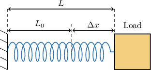
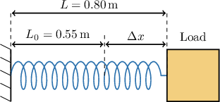
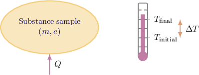
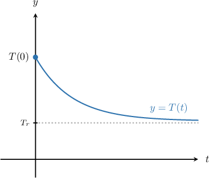

# Interpreting Rates of Change of Physical Phenomena

Source: https://www.mathacademy.com/topics/6342?courseId=120
Topic ID: 6342

## Prerequisites

- [The Power Rule for Exponents With Algebraic Expressions](../../../high-school/traditional/lessons/algebra-i/362-the-power-rule-for-exponents-with-algebraic-expressions.md)
- [Understanding Proportional Relationships From Descriptions](../../../middle-school/lessons/grade-7/2554-understanding-proportional-relationships-from-descriptions.md)
- [Determining Unknown Parameters in Exponential Functions](./6280-determining-unknown-parameters-in-exponential-functions.md)
- [Extrema of Exponential Functions](./6328-extrema-of-exponential-functions.md)
- [Interpreting Descriptions of Physical Phenomena](./6339-interpreting-descriptions-of-physical-phenomena.md)

## Lesson

### Introduction

Rates of change indicate how one quantity changes in response to a change in another. In physical situations such as springs, fluids, or temperature, they help us measure how rapidly or slowly something changes. We can use rates of change to determine an overall change that's of interest.

In this lesson, we'll consider three particular rates of change that occur frequently in nature, namely:

- Hooke's law.

- The specific heat capacity of a substance.

- Newton's law of cooling.

We'll learn how to write down these laws from a description, check their units, and use them to compute the overall change we're interested in.

### Hooke's Law

The diagram above illustrates a spring being stretched by a load, which holds the extended spring in a fixed position.

In the diagram:

- $L_0$ is the natural length of the spring (i.e., the length of the spring before any load is applied), measured in meters.

- $L$ is the length of the spring when the load is applied, measured in meters.

- $\Delta x,$ the **extension** of the spring, measured in meters, equals the change in the spring's length: We often use the symbol $\Delta$ to denote a *change* in some quantity.

According to **Hooke’s law**, the force $F$ exerted on a spring, measured in newtons $(\textrm{N}),$ is proportional to its extension.

$$

F = k \cdot \Delta x

$$

Here, $k$ is a constant of proportionality, known as the **spring constant,** measured in newtons per meter.

Notice that the units on both sides of Hooke's law are the same:

$$

\underbrace{\textrm{newtons}}_{\textrm{units of } F} = \underbrace{(\textrm{newtons per meter})(\textrm{meters})}_{\textrm{units of } k \cdot \Delta x}

$$

Note the following:

- The force exerted on the spring is proportional to its *extension* (i.e., its *change in length*), not the overall length of the spring.

- The spring constant $k$ is dependent on the spring. Springs that stretch easily have a small spring constant, while springs that are difficult to stretch have a large string constant.

### A Concrete Example

Suppose a spring has a natural length of $0.55$ meters, and when a load is applied, the spring is stretched to a length of $0.80$ meters. If the spring constant is $180$ newtons per meter, what is the force exerted on the spring, in newtons?

Recall that Hooke's law states that

$$

F = k\Delta x.

$$

We are given the following information:

- $k = 180$ newtons per meter

- $L_0 = 0.55$ meters

- $L = 0.80$ meters

So, the extension of the spring is

$$

\Delta x = 0.80 - 0.55 = 0.25 \,\textrm{m}.

$$

Substituting into the Hooke's law formula, we get the following:

$$

\begin{aligned}𝐹 & =180⋅0.25 \\ & =45\,N\end{aligned}

$$

So, the force exerted by the spring is $45$ newtons.

### Example: Applying Hooke's Law

#### Question

The force exerted on a stretched spring is defined as the product of the spring constant, in newtons per meter, and the extension of the spring, in meters. A spring has a natural length of $0.46$ meters. If the spring constant is $120$ newtons per meter and the spring experiences a force of $30$ newtons, what is the stretched length of the spring, in meters?

#### Explanation

First, let's examine the definition that's given to us:

The force exerted on a stretched spring is defined as the **** of the ****, in newtons per meter, and the ****, in meters.

So, let's define the following variables:

- $F$ is the force exerted on the spring, in newtons.

- $k$ is the spring constant, in newtons per meter.

- $\Delta x$ is the extension of the spring, in meters.

- $L_0$ is the natural length of the spring, in meters.

- $L$ is the stretched length of the spring, in meters.

The extension of the spring equals the change in length of the spring:

$$

\Delta x = L - L_0

$$

Therefore, the force is related to the extension by

$$

F = k \cdot \Delta x.

$$

We can check that the formula looks correct by comparing the units:

$$

\underbrace{\textrm{newtons}}_{\textrm{units of } F} = \underbrace{(\textrm{newtons per meter})(\textrm{meters})}_{\textrm{units of } k \cdot \Delta x}

$$

The units on both sides are the same, so our formula looks correct.

Now, we are given the following information:

- $F = 30$ newtons

- $k = 120$ newtons per meter

- $L_0 = 0.46$ meters

Rearranging the formula for the extension, we get

$$

\Delta x = \frac{F}{k}.

$$

Substituting the given values:

$$

\begin{aligned}Δ𝑥 & =\frac{30}{120}=0.25\,m\end{aligned}

$$

Therefore, the stretched length of the spring is

$$

\begin{aligned}𝐿 & =𝐿_{0}+Δ𝑥 \\ & =0.46+0.25 \\ & =0.71\,m.\end{aligned}

$$

So, the stretched length of the spring is $0.71$ meters.

### Specific Heat Capacity

Energy is required whenever we raise the temperature of a substance.

Suppose we heat a sample of a substance so that its temperature rises from $T_{\textrm{initial}}$ degrees Celsius to $T_{\textrm{final}}$ degrees Celsius, as shown in the diagram.

The amount of energy $Q$ (measured in joules, or $\textrm J$) required to raise the temperature of a substance is proportional to the product of its mass (in kilograms) and its *change in temperature* $\Delta T$ (in degrees Celsius):

$$

Q \propto m\Delta T,

$$

where the change in temperature (in ${}^\circ\textrm{C}$) is given by

$$

\Delta T = T_{\textrm{final}} - T_{\textrm{initial}}.

$$

As usual, we can replace the proportionality symbol $\propto$ with an equality symbol by introducing a constant of proportionality $c.$

$$

Q = mc\Delta T

$$

Here, the constant of proportionality $c$ is the **specific heat capacity** of the substance. It is defined as the amount of energy, in joules, required to raise the temperature of $1$ kilogram of the substance by $1$ degree Celsius.

We can find the units of $c$ by making it the subject of the equation. Doing this, we have

$$

c = \dfrac{Q}{m\Delta T}.

$$

Therefore, the units of the specific heat capacity $c$ are

$$

\dfrac{\textrm{J}}{\textrm{kg} \cdot {}^\circ \textrm{C}}.

$$

Let's consider a concrete example. The specific heat capacity of liquid water is approximately

$$

c = 4,180 \,\dfrac{\textrm{J}}{\textrm{kg} \cdot {}^\circ \textrm{C}}.

$$

How much energy, in joules, is required to raise the temperature of $1$ kilogram of water from $35\,^\circ\textrm{C}$ to $40\,^\circ\textrm{C}?$

We are given the following information:

- $m = 1\,\textrm{kg}$

- $T_{\textrm{initial}}= 35\,^\circ\textrm{C}$

- $T_{\textrm{final}}= 40\,^\circ\textrm{C}$

- $c = 4,180 \,\dfrac{\textrm{J}}{\textrm{kg} \cdot {}^\circ \textrm{C}}$

So, the temperature change is

$$

\Delta T = 40{}^\circ\textrm{C} - 35{}^\circ\textrm{C} = 5{}^\circ\textrm{C}.

$$

We have that

$$

Q = mc\Delta T.

$$

Substituting our values into the above formula, we get

$$

\begin{aligned}𝑄 & =1⋅4,180⋅5 \\ & =20,900\,J.\end{aligned}

$$

Therefore, the energy required is approximately $20{,}900$ joules.

### Example: Finding the Energy Required to Raise the Temperature of a Substance

#### Question

The specific heat capacity of a substance is defined as the amount of energy, in joules $(\textrm{J}),$ required to raise the temperature of $1$ gram $(\textrm{g})$ of the substance by $1$ degree Celsius $(^\circ\textrm{C}).$ The specific heat capacity of copper is approximately $0.39 \,\tfrac{\textrm{J}}{\textrm{g} \cdot {}^\circ \textrm{C}}.$ Approximately how much energy, in joules, is required to raise the temperature of $100$ grams of copper from $15\,^{\circ}\!\textrm{C}$ to $40\,^\circ\!\textrm{C}?$

#### Explanation

First, let's examine the definition that's given to us:

The specific heat capacity of a substance is defined as the amount of energy, in joules $(\textrm{J}),$ required to raise the temperature of $1$ gram $(\textrm{g})$ of the substance by $1$ degree Celsius $(^\circ\textrm{C}).$

We're also given the following information:

The specific heat capacity of copper is approximately $0.39 \,\tfrac{\textrm{J}}{\textrm{g} \cdot {}^\circ \textrm{C}}.$

So, let's define the following variables:

- $Q$ is the energy required, in joules $(\textrm{J})$

- $m$ is the mass of the substance, in grams $(\textrm{g})$

- $\Delta T$ is the **** in temperature, in degrees Celsius $({}^\circ\textrm{C})$

- $c$ is the specific heat capacity, in joules per gram per degree Celsius $\left(\dfrac{\textrm{J}}{\textrm{g} \cdot {}^\circ \textrm{C}}\right)$

Notice that the units of $c$ are

$$

\dfrac{\textrm{J}}{\textrm{g} \cdot {}^\circ \textrm{C}}

$$

which suggests that our variables are related by the following formula:

$$

c = \dfrac{Q}{m\Delta T}.

$$

We can check that the formula looks correct by comparing the units on each side of this formula:

$$

\underbrace{\dfrac{\textrm{J}}{\textrm{g} \cdot {}^\circ \textrm{C}}}_{\textrm{units of } c} = \underbrace{\dfrac{\textrm{J}}{\textrm{g} \cdot {}^\circ \textrm{C}}}_{\textrm{units of } Q/m\Delta T}.

$$

The units on both sides are the same, so our formula looks correct.

Now, we are given the following information:

- $m = 100\,\textrm{g}$

- $c = 0.39 \,\dfrac{\textrm{J}}{\textrm{g} \cdot {}^\circ \textrm{C}}$

- Initial temperature $= 15\,^\circ\!\textrm{C}$

- Final temperature $= 40\,^\circ\!\textrm{C}$

So, the temperature change is

$$

\Delta T = 40 - 15 = 25\,^\circ\!\textrm{C}.

$$

Since we wish to find the energy required, $Q,$ let's make $Q$ the subject in our formula. This gives

$$

Q = mc\Delta T.

$$

Substituting our values into the above formula, we get

$$

\begin{aligned}𝑄 & =100⋅0.39⋅25 \\ & =975\,J.\end{aligned}

$$

Therefore, the energy required is approximately $975$ joules.

### Newton’s Law of Cooling

When a warm object is placed in a cooler environment, it gradually loses heat and its temperature moves toward the surrounding (ambient) temperature. This can be modeled using **Newton's law of cooling.**

According to Newton's law of cooling, the temperature $T(t)$ of a cooling object at time $t$ is modeled by the equation

$$

T(t) = a \cdot b^t + T_r,

$$

where

- $T_r$ is the constant ambient (surrounding, or room) temperature,

- $a$ and $b$ are constants, and

- $t$ is the time.

We can visualize how an object cools under this law using a graph like the one below.

This model shows that the object’s temperature decreases exponentially over time, approaching the surrounding temperature $T_r.$ Here,

- the constant $a$ shows how much warmer the object was than its surroundings at the start, and

- the constant $b$ controls how quickly the temperature changes.

Let's see some concrete examples.

### Example: Modeling With Newton’s Law of Cooling

#### Question

In a science experiment, Priya heated a metal rod and then left it to cool in a room that maintained a constant temperature of $65^\circ \mathrm{F}.$ At $3{:}00$ p.m., the rod’s temperature was $200^\circ \mathrm{F}.$ After $5$ minutes, its temperature had dropped to $170^\circ \mathrm{F},$ and after $10$ minutes, it was $146.5^\circ \mathrm{F}.$ The rod continued to cool over time.

Write the function that best models the temperature $T(t)$ in degrees Fahrenheit of the rod $t$ minutes after it was removed from the heat.

#### Explanation

The temperature $T(t)$ at time $t$ is modeled by the equation

$$

T(t) = a \cdot b^t + T_r,

$$

where

- $T_r = 65^\circ \mathrm{F}$ is the room (ambient) temperature,

- $a$ and $b$ are constants to be determined, and

- $t$ is the time, in minutes.

At $t=0,$ the temperature is $T(0) = 200.$ Therefore, we can determine the value of $a{:}$

$$

\begin{aligned}𝑇(0) & =200 \\ 𝑎⋅𝑏^{0}+65 & =200 \\ 𝑎⋅1 & =135 \\ 𝑎 & =135\end{aligned}

$$

Thus, our model becomes

$$

T(t) = 135 \cdot b^t + 65.

$$

At $t=5,$ the temperature is $T(5) = 170.$ Hence, we can determine the value of $b{:}$

$$

\begin{aligned}𝑇(5) & =170 \\ 135⋅𝑏^{5}+65 & =170 \\ 135⋅𝑏^{5} & =105 \\ 𝑏^{5} & =\frac{105}{135} \\ 𝑏^{5} & =\frac{7}{9} \\ 𝑏 & =(\frac{7}{9})^{1/5}\end{aligned}

$$

Therefore, the function best models the temperature $T(t)$ is

$$

\begin{aligned}𝑇(𝑡) & =135⋅((\frac{7}{9})^{1/5})^{𝑡}+65 \\ & =135⋅(\frac{7}{9})^{𝑡/5}+65.\end{aligned}

$$
