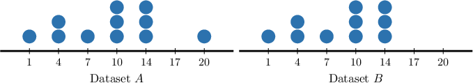

# Comparing Effects of Data Change on Measures of Centrality

Source: https://www.mathacademy.com/topics/6344?courseId=120
Topic ID: 6344

## Prerequisites

- [Comparing Medians](../../../middle-school/lessons/grade-7/6192-comparing-medians.md)
- [Effects of Data Change on the Mean](./6221-effects-of-data-change-on-the-mean.md)

## Lesson

### Introduction

In a previous lesson, we saw that when we add a data point to a dataset, the *mean* of the dataset shifts *toward* the new data point. In general:

- If the new value is *below* the current mean, the mean *decreases*

- If the new value is *above* the current mean, the mean *increases*.

The situation for the median is slightly different. In general, the median of the dataset moves toward that new data point *or stays the same!*

For example, consider the following ordered dataset containing $5$ datapoints.

$$

1,\quad 2,\quad {\color{blue}{2}},\quad 2,\quad 3

$$

Since the data set is symmetric about the middle data point $({\color{blue}{2}}),$ the median equals $2.$

Now, let's suppose we add a new data point $({\color{red}{4}})$ to this data set:

$$

1,\quad 2,\quad 2,\quad 2,\quad 3, \quad {\color{red}{4}}

$$

The data set now contains $6$ data points. Therefore, the median of this new dataset is the mean of the third and fourth values. Now, since the third and fourth values both equal $2,$ we have

$$

\text{median} = \dfrac{2+2}{2} = 2.

$$

In other words, the introduction of the new data point $({\color{red}{4}})$ did *not* change the median.

### Cases Where the Median Changes

Now, consider the following dataset containing $5$ datapoints.

$$

1,\quad 2,\quad {\color{blue}{3}},\quad 4,\quad 5

$$

Since the data set is symmetric about the middle data point $({\color{blue}{3}}),$ the median equals $3.$

Now, let's suppose we add a new data point $({\color{red}{6}})$ to this data set:

$$

1,\quad 2,\quad 3,\quad 4,\quad 5, \quad {\color{red}{6}}

$$

The data set now contains $6$ data points. Therefore, the median of this new dataset is the mean of the third and fourth values. Now, since the third and fourth values equal $3$ and $4,$ respectively, we have

$$

\text{median} = \dfrac{3+4}{2} = 3.5.

$$

In other words, the introduction of the new data point $({\color{red}{6}})$ caused the median to *increase* (i.e., move *toward* the additional data point).

To summarize:

When a new data point is added, the mean of the dataset *will* change (unless the new data point equals the mean), and the median of the dataset *may* change. In general:

- The mean of the dataset moves toward that new data point.

- The median of the dataset moves toward that new data point or stays the same.

### Example: Comparing Means and Medians of Datasets Differing by One Data Point

#### Question

The table shows the daily study times, rounded to the nearest minute, for a group of $50$ students.

A new time of $120$ minutes is added to the dataset, making $51$ times in total. Which measure (mean or median) remains the same?

#### Explanation

When a new data point is added, the mean of the dataset ** change (unless the new data point equals the mean), and the median of the dataset ** change. In general:

- The mean of the dataset moves toward that new data point.

- The median of the dataset moves toward that new data point or stays the same.

Since the original mean lies somewhere in the range of values between $30$ and $80,$ and the new data point $120$ lies above this range, the mean of the new dataset must be **** than the original mean.

Now, to compare the medians, we first calculate the cumulative frequencies.

In the original dataset of $50$ students, the middle lies between the $25$th and $26$th values. From the cumulative frequencies, both of these values correspond to a time of $60$ minutes. Thus, the median is $60$ minutes.

When the $120$ is added, the dataset size becomes $51,$ so the median is simply the $26$th value. The $26$th value still corresponds to a time of $60$ minutes. Thus, the median remains $60$ minutes.

Therefore, the median remains the same.

### Example: Comparing Differences in Means and Medians Using Dot Plots

#### Question

The two dot plots above show the distributions of datasets $A$ and $B$, where dataset $B$ is formed by removing a single data point from dataset $A.$ Complete the following statements so that they correctly compare the means and medians of the two datasets.

#### Body:

$\qquad$ The mean of dataset $A$ is $𝑋𝑋𝑋𝑋𝑋𝑋𝑋$ the mean of dataset B.

$\qquad$ The median of dataset $A$ is $𝑋𝑋𝑋𝑋𝑋𝑋𝑋$ the median of dataset $B.$

#### Explanation

First, notice that dataset $B$ is the result of removing a data point with a value of $20$ from dataset $A.$

When a new data point is added, the mean of the dataset ** change (unless the new data point equals the mean), and the median of the dataset ** change. In general:

- The mean of the dataset moves toward that new data point.

- The median of the dataset moves toward that new data point or stays the same.

By examining the dot plot, we estimate that the mean of dataset $A$ is approximately $9.$

The removed value of $20$ is greater than the approximate mean of dataset $A.$ As a result, the overall mean will decrease when this data point is removed.

Now, we compare the medians.

- Since dataset $A$ has an odd number of data points ($11$ in total), the median is the middle value (${\color{blue}6}$th). Hence, the median of dataset $A$ is $10.$

- Since dataset $B$ has an even number of data points ($10$ in total), the median is the average of the two middle values (the ${\color{blue}5}$th and ${\color{blue}6}$th, respectively). Hence, the median of dataset $B$ is $\dfrac{10+10}{2}=10.$

Therefore, in conclusion, the mean of dataset $A$ is $\boxed{\text{greater than}}$ the mean of dataset $B,$ and the median of dataset $A$ is $\boxed{\text{equal to}}$ the median of dataset $B.$

### Comparing the Statistics of Symmetric and Near-Symmetric Datasets

In contrast to adding an outlier, changing a middle data value often affects both the mean and the median.

For example, suppose dataset $A$ is given by

$$

8, \: 12, \: 16, \: 20, \: 24, \: 28

$$

and dataset $B$ is given by

$$

8, \: 12, \: 16, \: y, \: 24, \: 28

$$

where $16 < y < 20.$

Recall that a dataset is symmetric if its values mirror each other around the central value (or central average). In a perfectly symmetric dataset, the mean is equal to the median.

Dataset $A$ is symmetric about $18$ (the mean of the two middle values, $16$ and $20$), while $B$ is a near-symmetric counterpart obtained by decreasing one value from $20$ to $y.$

- For dataset $A,$ symmetry implies that the mean and median are both equal to $18.$

- For dataset $B,$ the order remains ascending and the middle two values are $16$ and $y,$ so the median is Moreover, since one value has decreased from dataset $A$ to dataset $B$ (one value decreased from $20$ to $y<20$), the mean also decreases.

Therefore, the median of dataset $B$ is *less than* the median of dataset $A,$ and the mean of dataset $B$ is *less than* the mean of dataset $A.$

Let's see another example.

### Example: Comparing the Mean and Median of a Near-Symmetric Dataset to Its Symmetric Counterpart

#### Question

The dataset $C$ is given by

$$

12, \: 24, \: 36, \: 48, \: 60

$$

and the dataset $D$ is given by

$$

12, \: 24, \: 36, \: 48, \: z

$$

where $z > 60.$ Compare the median and mean of both datasets.

#### Explanation

A dataset is symmetric if its values mirror each other around the central value (or central average). In a perfectly symmetric dataset, the mean is equal to the median.

Dataset $C$ is symmetric about $36,$ while $D$ is a near-symmetric counterpart obtained by increasing the largest value from $60$ to $z.$

- For dataset $C,$ symmetry implies that the mean and median are both equal to $36.$

- For dataset $D,$ the order remains ascending, and the central value, the median, remains the same.

On the other hand, since one value has increased from dataset $C$ to dataset $D$ (the largest value increased from $60$ to $z > 60$), the mean also increases.

Therefore, the median of dataset $D$ is ** the median of dataset $C,$ and the mean of dataset $D$ is ** the mean of dataset $C.$
