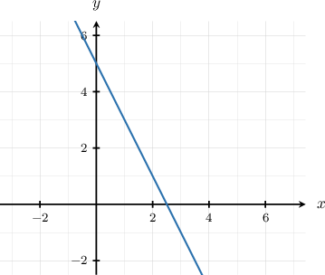
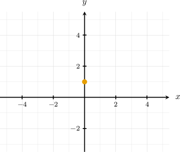
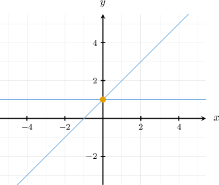
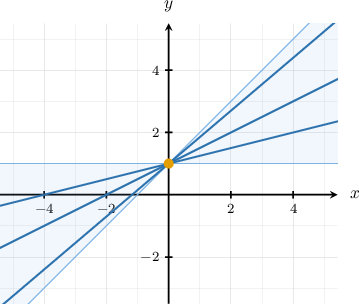
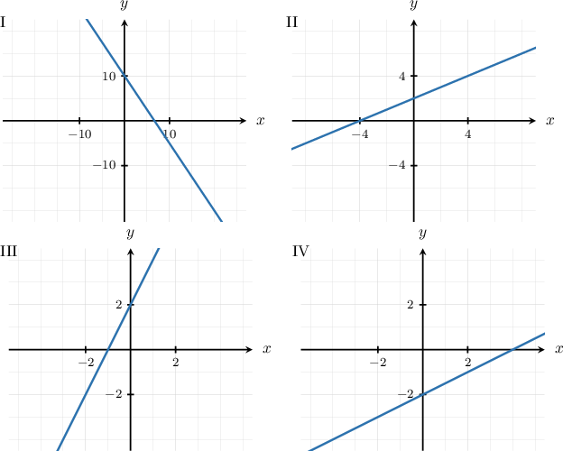

# Working With Lines in Slope-Intercept Form

Source: https://www.mathacademy.com/topics/6350?courseId=120
Topic ID: 6350

## Prerequisites

- [Equations of Lines in Slope-Intercept Form](../../../high-school/traditional/lessons/algebra-i/1240-equations-of-lines-in-slope-intercept-form.md)
- [Compound Inequalities](../../../middle-school/lessons/grade-7/2310-compound-inequalities.md)

## Lesson

### Introduction

In this lesson, we'll learn how to work with equations of lines not written in slope-intercept form.

Suppose that we have the following two-variable linear equation:

$$

2x+y-5 = 0

$$

This equation is, in fact, a straight line equation. But it isn't in the form

$$

y=mx+b.

$$

So how can we determine its slope and $y$-intercept?

Using our knowledge of algebra, we can solve the equation for $y$ as follows:

$$

\begin{aligned}2𝑥+𝑦−5 & =0 \\ 𝑦−5 & =−2𝑥 \\ 𝑦 & =−2𝑥+5\end{aligned}

$$

The equation is now in the slope-intercept form $y=mx+b.$ We can now tell straight away that the slope of the line is $m=-2$ and the $y$-intercept is $5.$

Furthermore, now that we know the slope and $y$-intercept of the line, we can graph it:

### Example: Converting an Equation to Slope-Intercept Form

#### Question

Find the slope-intercept form of the equation $3x-9+12y=6y-9.$

#### Explanation

To convert the equation to slope-intercept form, we solve the equation for $y\mathbin{:}$

$$

\begin{aligned} 3x-9+12y&=6y-9\\[3pt] 3x-9+6y&=-9\\[3pt] -9+6y&=-3x-9\\[3pt] 6y&=-3x\\[3pt] \dfrac{6y}{6}&=\dfrac{-3}{6}x\\[3pt] y&=-\dfrac{1}{2}x \end{aligned}

$$

Therefore, the slope-intercept form of the line is $y =-\dfrac 1 2 x.$

### Sketching the Graph of a Linear Equation Given Bounds on the Coefficients

Next, we'll learn how to analyze and quickly sketch a linear graph given certain restrictions on its coefficients in slope-intercept form.

For example, suppose we have a line in the form

$$

y=mx+b,

$$

where $m$ and $b$ are constants such that

$$

0 \leq m \leq 1, \qquad b = 1.

$$

How would the graph of that line look?

First, we are given the $y$-intercept $b=1.$ So, the line passes through the point $(0,1)$ on the $y$-axis.

Next, we are told that the slope of the graph lies between $m=0$ and $m=1,$ inclusive. Let's draw these boundary cases on the coordinate plane.

Our required graph could be any line that passes through $(0,1)$ and lies in the shaded region, as shown below.

### Example: Identifying a Possible Straight Line Graph Given Bounds on the Coefficients

#### Question

Which of the above could be the graph of $y=mx+b,$ where $m$ and $b$ are constants such that $m \geq 1$ and $b \gt 0?$

#### Explanation

Recall that, in an equation of a line in slope-intercept form, $y=mx+b,$

- $m$ represents the slope of the line, and

- $b$ represents the $y$-intercept of the line.

With that in mind, let's examine the given graph in turn.

- Graph I is ** valid. Notice that the line has a negative slope, which doesn't satisfy the condition $m \geq 1.$ $\color{red}\times$

- Graph II is ** valid. Notice that the line has the slope $m \approx\dfrac{2}{4}=\dfrac{1}{2},$ which doesn't satisfy the condition $m \geq 1.$ $\color{red}\times$

- Graph III is valid. Notice that: The line has the slope $m \approx \dfrac{2}{1}$ $=2,$ which satisfies $m \geq 1.$ $\color{darkgreen}\checkmark$ The line has the $y$-intercept $b \approx 2,$ which satisfies $b \gt 0.$ $\color{darkgreen}\checkmark$

- Graph IV is ** valid. Notice that the line has the $y$-intercept $b \approx -2,$ which doesn't satisfy the condition $b \gt 0.$ $\color{red}\times$

Therefore, the correct answer is "III only".
