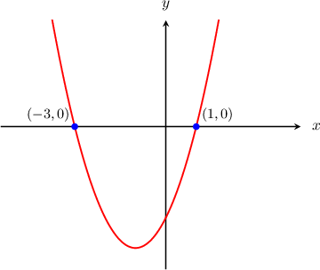

# Roots of Quadratic Functions

Source: https://www.mathacademy.com/topics/661?courseId=120
Topic ID: 661

## Prerequisites

- [Graphs of General Quadratic Functions](../../../high-school/traditional/lessons/algebra-i/84-graphs-of-general-quadratic-functions.md)
- [Solving Quadratic Equations with No Constant Term](../../../high-school/traditional/lessons/algebra-i/393-solving-quadratic-equations-with-no-constant-term.md)
- [The Quadratic Formula](../../../high-school/traditional/lessons/algebra-i/422-the-quadratic-formula.md)
- [Solving Quadratic Equations with Leading Coefficients by Factoring](../../../high-school/traditional/lessons/algebra-i/1422-solving-quadratic-equations-with-leading-coefficients-by-factoring.md)

## Lesson

### Introduction

Let's consider the parabola $y=x^2+2x-3,$ shown below.

We see that the roots, or $x$-intercepts, are $x=-3$ and $x=1.$ But can we find the roots without using a graph?

Indeed, we can. To do this, we need to find the points on the parabola where $y=0.$ So, setting $y=0,$ we get the following quadratic equation:

$$

\begin{aligned}𝑥^{2}+2𝑥−3=0\end{aligned}

$$

We can solve this equation by factoring. In doing so, we get

$$

\begin{aligned}(𝑥+3)(𝑥−1)=0.\end{aligned}

$$

Using the zero product rule, we have

$$

x+3=0 \qquad \text{or} \qquad x-1=0,

$$

which gives us the two expected solutions, $x= -3$ and $x=1.$

### Example: Finding the Roots By Factoring

#### Question

What are the roots of the parabola $y=-5x^2-x?$

#### Explanation

We need to find the points on the parabola where $y=0.$ So, we have the following quadratic equation:

$$

\begin{aligned}−5𝑥^{2}−𝑥=0\end{aligned}

$$

We can solve this equation by factoring. This gives

$$

\begin{aligned}−𝑥(5𝑥+1)=0.\end{aligned}

$$

Using the zero product rule, we have

$$

x=0 \qquad \text{or} \qquad 5x+1=0,

$$

which gives us the roots $x= 0$ and $x=-\dfrac{1}{5}.$

### Example: Finding the Roots Using the Square Root Method

#### Question

Find the roots of the parabola $y={(x-2)}^2-9.$

#### Explanation

To find the roots of the parabola, we set $y=0$ and solve for $x$ using the square root method, as follows:

$$

\begin{aligned}(𝑥−2)^{2}−9 & =0 \\ (𝑥−2)^{2} & =9 \\ 𝑥−2 & =±\sqrt{√9} \\ 𝑥−2 & =±3 \\ 𝑥 & =2±3.\end{aligned}

$$

So, the roots are $x=-1$ and $x=5.$

### Example: Finding the Roots Using the Quadratic Formula

#### Question

Find the $x$-intercepts of $y=-2x^2+x+4.$

#### Explanation

We need to find points on the parabola where $y=0.$ So, we have the following quadratic equation:

$$

\begin{aligned}−2𝑥^{2}+𝑥+4=0\end{aligned}

$$

Let's multiply by $-1$ to make the leading coefficient positive:

$$

\begin{aligned}(−1)⋅(−2𝑥^{2}+𝑥+4) & =(−1)⋅0 \\ 2𝑥^{2}−𝑥−4 & =0\end{aligned}

$$

This equation is difficult to factor, but we can solve it using the quadratic formula, as follows:

$$

\begin{aligned}𝑥 & =\frac{−𝑏±\sqrt{√𝑏^{2}−4𝑎𝑐}}{2𝑎} \\ & =\frac{−(−1)±\sqrt{√(−1)^{2}−4(2)(−4)}}{2(2)} \\ & =\frac{1±\sqrt{√1+32}}{4} \\ & =\frac{1±\sqrt{√33}}{4}\end{aligned}

$$

Therefore, the $x$-intercepts are $x= \dfrac{1 + \sqrt{33}}{4}$ and $x=\dfrac{1 - \sqrt{33}}{4}.$

### Example: Solving for Some Unknown Coefficients

#### Question

The parabola $y=3x^2+px+q$ has $x$-intercepts at the points $(\pm 2,0).$ What are the values of $p$ and $q?$

#### Explanation

The parabola has $x$-intercepts at $(2,0)$ and $(-2,0),$ which means that it has roots $x=2$ and $x=-2.$

Each root of the parabola corresponds to a factor:

- the root $x=2$ corresponds to the factor $(x-2),$ and

- the root $x=-2$ corresponds to the factor $(x+2).$

Therefore, the parabola $y=3x^2+px+q$ must factor as follows:

$$

\begin{aligned}𝑦 & =3𝑥^{2}+𝑝𝑥+𝑞 \\ 𝑦 & =3(𝑥−2)(𝑥+2)\end{aligned}

$$

It's important to not forget about the leading $3$ before the parenthesis. We need the $3$ to provide the leading coefficient in $3x^2.$

Now, by setting the two expressions for the parabola equal to each other and expanding out the product of factors, we can find $p$ and $q\mathbin{:}$

$$

\begin{aligned}3𝑥^{2}+𝑝𝑥+𝑞 & =3(𝑥−2)(𝑥+2) \\ & =3(𝑥^{2}−2^{2}) \\ & =3(𝑥^{2}−4) \\ & =3𝑥^{2}−12 \\ & =3𝑥^{2}+0𝑥+(−12)\end{aligned}

$$

Therefore, $p=0$ and $q=-12.$
