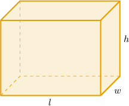

# Surface Areas of Rectangular Solids

Source: https://www.mathacademy.com/topics/674?courseId=120
Topic ID: 674

## Prerequisites

- [Surface Areas of Cubes](../../../high-school/traditional/lessons/geometry/681-surface-areas-of-cubes.md)

## Lesson

### Introduction

Let's calculate the surface area of the rectangular prism shown below:

The surface area is made up of 6 faces, as follows:

- the top and bottom faces each have area $4\,\text{cm}\times 2\,\text{cm} = 8\,\text{cm}^2$

- the front and back faces each have area $4\,\text{cm}\times 3\,\text{cm} = 12\,\text{cm}^2$

- the left and right faces each have area $2\,\text{cm}\times 3\,\text{cm} = 6\,\text{cm}^2$

Therefore, the total surface area $S$ of the prism is

$$

\begin{aligned}𝑆 & =2(8\,cm^{2})+2(12\,cm^{2})+2(6\,cm^{2}) \\ & =16\,cm^{2}+24\,cm^{2}+12\,cm^{2} \\ & =52\,cm^{2}\end{aligned}

$$

We conclude that the surface area of the rectangular prism is $52\,\text{cm}^2.$

### Deriving a General Formula for the Surface Area of a Rectangular Prism

A general rectangular prism has length $l,$ width $w,$ and height $h.$ Let's now derive a general formula for the surface area $S$ of a rectangular prism.

Similarly to the previous example, the surface area is made up of six faces:

- the top and bottom faces both have area $lw$

- the front and back faces both have area $lh$

- the left and right faces both have area $wh$

Adding the areas of the faces together, we get

$$

S = 2lw + 2lh + 2wh,

$$

which simplifies to

$$

S = 2(lw + lh + wh).

$$

From now on, we will use this formula to compute the surface area of a rectangular prism.

### Example: Calculating the Surface Area of a Rectangular Solid Given Its Dimensions

#### Question

Find the surface area of the rectangular prism shown below.

#### Explanation

We can find the surface area $S$ of a rectangular prism using the formula

$$

S = 2(lw + lh + wh),

$$

where $l$ is the length, $w$ is the width, and $h$ is the height of the solid.

Substituting

$$

l=4 \, \text{in}, \qquad w=5 \, \text{in}, \qquad h=1 \, \text{in}

$$

into the formula, we obtain

$$

\begin{aligned}𝑆 & =2(4⋅5+4⋅1+5⋅1) \\ & =2(20+4+5) \\ & =2⋅29 \\ & =58\,in^{2}.\end{aligned}

$$

### Example: Finding a Dimension of a Rectangular Solid Given Its Surface Area and Other Dimensions

#### Question

The width and height of a rectangular prism are $5 \, \textrm {cm}$ and $4 \, \text{cm},$ respectively, and its surface area is $148 \, \text{cm}^2.$ What is the length of the prism?

#### Explanation

We can find the surface area $S$ of a rectangular prism using the formula

$$

S = 2(lw + lh + wh),

$$

where $l$ is the length, $w$ is the width, and $h$ is the height of the solid.

Substituting

$$

S = 148, \qquad w=5, \qquad h=4

$$

into the formula, we obtain the following:

$$

\begin{aligned}𝑆 & =2(𝑙𝑤+𝑙ℎ+𝑤ℎ) \\ 148 & =2(5𝑙+4𝑙+5⋅4) \\ 148 & =2(9𝑙+20) \\ 74 & =9𝑙+20 \\ 54 & =9𝑙 \\ 𝑙 & =6\end{aligned}

$$

Therefore, the length of the prism is $6 \, \text{cm}.$

### Lateral Surface Areas of Rectangular Solids

The **lateral surface area** of a rectangular solid is the surface area of the side faces alone. In other words, it's the surface area that does not include the area of the top or bottom faces.

The lateral surface area $S_L$ of a rectangular solid can be found using the formula

$$

S_L = 2(lh + wh),

$$

where $l,$ $w,$ and $h$ are the solid's length, width, and height, respectively.

Notice that the $lw$ term is missing from the expression for $S_L.$ This is because $lw$ denotes the area of the top and bottom faces.

### Example: Calculating the Lateral Surface Area of a Rectangular Solid Given Its Dimensions

#### Question

Determine the lateral surface area for the rectangular solid below.

#### Explanation

We can find the lateral surface area $S_L$ of a rectangular solid using the formula

$$

S_L = 2(lh + wh),

$$

where $l$ is the length, $w$ is the width, and $h$ is the height of the solid.

Substituting

$$

l = 4\: \text{mm}, \qquad w=5\: \text{mm}, \qquad h=2\: \text{mm}

$$

into the formula, we obtain

$$

\begin{aligned}𝑆_{𝐿} & =2(4⋅2+5⋅2) \\ & =2(8+10) \\ & =2(18) \\ & =36\,mm^{2}.\end{aligned}

$$
