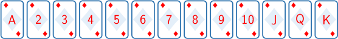
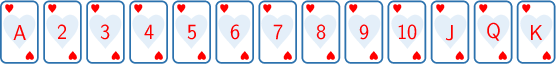

# Single Events in Probability

Source: https://www.mathacademy.com/topics/709?courseId=120
Topic ID: 709

## Prerequisites

- [The Likelihood of an Event](../../../high-school/traditional/lessons/geometry/7221-the-likelihood-of-an-event.md)

## Lesson

### Introduction

In many situations, each possible outcome in a probability experiment has the same chance of occurring. When this happens, we say the outcomes are **equally likely**.

When outcomes are equally likely, we can calculate probability using the formula

$$

P(\text{Event}) = \frac{\text{Number of favorable outcomes}}{\text{Total number of outcomes}}.

$$

To use this formula, we count how many outcomes match what we want and divide by the total number of possible outcomes.

Consider a box that contains $4$ blue markers, $7$ red markers, and $5$ green markers. One marker is selected at random. Let's find the probability that the selected marker is red.

Since each marker is equally likely to be chosen, we can use the formula.

First, we find the total number of markers:

$$

4 + 7 + 5 = 16.

$$

Next, we count the number of favorable outcomes. There are $7$ red markers.

So, the probability of selecting a red marker is

$$

P(\text{red marker}) = \frac{7}{16}.

$$

### Example: Computing Probability from Groups

#### Question

A survey is conducted in a class to find students' favorite type of after-school activity. The results are shown in the table below.

If one student from the class is selected at random, what is the probability that the student prefers gaming?

#### Explanation

The probability of an event when all outcomes are equally likely is given by

$$

P(\text{Event}) = \frac{\text{Number of favorable outcomes}}{\text{Total number of outcomes}}.

$$

In this case, there are a total of $9+7+3+5+6=30$ students.

The possible outcomes are selecting any one of these $30$ students. Of these, $5$ prefer gaming.

Since each student is equally likely to be selected, the probability of randomly selecting one who prefers gaming is

$$

P(\text{gaming}) = \dfrac{5}{30} = \dfrac{1}{6}.

$$

### Example: Computing Probability from Equally Likely Outcomes

#### Question

A spinner has $6$ equal sections labeled $\text{A},$ $\text{B},$ $\text{C},$ $\text{D},$ $\text{E},$ and $\text{F}.$ What is the probability of **** landing on a consonant?

#### Explanation

The probability of an event when all outcomes are equally likely is given by

$$

P(\text{Event}) = \frac{\text{Number of favorable outcomes}}{\text{Total number of outcomes}}.

$$

In this case, there are $6$ possible outcomes when spinning the spinner:

$$

\{\text{A}, \text{B}, \text{C}, \text{D}, \text{E}, \text{F}\}

$$

Of these outcomes, $2$ of them are not consonants (that is, they are vowels):

$$

\{\text{A}, \text{E}\}

$$

Since the spinner has equal sections, all outcomes are equally likely. Therefore, the probability of not landing on a consonant is

$$

P(\text{not a consonant}) = \dfrac{2}{6} = \dfrac{1}{3}.

$$

### Probabilities of "Or" Statements

Sometimes we are interested in the probability that one event happens *or* another event happens.

In probability, the word "or" means that either event can occur. We still use the same formula:

$$

P(\text{Event}) = \frac{\text{Number of favorable outcomes}}{\text{Total number of outcomes}}

$$

The only difference is how we count the favorable outcomes. For an "or" statement, we include all outcomes that satisfy either condition.

If the two events do not overlap, we can simply add the number of outcomes from each event.

For example, consider a basket that contains $6$ bananas, $8$ apples, and $6$ oranges. One fruit is selected at random. What is the probability of selecting a banana or an apple?

First, we find the total number of fruits. In this case, there are $6 + 8 + 6 = 20$ fruits. The possible outcomes are selecting any one of these $20$ fruits. Of these,

- $6$ fruits are bananas and

- $8$ fruits are apples.

These groups do not overlap. So, the number of favorable outcomes is

$$

6 + 8 = 14.

$$

Since each fruit is equally likely to be selected, the probability of randomly selecting a banana or an apple is

$$

P(\text{banana or apple}) = \dfrac{14}{20} = \dfrac{7}{10}.

$$

### Example: Computing Probability Using "Or" Statements

#### Question

A fair $12$-sided die has faces numbered $1$ through $12.$ The die is rolled once. What is the probability of getting a number divisible by $3$ or divisible by $5$?

#### Explanation

The probability of an event when all outcomes are equally likely is given by

$$

P(\text{Event}) = \frac{\text{Number of favorable outcomes}}{\text{Total number of outcomes}}.

$$

In this case, there are $12$ possible outcomes when rolling a $12$-sided die:

$$

\{1,2,3,4,5,6,7,8,9,10,11,12\}

$$

Of these outcomes:

- $4$ of them are divisible by $3{:}$

- $2$ of them are divisible by $5{:}$

These events do not overlap. So, the number of favorable outcomes is

$$

4 + 2 = 6.

$$

Since each outcome is equally likely, the probability of rolling a number divisible by $3$ or $5$ is

$$

P(\text{divisible by 3 or 5}) = \dfrac{6}{12} = \dfrac{1}{2}.

$$

### Overlapping "Or" Statements

Sometimes the events in an "or" statement can overlap. This means that some outcomes belong to both events. In such cases, we still use the same formula:

$$

P(\text{Event}) = \frac{\text{Number of favorable outcomes}}{\text{Total number of outcomes}}

$$

However, the key idea is how we count the favorable outcomes. When events overlap, we must be careful not to count the same outcome more than once.

Consider a bag that contains cards numbered $1$ through $10$. One card is selected at random. What is the probability that the card is an even number or a number less than $6?$

In this case, there are $10$ possible outcomes when picking a card:

$$

\{1,2,3,4,5,6,7,8,9,10\}

$$

Now, we identify the outcomes for each condition. Of these outcomes:

- $5$ of them are even:

- $5$ of them are less than $6{:}$ But $2$ and $4$ have already been counted as even numbers. We must not count these outcomes twice. So, we include only the $3$ additional outcomes:

So, in total, the number of favorable outcomes is

$$

5+3=8.

$$

Since each outcome is equally likely, the probability that the card is an even number or a number less than $6$ is

$$

6

$$

### Example: Computing Probability Using Overlapping "Or" Statements

#### Question

A fair $12$-sided die has faces numbered $1$ through $12.$ The die is rolled once. What is the probability of getting an even number or a number less than $7?$

#### Explanation

The probability of an event when all outcomes are equally likely is given by

$$

P(\text{Event}) = \frac{\text{Number of favorable outcomes}}{\text{Total number of outcomes}}.

$$

In our case, there are $12$ possible outcomes when rolling a $12$-sided die:

$$

\{1,2,3,4,5,6,7,8,9,10,11,12\}

$$

Of these outcomes:

- $6$ of them are even numbers:

- $6$ of them are less than $7{:}$ But $2,4,$ and $6$ have already been counted as even numbers. So, we include only the $3$ additional outcomes:

So, the number of favorable outcomes is

$$

6+3=9.

$$

Since each outcome is equally likely, the probability of getting an even number or a number less than $7$ is

$$

P(\text{even or less than 7}) = \dfrac{9}{12} = \dfrac{3}{4}.

$$

### The Structure of a Deck of Standard Playing Cards

Probability problems often involve the use of playing cards. A standard deck of playing cards is composed of $52$ cards, divided into $4$ suits.

- There are two red suits (diamonds and hearts) and two black suits (clubs and spades).

- Each suit has $13$ cards: ace, 2, 3, 4, 5, 6, 7, 8, 9, 10, jack, queen, king.

Jacks, queens, and kings are also called face cards.

A full standard deck of cards is shown below.

- Diamonds:

- Hearts:

- Spades:

- Clubs:

**Important**: An ace is considered to be a number card!
