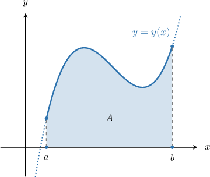
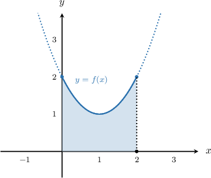
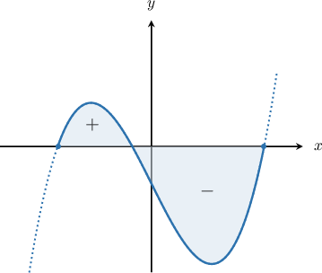
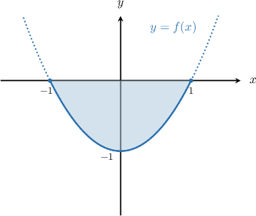

# The Area Bounded by a Curve and the X-Axis

Source: https://www.mathacademy.com/topics/1040?courseId=105
Topic ID: 1040

## Prerequisites

- [The Sum and Constant Multiple Rules for Definite Integrals](./1685-the-sum-and-constant-multiple-rules-for-definite-integrals.md)

## Lesson

### Introduction

To calculate the area $A$ bounded by a curve $y=y(x),$ the $x$-axis, and the vertical lines $x=a$ and $x=b,$ as shown below, we compute the integral

$$

A = \int_{a}^{b} y(x) \:\text{d}x.

$$

### Example: Calculating the Area Bounded Below a Curve and Above the X-Axis

#### Question

Find the area between the curve $y=x^2-2x+2,$ the $x$-axis, and the lines $x=0$ and $x=2.$

#### Explanation

To find the area, we just need to compute the corresponding definite integral:

$$

\begin{aligned}𝐴 & =∫_{𝑏𝑎}𝑦(𝑥)\,d𝑥 \\ & =∫_{20}(𝑥^{2}−2𝑥+2)\,d𝑥 \\ & =∫_{20}𝑥^{2}\,d𝑥−2∫_{20}𝑥\,d𝑥+2∫_{20}\,d𝑥 \\ & =\frac{𝑥^{3}}{3}_{20}−2⋅\frac{𝑥^{2}}{2}_{20}+2𝑥_{20} \\ & =(\frac{8}{3}−0)−2(2−0)+2(2−0) \\ & =\frac{8}{3}−4+4 \\ & =\frac{8}{3}.\end{aligned}

$$

### Signed Areas Bounded by a Curve and the x-Axis

When we compute the area under a curve using integration, we must bear the following in mind:

- definite integrals that correspond to areas above the $x$-axis are positive, while

- definite integrals that correspond to areas below the $x$-axis are negative.

Let's see an example where the area comes out to be negative.

### Example: Calculating the Area Bounded Above a Curve and Below the X-Axis

#### Question

Find the area of the closed region between the curve $y=x^2-1$ and the $x$-axis.

#### Explanation

First, we find the intersections of the curve with the $x$-axis:

$$

\begin{aligned}𝑥^{2}−1 & =0 \\ 𝑥^{2} & =1 \\ 𝑥 & =±1.\end{aligned}

$$

We draw a sketch of the region, as follows:

We want the area between the curve $y=x^2-1$ and the $x$-axis, from $x=-1$ to $x=1.$ To find the area, we just need to compute the corresponding definite integral:

$$

\begin{aligned}𝐴 & =∫_{𝑏𝑎}𝑦(𝑥)\,d𝑥 \\ & =∫_{1−1}(𝑥^{2}−1)\,d𝑥 \\ & =∫_{1−1}𝑥^{2}\,d𝑥−∫_{1−1}\,d𝑥 \\ & =\frac{𝑥^{3}}{3}_{1−1}−𝑥_{1−1} \\ & =(\frac{1}{3}−(−\frac{1}{3}))−(1−(−1)) \\ & =\frac{2}{3}−2 \\ & =−\frac{4}{3}.\end{aligned}

$$

Since the region lies below the $x$-axis, we obtained a negative number. So the area that we want is $\dfrac{4}{3}.$
