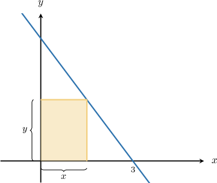
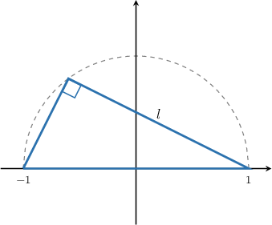
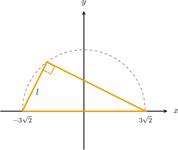

# Optimization Problems With Inscribed Shapes

Source: https://www.mathacademy.com/topics/1217?courseId=105
Topic ID: 1217

## Prerequisites

- [Solving Radical Equations](../../../high-school/traditional/lessons/algebra-i/116-solving-radical-equations.md)
- [The Second Derivative Test](./339-the-second-derivative-test.md)
- [Calculating Areas of Triangles and Quadrilaterals in the Plane](../../../high-school/traditional/lessons/geometry/2977-calculating-areas-of-triangles-and-quadrilaterals-in-the-plane.md)

## Lesson

### Introduction

Let's remind ourselves of the general strategy for optimization problems:

1. Draw a diagram of the situation, introducing variables where necessary.

2. Write down the equation of the quantity that you're trying to maximize or minimize. This is called the **objective function**, and it might include more than one variable.

3. Write down the constraint equation.

4. Use the constraint equation to write the objective function in terms of a single variable only.

5. Differentiate the objective function, set it equal to zero, and solve for the stationary points.

6. Test each stationary point using the second derivative test. Or you can use the first derivative test if it's easier.

We can use differentiation to solve optimization problems involving inscribed shapes. Let's find out how.

### Example: Maximizing the Area of a Rectangle Inscribed in the First Quadrant Under a Given Curve

#### Question

Find the area of the largest rectangle that can be inscribed in the closed region bounded by the $x$-axis, the $y$-axis, and the graph of $y=f(x)=4 - \dfrac{4}{3} x.$

#### Explanation

First, let's make a diagram of the situation:

Let $x$ and $y$ be the width and height of the rectangle, respectively. Given a width $x,$ the height $y$ of the rectangle rises up to the curve $y= 4 - \dfrac{4}{3} x.$

We want to maximize the area of the rectangle, which is given by

$$

A = xy = x \left( 4 - \dfrac{4}{3} x \right) = 4x - \dfrac{4}{3} x^2.

$$

Let's compute the critical points. Taking the derivative of the area, we get

$$

A'(x) = 4 - \dfrac{8}{3} x,

$$

and solving $A'(x)=0$ gives the following critical point:

$$

\begin{aligned}𝐴^{′}(𝑥) & =0 \\ 4−\frac{8}{3}𝑥 & =0 \\ \frac{8}{3}𝑥 & =4 \\ 𝑥 & =\frac{3}{2}\end{aligned}

$$

All that's left now is to confirm that $x=\dfrac{3}{2}$ does indeed give a maximum value of $A(x).$ To do this, we use the first derivative test. We write up a table of values:

So $x=\dfrac{3}{2}$ does indeed give a maximum, and the area of the resulting rectangle will be the largest possible.

Therefore, the greatest area that a rectangle can have is

$$

\begin{aligned}𝐴(\frac{3}{2}) & =4(\frac{3}{2})−\frac{4}{3}(\frac{3}{2})^{2} \\ & =6−\frac{4}{3}(\frac{9}{4}) \\ & =6−3 \\ & =3.\end{aligned}

$$

### Example: Maximizing the Perimeter of a Triangle Inscribed in a Circle

#### Question

Consider a right triangle inscribed in a semicircle of radius $1.$ What is the greatest possible perimeter of the triangle?

#### Explanation

We first draw a picture of the situation:

Let's call $l$ the length of one of the legs. Since the hypotenuse of the triangle has length $2,$ then by the Pythagorean theorem, the length of the other leg $b$ is given by

$$

\begin{aligned}𝑏^{2} & =(2)^{2}−𝑙^{2}\,⟹\,𝑏=\sqrt{4−𝑙^{2}}.\end{aligned}

$$

Therefore, the perimeter is given by

$$

P(l) = 2 + l + \sqrt{4-l^2}.

$$

Since $l$ is the length of a leg of a right triangle whose hypotenuse is $2,$ the permitted range of $l$ is $0< l <2.$

We want to maximize $P(l),$ so we need to compute the critical points. Taking the derivative, we get

$$

\begin{aligned}𝑃^{′}(𝑙) & =1+\frac{1}{2}⋅\frac{−2𝑙}{\sqrt{4−𝑙^{2}}} \\ & =1−\frac{𝑙}{\sqrt{4−𝑙^{2}}},\end{aligned}

$$

and solving $P'(l)=0$ gives the following critical point:

$$

\begin{aligned}𝑃^{′}(𝑙) & =0 \\ 1−\frac{𝑙}{\sqrt{4−𝑙^{2}}} & =0 \\ \frac{𝑙}{\sqrt{4−𝑙^{2}}} & =1 \\ 𝑙 & =\sqrt{4−𝑙^{2}} \\ 𝑙^{2} & =4−𝑙^{2} \\ 𝑙^{2} & =2 \\ 𝑙 & =\sqrt{2}\end{aligned}

$$

All that's left now is to confirm that $l = \sqrt{2}$ does indeed give a maximum value of $P(l).$ To do this, we use the first derivative test. We write up a table of values:

So, $l = \sqrt{2}$ does indeed give a maximum, and the perimeter of the resulting triangle will be the largest possible.

Therefore, the greatest perimeter that a triangle can have is

$$

\begin{aligned}𝑃(\sqrt{2}) & =2+\sqrt{2}+\sqrt{4−(\sqrt{2})^{2}} \\ & =2+\sqrt{2}+\sqrt{4−2} \\ & =2+\sqrt{2}+\sqrt{2} \\ & =2+2\sqrt{2}\,.\end{aligned}

$$

### Example: Maximizing the Area of a Triangle Inscribed in a Circle

#### Question

Consider a right triangle inscribed in a semicircle of radius $3\sqrt{2}.$ Find the maximum possible area of the triangle.

#### Explanation

We first draw a picture of the situation:

Let's call $l$ the length of one leg. By the Pythagorean theorem, the length of the other leg is $\sqrt{72-l^2}.$

Therefore, the area of the triangle is given by

$$

A(l) = \frac{1}{2}l\sqrt{72-l^2} \,.

$$

Since $l$ is the length of a leg of a right triangle whose hypotenuse is $6\sqrt{2}$, the permitted range of $l$ is $0< l< 6\sqrt{2}.$

We want to maximize $A(l),$ so we need to compute the critical points. Taking the derivative, we get

$$

\begin{aligned}𝐴^{′}(𝑙) & =\frac{1}{2}\sqrt{72−𝑙^{2}}−\frac{𝑙^{2}}{2\sqrt{72−𝑙^{2}}},\end{aligned}

$$

and solving $A'(l)=0$ gives the following critical point:

$$

\begin{aligned}𝐴^{′}(𝑙) & =0 \\ \frac{1}{2}\sqrt{72−𝑙^{2}}−\frac{𝑙^{2}}{2\sqrt{72−𝑙^{2}}} & =0 \\ 2\sqrt{72−𝑙^{2}}⋅(\frac{1}{2}\sqrt{72−𝑙^{2}}−\frac{𝑙^{2}}{2\sqrt{72−𝑙^{2}}}) & =2\sqrt{72−𝑙^{2}}⋅0 \\ 72−𝑙^{2}−𝑙^{2} & =0 \\ 𝑙^{2} & =\frac{72}{2} \\ 𝑙^{2} & =36 \\ 𝑙 & =6\end{aligned}

$$

All that's left now is to confirm that $l=6$ does indeed give a maximum value of $A(l).$ To do this, we use the first derivative test. We write up a table of values:

So, $l=6$ does indeed give a maximum, and the area of the resulting triangle will be the largest possible.

Finally, the maximum possible area is

$$

\begin{aligned}𝐴(6) & =\frac{1}{2}⋅6⋅\sqrt{72−(6)^{2}} \\ & =3⋅\sqrt{72−36} \\ & =3⋅\sqrt{36} \\ & =3⋅6 \\ & =18.\end{aligned}

$$
