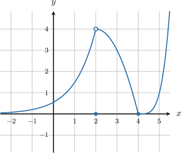
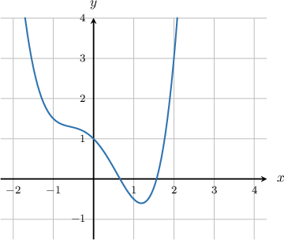

# The Product and Quotient Rules for Limits

Source: https://www.mathacademy.com/topics/1246?courseId=105
Topic ID: 1246

## Prerequisites

- [The Sum Rule for Limits](./1914-the-sum-rule-for-limits.md)

## Lesson

### Introduction

The **product rule** states that the limit of the product of two functions equals the product of the limits.

More precisely, if $\lim\limits_{x\rightarrow \, a}f(x)=L$ and $\lim\limits_{x\rightarrow \, a}g(x)=K,$ then

$$

\begin{aligned}\underset{𝑥→\,𝑎}{lim}(𝑓(𝑥)⋅𝑔(𝑥)) & =\underset{𝑥→\,𝑎}{lim}𝑓(𝑥)⋅\underset{𝑥→\,𝑎}{lim}𝑔(𝑥) \\ & =𝐿⋅𝐾.\end{aligned}

$$

For example, we can evaluate

$$

\lim\limits_{x \rightarrow \,2} \left[ (x^2 +2x +3)(x^3-2x-1) \right]

$$

by evaluating the limit of each polynomial separately, and then multiplying the results together:

$$

\begin{aligned}\underset{𝑥→\,2}{lim}[(𝑥^{2}+2𝑥+3)(𝑥^{3}−2𝑥−1)] & =\underset{𝑥→\,2}{lim}(𝑥^{2}+2𝑥+3)⋅\underset{𝑥→\,2}{lim}(𝑥^{3}−2𝑥−1) \\ & =(2^{2}+2⋅2+3)⋅(2^{3}−2⋅2−1) \\ & =(4+4+3)⋅(8−4−1) \\ & =(11)⋅(3) \\ & =33\end{aligned}

$$

### Example: Applying the Product Rule to Compute a Limit

#### Question

Find $\lim\limits_{x\rightarrow -2}(x^2-3x)(x+1)^{3}.$

#### Explanation

Applying the product rule, followed by the sum and constant multiple rules, we have

$$

\begin{aligned}\underset{𝑥→−2}{lim}(𝑥^{2}−3𝑥)(𝑥+1)^{3} & =\underset{𝑥→−2}{lim}(𝑥^{2}−3𝑥)⋅\underset{𝑥→−2}{lim}(𝑥+1)^{3} \\ & =(\underset{𝑥→−2}{lim}𝑥^{2}−3\underset{𝑥→−2}{lim}𝑥)(\underset{𝑥→−2}{lim}(𝑥^{3}+3𝑥^{2}+3𝑥+1)) \\ & =((−2)^{2}−3(−2))((−2)^{3}+3(−2)^{2}+3(−2)+1) \\ & =(4+6)(−8+12−6+1) \\ & =(10)(−1) \\ & =−10.\end{aligned}

$$

### Example: Applying the Product Rule to Compute a Limit Given a Graph

#### Question

Find $\lim\limits_{x\rightarrow 2}\left(\dfrac{x^3 f(x)}{4}\right)$ for the function $f(x)$ plotted below.

#### Explanation

From the graph, we get that $\lim\limits_{x\rightarrow 2} f(x)=4.$ So, applying the product rule, we have

$$

\begin{aligned}\underset{𝑥→2}{lim}(\frac{𝑥^{3}𝑓(𝑥)}{4}) & =\frac{1}{4}⋅\underset{𝑥→2}{lim}𝑥^{3}⋅\underset{𝑥→2}{lim}𝑓(𝑥) \\ & =\frac{1}{4}⋅2^{3}⋅4 \\ & =8\,.\end{aligned}

$$

### The Quotient Rule for Limits

The **quotient rule** states that the limit of the quotient of two functions equals the quotient of the limits (provided that the limit of the denominator is not zero).

More precisely, if $\lim\limits_{x\rightarrow a}f(x)=L$ and $\lim\limits_{x\rightarrow a}g(x)= K \neq 0$, then

$$

\lim\limits_{x\rightarrow a} \dfrac{f(x)}{g(x)} = \dfrac{\lim\limits_{x\rightarrow a}f(x)}{\lim\limits_{x\rightarrow a}g(x)}=\dfrac{L}{K}.

$$

For example, we can evaluate

$$

\lim\limits_{x \rightarrow \,2} \dfrac{x^2+4x}{x+1}

$$

by evaluating the limits of the numerator and denominator separately, and then dividing the results:

$$

\begin{aligned}\underset{𝑥→\,2}{lim}\frac{𝑥^{2}+4𝑥}{𝑥+1} & =\frac{\underset{𝑥→\,2}{lim}(𝑥^{2}+4𝑥)}{\underset{𝑥→\,2}{lim}(𝑥+1)} \\ & =\frac{2^{2}+4⋅2}{2+1} \\ & =\frac{12}{3} \\ & =4\end{aligned}

$$

### Example: Applying the Quotient Rule to Compute a Limit

#### Question

Calculate $\lim\limits_{x\rightarrow 2} x^{-5}.$

#### Explanation

First, we will express the negative exponent as a quotient:

$$

\lim\limits_{x\rightarrow 2} x^{-5}= \lim\limits_{x\rightarrow 2} \dfrac{1}{x^5}

$$

Then, we apply the quotient rule:

$$

\begin{aligned}\underset{𝑥→2}{lim}𝑥^{−5} & =\frac{\underset{𝑥→2}{lim}1}{\underset{𝑥→2}{lim}𝑥^{5}} \\ & =\frac{1}{2^{5}} \\ & =\frac{1}{32}.\end{aligned}

$$

### Example: Applying the Quotient Rule to Compute a Limit Given a Graph

#### Question

Find $\lim\limits_{x\rightarrow 2} \dfrac{xf(x)+x^2}{2+f(x)}$ for the function $f(x)$ plotted below.

#### Explanation

Using the quotient rule, we have

$$

\begin{aligned}\underset{𝑥→2}{lim}\frac{𝑥𝑓(𝑥)+𝑥^{2}}{2+𝑓(𝑥)} & =\frac{\underset{𝑥→2}{lim}(𝑥𝑓(𝑥)+𝑥^{2})}{\underset{𝑥→2}{lim}(2+𝑓(𝑥))}\,.\end{aligned}

$$

We find from the graph that $\lim\limits_{x\rightarrow 2} f(x)=3.$ Calculating the limits of the numerator and denominator separately, we have

$$

\begin{aligned}\underset{𝑥→2}{lim}(𝑥𝑓(𝑥)+𝑥^{2}) & =2(3)+2^{2}=10, \\ \underset{𝑥→2}{lim}(2+𝑓(𝑥)) & =2+3=5.\end{aligned}

$$

Taking the quotient of these limits, we have

$$

\begin{aligned}\underset{𝑥→2}{lim}\frac{𝑥𝑓(𝑥)+𝑥^{2}}{2+𝑓(𝑥)} & =\frac{\underset{𝑥→2}{lim}(𝑥𝑓(𝑥)+𝑥^{2})}{\underset{𝑥→2}{lim}(2+𝑓(𝑥))} \\ & =\frac{10}{5} \\ & =2\,.\end{aligned}

$$
