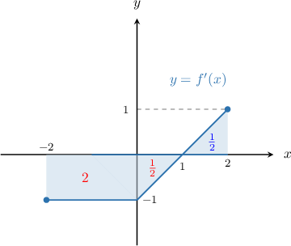
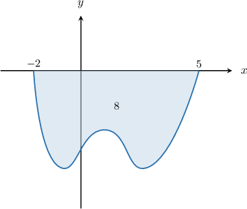
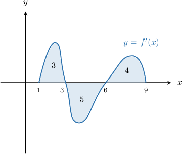
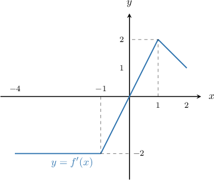
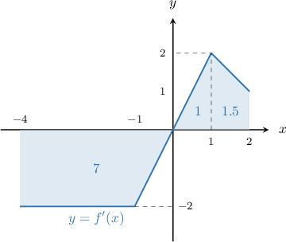

# Minimizing a Function Using the Graph of its Derivative

Source: https://www.mathacademy.com/topics/1250?courseId=105
Topic ID: 1250

## Prerequisites

- [The Candidates Test](./364-the-candidates-test.md)
- [Interpreting the Graph of a Function's Derivative](./624-interpreting-the-graph-of-a-function-s-derivative.md)
- [Calculating the Definite Integral of a Function's Derivative Given its Graph](./1201-calculating-the-definite-integral-of-a-function-s-derivative-given-its-graph.md)

## Lesson

### Introduction

In this lesson, we will learn how to use the graph of a function's derivative to minimize the function. Let's understand how this process works by studying a specific example.

The graph of $y = f'(x),$ the *derivative* of $f(x),$ is shown in the picture below.

The areas of the shaded regions are indicated on the diagram. Additionally, it is known that $f(-2)=5.$ Our goal is find the *minimum* value of $f(x)$ on the interval $x\in [-2,2].$

To find the minimum value of $f(x),$ we use the candidates test.

According to the candidates test, the minimum value of $f(x)$ on $[-2,2]$ must occur at a critical point or an endpoint of the interval. Therefore, we proceed as follows.

**Step 1**: Find the critical points.

We see that $f'(x)$ is defined everywhere on $x\in (-2,2),$ so there are no non-stationary critical points. Additionally, we see that $f'(x)=0$ at $x=1.$ Therefore, the candidates are

$$

x=-2,\quad x=1,\quad x=2.

$$

**Step 2**: Compute the value of $f$ for each candidate using the fundamental theorem of calculus.

- The value of $f(x)$ at the left endpoint is given:

- To compute $f(1),$ we apply the fundamental theorem of calculus. Since the areas of the rectangle and middle triangle in our picture equal ${\color{red}{2}}$ and ${\color{red}{\dfrac12}},$ respectively, we have Notice that we *subtracted* these areas since both lie *under* the $x$-axis.

- To compute $f(2),$ we apply the fundamental theorem of calculus once more. Using the fact that the area of the right triangle equals ${\color{blue}{\dfrac12}},$ we have

**Step 3**: Select the smallest value of $f$ from our candidates.

Comparing the values of $f$ found in step $2,$ we have

$$

f_{\text{min}} = \min\left\lbrace 5, \dfrac52, 3 \right\rbrace = \dfrac52.

$$

Therefore, the minimum value of $f$ is $f_{\text{min}}=\dfrac52,$ and the value of $x$ that minimizes $f(x)$ is $x_\text{min}=1.$

### Example: Finding a Minimum Value Given a Derivative Graph With One Area

#### Question

The function $f(x)$ is defined and differentiable on $[-2,5].$ The graph of $f'(x),$ the derivative of $f(x),$ is shown above, where the area of the region between the graph and the $x$-axis is $8.$ Find the minimum value of $f(x)$ on the interval $[-2,5]$ given that $f(-2)=4.$

#### Explanation

According to the candidates test, the minimum value of $f(x)$ on $[-2,5]$ must occur at a critical point or an endpoint of the interval.

****: Find the critical points.

We see that $f'(x)$ is defined everywhere on $x \in (-2,5),$ and $f'(x) \neq 0$ on this interval. Therefore, the candidates are $x=-2,5.$

****: Compute the value of $f$ for each candidate using the fundamental theorem of calculus.

$$

\begin{aligned}𝑓(−2) & =4 \\ 𝑓(5) & =𝑓(−2)+∫_{5−2}𝑓^{′}(𝑥)\,d𝑥 \\ & =4−8 \\ & =−4\end{aligned}

$$

****: Select the smallest value of $f$ from our candidates.

Comparing the values of $f$ found in step $2,$ we have

$$

f_{\text{min}} = \min\{4, -4\} = -4.

$$

Therefore, the minimum value of $f$ is $f_{\text{min}} = -4,$ and the value of $x$ that minimizes $f(x)$ is $x_{\text{min}} = 5.$

### Example: Finding a Minimum Value Given a Derivative Graph With More Than One Area

#### Question

The function $f(x)$ is defined and differentiable on $[1,9].$ The graph of $f'(x),$ the derivative of $f(x),$ is shown below, where the areas of the regions between the graph and the $x$-axis are $3,$ $5,$ and $4$ respectively (from left to right). Find the minimum value of $f(x)$ on the interval $[1,9]$ given that $f(1)=5.$

#### Explanation

According to the candidates test, the minimum value of $f(x)$ on $[1,9]$ must occur at a critical point or an endpoint of the interval.

****: Find the critical points.

We see that $f'(x)$ is defined everywhere on $x \in (1,9),$ and $f'(x) = 0$ at $x=3$ and $x=6.$ Therefore, the candidates are $x=1,3,6,9.$

****: Compute the values of $f$ for each candidate using the fundamental theorem of calculus.

$$

\begin{aligned}𝑓(1) & =5 \\ 𝑓(3) & =𝑓(1)+∫_{31}𝑓^{′}(𝑥)\,d𝑥 \\ & =5+3 \\ & =8 \\ 𝑓(6) & =𝑓(1)+∫_{61}𝑓^{′}(𝑥)\,d𝑥 \\ & =5+3−5 \\ & =3 \\ 𝑓(9) & =𝑓(1)+∫_{91}𝑓^{′}(𝑥)\,d𝑥 \\ & =5+3−5+4 \\ & =7\end{aligned}

$$

****: Select the smallest value of $f$ from our candidates.

Comparing the values of $f$ found in step $2,$ we have

$$

f_{\text{min}} = \min\{5, 8, 3, 7\} = 3.

$$

Therefore, the minimum value of $f$ is $f_{\text{min}} = 3,$ and the value of $x$ that minimizes $f(x)$ is $x_{\text{min}} = 6.$

### Example: Finding a Minimum Value by Computing Areas Under Curves

#### Question

The function $f$ is defined and differentiable on $[-4,2].$ The graph of $f'(x),$ the derivative of $f(x),$ is shown above. Find the minimum value of the function $f(x)$ on the interval $[-4,2]$ given that $f(-4)=0.$

#### Explanation

According to the candidates test, the minimum value of $f(x)$ on $[-4,2]$ must occur at a critical point or an endpoint of the interval.

****: Find the critical points.

We see that $f'(x)$ is defined everywhere on $x \in (-4,2),$ and $f'(x)=0$ at $x=0.$ Therefore, the candidates are $x = -4, 0, 2.$

****: Compute the values of $f$ for each candidate using the fundamental theorem of calculus.

The function is made up of two trapezoids and one triangle. Let's add the areas bounded by these shapes to our diagram:

Using the given information and the fundamental theorem of calculus, we have the following:

$$

\begin{aligned}𝑓(−4) & =0 \\ 𝑓(0) & =𝑓(−4)+∫_{0−4}𝑓^{′}(𝑥)\,d𝑥 \\ & =0−7 \\ & =−7 \\ 𝑓(2) & =𝑓(−4)+∫_{2−4}𝑓^{′}(𝑥)\,d𝑥 \\ & =0−7+1+1.5 \\ & =−4.5\end{aligned}

$$

****: Select the smallest value of $f$ from our candidates.

Comparing the values of $f$ found in step $2,$ we have

$$

f_{\text{min}} = \min\{ 0, -7, -4.5 \} = -7.

$$

Therefore, the minimum value of $f$ is $f_{\text{min}} = -7,$ and the value of $x$ that minimizes $f(x)$ is $x_\text{min} = 0.$
