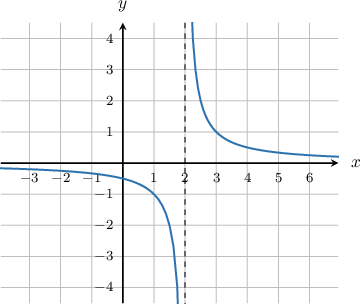
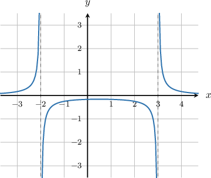
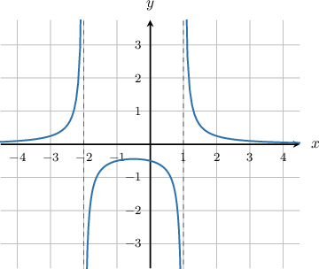
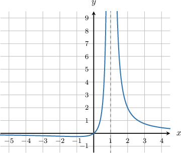
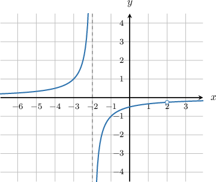

# Connecting Infinite Limits and Vertical Asymptotes of Rational Functions

Source: https://www.mathacademy.com/topics/1384?courseId=105
Topic ID: 1384

## Prerequisites

- [Vertical Asymptotes of Rational Functions](./1815-vertical-asymptotes-of-rational-functions.md)
- [Limits of Reciprocal Functions](./1905-limits-of-reciprocal-functions.md)

## Lesson

### Introduction

Rational functions have infinite limits when the $x$-value approaches vertical asymptotes. To find the infinite limits of a rational function $f(x),$ we first find the vertical asymptotes.

For example, consider the rational function $f(x) = \dfrac{1}{x-2}.$ This rational function has a vertical asymptote at $x=2.$

To find the one-sided limits at the asymptote $x=2,$ we check the sign of $f(x)$ as $x$ approaches $2$ from the left and the right.

- To find the limit as $x \to 2^-,$ we evaluate $f(x)$ at $x$-values very close to $x=2$ from the left:

The values of $f(x)$ are negative, and they get more and more negative. Therefore,

$$

\lim\limits_{x \to 2^-} f(x) = -\infty.

$$

- To find the limit as $x \to 2^+,$ we evaluate $f(x)$ at $x$-values very close to $x=2$ from the right:

The values of $f(x)$ are positive, and they get larger and larger. Therefore,

$$

\lim\limits_{x \to 2^+} f(x) = +\infty.

$$

These one-sided limits match up with what we see in the graph of $f(x),$ shown below.

### Example: Evaluating the Right-Sided Limit of a Rational Function at a Vertical Asymptote

#### Question

Evaluate $\lim\limits_{x \to 3^+} \dfrac{1}{x^2-x-6}.$

#### Explanation

First, notice that we can factor the function, as follows:

$$

f(x) = \dfrac{1}{x^2-x-6} = \dfrac{1}{(x-3)(x+2)}

$$

So, the function $f(x)$ has two vertical asymptotes, $x=-2$ and $x=3.$

Since $x=3$ is a vertical asymptote, the limit as $x \to 3^+$ will be either $+\infty$ or $-\infty.$

To find the limit as $x \to 3^+,$ we evaluate $f(x)$ at $x$-values very close to $x=3$ from the right:

The values of $f(x)$ are positive, and they get larger and larger. Therefore,

$$

\lim\limits_{x \to 3^+} f(x) = +\infty.

$$

This matches up with what we see in the graph of $f(x),$ shown below.

### Example: Evaluating the Left-Sided Limit of a Rational Function at a Vertical Asymptote

#### Question

Calculate $\lim\limits_{x \to 1^-} \dfrac{1}{x^2+x - 2}.$

#### Explanation

First, let's factor the denominator.

$$

\begin{aligned}𝑓(𝑥) & =\frac{1}{𝑥^{2}+𝑥−2} \\ & =\frac{1}{𝑥^{2}+2𝑥−𝑥−2} \\ & =\frac{1}{𝑥(𝑥+2)−(𝑥+2)} \\ & =\frac{1}{(𝑥−1)(𝑥+2)}\end{aligned}

$$

This implies that the function $f(x)$ has two vertical asymptotes, $x=-2$ and $x=1.$

Since $x=1$ is a vertical asymptote, the limit as $x \to 1^-$ will be either $+\infty$ or $-\infty.$

To find the limit is $x \to 1^-,$ we evaluate $f(x)$ at $x$-values very close to $x=1$ from the left:

The values of $f(x)$ are negative, and they get more and more negative. Therefore,

$$

\lim\limits_{x \to 1^-} f(x)= -\infty.

$$

This matches up with what we see in the graph of $f(x),$ shown below.

### Example: Identifying Correct Limits of a Given Rational Function

#### Question

Given that $f(x) = \dfrac{x}{(x-1)^2},$ which of the following statements is correct?

1. $\lim\limits_{x \to 1^-}f(x)= -\infty$

2. $\lim\limits_{x \to 1^+} f(x)= +\infty$

3. $\lim\limits_{x \to 1} f(x)= +\infty$

#### Explanation

The function $f(x)= \dfrac{x}{(x-1)^2}$ has a vertical asymptote at $x=1.$

To compute the one-sided limits as $x \to 1,$ we evaluate $f(x)$ at $x$-values very close to $x=1$ from the right and from the left.

All the values of $f(x)$ are positive, and they get larger and larger as $x\to1$ from both sides. Therefore,

$$

\lim\limits_{x \to 1^-} f(x)=\lim\limits_{x \to 1^+} f(x)= +\infty.

$$

Consequently, statement I is false and II is true.

Finally, since both left and right-sided limits at $x=1$ are equal, we have

$$

\lim\limits_{x \to 1} f(x)= +\infty,

$$

and therefore III is true.

In conclusion, only statements II and III are true. A plot of the function is shown below.

### Example: Identifying Correct Limits of a Given Function when Simplification is Required

#### Question

Given that $f(x) = \dfrac{2-x}{x^2-4},$ which of the following statements is correct?

1. $\lim\limits_{x \to (-2)^+}f(x)= -\infty$

2. $\lim\limits_{x \to 2^+}f(x)= -\infty$

3. $\lim\limits_{x \to 2^-}f(x)= \infty$

#### Explanation

First, let's factor the numerator and denominator, as follows:

$$

\begin{aligned}𝑓(𝑥) & =\frac{2−𝑥}{𝑥^{2}−4} \\ & =−\frac{(𝑥−2)}{(𝑥−2)(𝑥+2)}\end{aligned}

$$

Therefore, the domain is $x\neq \pm 2$, and we notice that the function can be simplified:

$$

\begin{aligned}𝑓(𝑥)=−\frac{1}{𝑥+2}\end{aligned}

$$

Now we see that the function has only one vertical asymptote, $x=-2.$ So statements II and III are false.

To find $\lim\limits_{x \to (-2)^+}f(x),$ we evaluate $f(x)$ at $x$-values very close to $x=-2$ from the right.

All the values of $f(x)$ are negative, and they get more and more negative as $x\to-2$ from the right. Therefore,

$$

\lim\limits_{x \to (-2)^+}f(x) = -\infty,

$$

and therefore statement I is correct.

In conclusion, only statement I is correct. A plot of the function is shown below.

