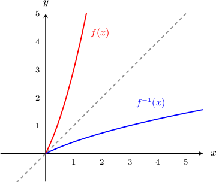

# Differentiating Inverse Functions

Source: https://www.mathacademy.com/topics/1785?courseId=105
Topic ID: 1785

## Prerequisites

- [The Chain Rule With Trigonometric Functions](./305-the-chain-rule-with-trigonometric-functions.md)
- [Calculating the Inverse of a Function](../../../high-school/traditional/lessons/algebra-ii/627-calculating-the-inverse-of-a-function.md)
- [The Chain Rule With Exponential Functions](./1007-the-chain-rule-with-exponential-functions.md)
- [The Chain Rule With Logarithmic Functions](./1036-the-chain-rule-with-logarithmic-functions.md)
- [Calculating dy/dx Using dx/dy](./1784-calculating-dy-dx-using-dx-dy.md)

## Lesson

### Introduction

Suppose that we have a function $f(x) = x^2+2x,$ and we want to find the derivative of the *inverse* function $(f^{-1})'(x).$ Can we do this without explicitly computing the inverse?

Indeed, we can! The trick is to write the inverse function *implicitly*, differentiate it, and then write the result in terms of $f^{-1}(x).$

**Step 1:** First, we write the inverse function implicitly. The given function is $y = x^2+2x,$ and to write the inverse function implicitly, we swap $x$ and $y$ as follows:

$$

x=y^2+2y

$$

Note that in the equation above, we have $y=f^{-1}(x).$ Also, remember that swapping $x$ and $y$ gives us the inverse function because the inverse function $f^{-1}(x)$ can be obtained by reflecting the graph of $f(x)$ over the line $y=x.$

**Step 2:** Next, we differentiate. The overall goal is to find $\dfrac{\textrm dy}{\textrm dx},$ but the equation is already solved for $x,$ so we start by computing $\dfrac{\textrm dx}{\textrm dy}\mathbin{:}$

$$

\begin{aligned}𝑥 & =𝑦^{2}+2𝑦 \\ \frac{d𝑥}{d𝑦} & =\frac{d}{d𝑦}(𝑦^{2}+2𝑦) \\ \frac{d𝑥}{d𝑦} & =2𝑦+2.\end{aligned}

$$

To find $\dfrac{\textrm{d}y}{\textrm{d}x},$ we take the reciprocal of $\dfrac{\textrm{d}x}{\textrm{d}y}\mathbin{:}$

$$

\dfrac{\textrm{d}x}{\textrm{d}y} = 2y + 2 \quad \Rightarrow \quad \dfrac{\textrm{d}y}{\textrm{d}x}=\dfrac{1}{2y+2}

$$

**Step 3:** Lastly, we write the result in terms of $f^{-1}(x).$ Since $y=f^{-1}(x),$ we have

$$

\begin{aligned}\frac{d𝑦}{d𝑥} & =\frac{1}{2𝑦+2} \\ \frac{d}{d𝑥}[𝑓^{−1}(𝑥)] & =\frac{1}{2𝑓^{−1}(𝑥)+2} \\ (𝑓^{−1})^{′}(𝑥) & =\frac{1}{2𝑓^{−1}(𝑥)+2}.\end{aligned}

$$

### Example: Calculating the Derivative of the Inverse of a Polynomial Function

#### Question

If $f(x)=3x^2+9,$ find $(f^{-1})'(x)$ as a function of $f^{-1}(x).$

#### Explanation

**** First, we write the inverse function implicitly. The given function is $y = 3x^2+9,$ and to write the inverse function implicitly, we swap $x$ and $y$ as follows:

$$

x=3y^2+9

$$

Note that in the equation above, we have $y=f^{-1}(x).$

**** Next, we differentiate. The overall goal is to find $\dfrac{\textrm dy}{\textrm dx},$ but the equation is already solved for $x,$ so we compute $\dfrac{\textrm dx}{\textrm dy}$ and then take the reciprocal:

$$

\begin{aligned}\frac{d𝑥}{d𝑦} & =\frac{d}{d𝑦}(3𝑦^{2}+9) \\ \frac{d𝑥}{d𝑦} & =6𝑦 \\ \frac{d𝑦}{d𝑥} & =\frac{1}{6𝑦}\end{aligned}

$$

**** Lastly, we write the result in terms of $f^{-1}(x).$ Since $y=f^{-1}(x),$ we have

$$

\begin{aligned}\frac{d}{d𝑥}[𝑓^{−1}(𝑥)] & =\frac{1}{6𝑓^{−1}(𝑥)} \\ (𝑓^{−1})^{′}(𝑥) & =\frac{1}{6𝑓^{−1}(𝑥)}.\end{aligned}

$$

### Example: Calculating the Derivative of the Inverse of a Composite Function

#### Question

Find $\left(f^{-1}\right)'(x)$ as a function of $f^{-1}(x)$ if $f(x) = \cos \left(x^2\right) +6.$

#### Explanation

**** First, we write the inverse function implicitly. The given function is $y = \cos \left(x^2\right) +6,$ and to write the inverse function implicitly, we swap $x$ and $y$ as follows:

$$

x = \cos \left(y^2\right) + 6

$$

Note that in the equation above, we have $y=f^{-1}(x).$

**** Next, we differentiate. The overall goal is to find $\dfrac{\textrm dy}{\textrm dx},$ but the equation is already solved for $x,$ so we compute $\dfrac{\textrm dx}{\textrm dy}$ and then take the reciprocal:

$$

\begin{aligned}\frac{d𝑥}{d𝑦} & =\frac{d}{d𝑦}[cos⁡(𝑦^{2})+6] \\ \frac{d𝑥}{d𝑦} & =−2𝑦sin⁡(𝑦^{2}) \\ \frac{d𝑦}{d𝑥} & =−\frac{1}{2𝑦sin⁡(𝑦^{2})} \\ \frac{d𝑦}{d𝑥} & =−\frac{1}{2𝑦}csc⁡(𝑦^{2})\end{aligned}

$$

**** Lastly, we write the result in terms of $f^{-1}(x).$ Since $y=f^{-1}(x),$ we have

$$

\begin{aligned}\frac{d}{d𝑥}[𝑓^{−1}(𝑥)] & =−\frac{1}{2(𝑓^{−1}(𝑥))}csc⁡((𝑓^{−1}(𝑥))^{2}) \\ (𝑓^{−1})^{′}(𝑥) & =−\frac{1}{2(𝑓^{−1}(𝑥))}csc⁡((𝑓^{−1}(𝑥))^{2}).\end{aligned}

$$
