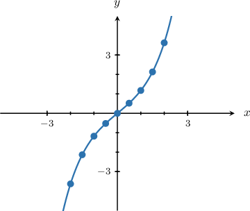
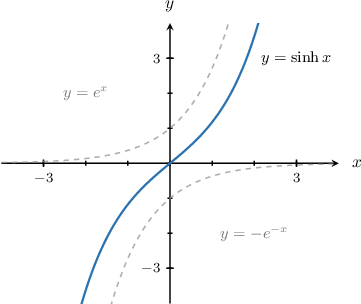
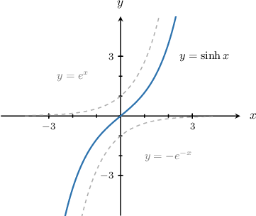
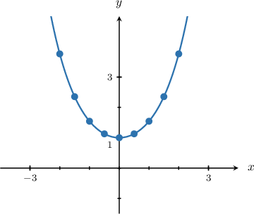
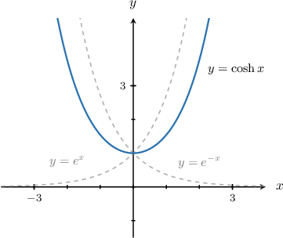
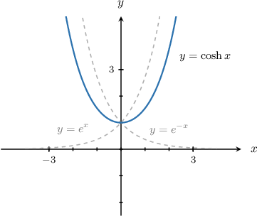
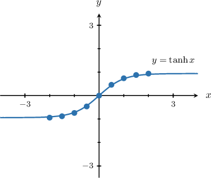
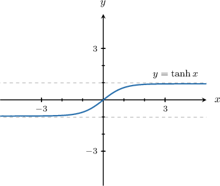
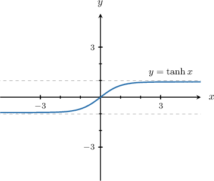

# Graphs of the Hyperbolic Functions

Source: https://www.mathacademy.com/topics/1831?courseId=105
Topic ID: 1831

## Prerequisites

- [Even and Odd Functions](../../../high-school/traditional/lessons/algebra-ii/725-even-and-odd-functions.md)
- [The Hyperbolic Functions](./967-the-hyperbolic-functions.md)
- [Properties of Transformed Exponential Functions](../../../high-school/traditional/lessons/algebra-ii/1609-properties-of-transformed-exponential-functions.md)

## Lesson

### Introduction

$$

$$

Suppose we want to plot the graph of the function $y= \sinh x.$ To do this, we start with the definition:

$$

\sinh x = \dfrac{e^x-e^{-x}}{2}

$$

We create a table of values by substituting some $x$-values into the definition of $y = \sinh x$ and finding the corresponding (approximate) $y$-values:

Plotting these points, we get the following curve:

The key features of the graph are as follows:

- The domain and range are $(-\infty,\infty).$

- It is an odd function.

- It has a zero at $x=0.$

- Its graph is increasing over the entire real line. Moreover, $\qquad$ $\sinh{x} \to -\infty$ as $x \to -\infty,$ $\qquad$ $\sinh{x} \to \infty$ as $x \to \infty.$

- It is the mean (average) of the functions $y=e^x$ and $y=-e^{-x}.$

### Example: Identifying the Graph and Properties of the Hyperbolic Sine

#### Question

Which of the following statements are true regarding the function $y=\sinh{x}?$

1. The function is the average of $y=e^x$ and $y=e^{-x}.$

2. The function is decreasing over $(-\infty,0)$ and increasing over $(0, \infty).$

3. The function is odd.

#### Explanation

Let's recall the graph of $y=\sinh{x}.$

Let's now examine our statements in turn.

- Statement I is false. The function $y=\sinh{x}$ is the average of $y=e^x$ and $y=-e^{-x}{:}$

- Statement II is false. The function $y=\sinh{x}$ is increasing over the entire real line.

- Statement III is true. Indeed, the function $y=\sinh{x}$ is odd, i.e., $\sinh(-x)=-\sinh(x),$ and the graph has rotational symmetry of order $2$ about the origin.

Therefore, the correct answer is "III only."

### The Graph of the Hyperbolic Cosine

Let's now plot the graph of the hyperbolic cosine. As before, we start with the definition:

$$

y= \cosh x = \dfrac{e^x+e^{-x}}{2}

$$

Creating a table of values (rounded to two decimal places where appropriate), we get the following:

Plotting these points, we get the curve shown below:

The key features of the graph are as follows:

- The domain is $(-\infty,\infty)$ and the range is $[1,\infty).$

- It is an even function (the graph is symmetric about the $y$-axis).

- It has no zeros.

- Its minimum value occurs at $x=0.$

- Its graph is decreasing over $(-\infty,0)$ and is increasing over $(0,\infty).$ Moreover, $\qquad$ $\cosh{x} \to \infty$ as $x \to \pm\infty.$

- It is the mean (average) of the functions $y=e^x$ and $y=e^{-x}.$

### Example: Identifying the Graph and Properties of the Hyperbolic Cosine

#### Question

Which of the following statements are true regarding the function $y=\cosh{x}?$

1. The domain of the function is $[0, \infty).$

2. The graph of the function is symmetric with respect to the $y$-axis.

3. The minimum of the function occurs at $x=0.$

#### Explanation

Let's recall the graph of $y=\cosh{x}.$

Let's now examine our statements in turn.

- Statement I is false. The domain of the function $y=\cosh{x}$ is $(-\infty,\infty)$ and the range is $[1,\infty).$

- Statement II is true. Indeed, the function $y=\cosh{x}$ is even, i.e. $\cosh(-x)=\cosh(x),$ and the graph is symmetric about the $y$-axis.

- Statement III is true. Indeed, the minimum value of the function $y=\cosh{x}$ is $y=1$ and occurs at $x=0.$

Therefore, the correct answer is "II and III only."

### The Graph of the Hyperbolic Tangent

Finally, let's plot the graph of the function $y= \tanh x.$

We start with the definition:

$$

\tanh x = \dfrac{\sinh x}{\cosh x} = \dfrac{e^x-e^{-x}}{e^x+e^{-x}}

$$

Our table of values (rounded to two decimal places where appropriate) is given below:

Plotting these points, we get the following curve:

The key features of the graph are as follows:

- The domain is $(-\infty,\infty)$ and the range is $(-1,1).$

- It is an odd function (the graph has rotational symmetry of order $2$ about the origin).

- It has a zero at $x=0.$

- The graph is increasing over the entire real line. Moreover, $\qquad$ $\tanh{x} \to -1$ as $x \to -\infty,$ $\qquad$ $\tanh{x} \to 1$ as $x \to \infty.$

### Example: Identifying the Graph and Properties of the Hyperbolic Tangent

#### Question

Which of the following statements are true regarding the function $y=\tanh{x}?$

1. $\tanh{x} \to 1$ as $x \to \infty.$

2. The range of the function is $(-\infty,\infty).$

3. The function has no zeros.

#### Explanation

Let's recall the graph of $y=\tanh{x}.$

Let's now examine our statements in turn.

- Statement I is true. Indeed, we have that $\tanh{x} \to 1$ as $x \to \infty.$

- Statement II is false. The range of $\tanh{x}$ is $(-1,1).$

- Statement III is false. The function $y=\tanh{x}$ has a zero at $x=0.$

Therefore, the correct answer is "I only."
