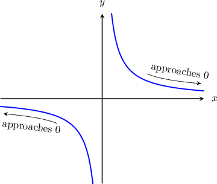
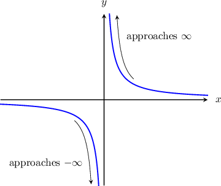
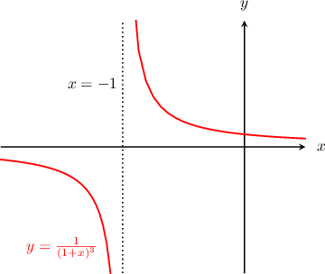
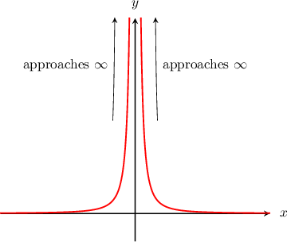
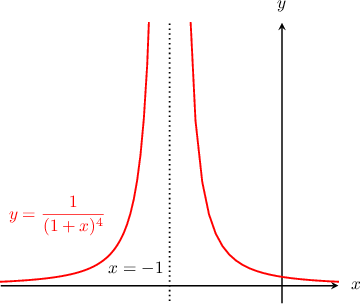

# Limits of Reciprocal Functions

Source: https://www.mathacademy.com/topics/1905?courseId=105
Topic ID: 1905

## Prerequisites

- [Limits at Infinity of Polynomials](./1263-limits-at-infinity-of-polynomials.md)
- [Infinite Limits from Graphs](./1814-infinite-limits-from-graphs.md)
- [Graphing Reciprocal Functions](../../../high-school/traditional/lessons/algebra-ii/2033-graphing-reciprocal-functions.md)

## Lesson

### Introduction

How do we calculate $\displaystyle \lim_{x\to\infty}\left(\dfrac{1}{x}\right)$ and $\displaystyle \lim_{x\to-\infty}\left(\dfrac{1}{x}\right)?$ To find out, let's look at the graph of $y=\dfrac{1}{x}.$

We see that the curve approaches zero as $x$ approaches positive infinity. The same is true as $x$ approaches negative infinity. So, we write

$$

\lim_\limits{x \to \infty} \left(\dfrac{1}{x}\right)=0 \qquad \textrm{and} \qquad \lim_\limits{x \to -\infty} \left(\dfrac{1}{x}\right)=0.

$$

The same is true for $\dfrac{1}{x^n}$ where $n$ is *any* positive integer. For example,

$$

\begin{aligned}\underset{𝑥→∞}{lim}(\frac{1}{𝑥^{2}})=0\, & and\,\underset{𝑥→−∞}{lim}(\frac{1}{𝑥^{2}})=0 \\ \underset{𝑥→∞}{lim}(\frac{1}{𝑥^{3}})=0\, & and\,\underset{𝑥→−∞}{lim}(\frac{1}{𝑥^{3}})=0 \\ & ⋮\end{aligned}

$$

and so on. This is because as the size of $x$ increases, the size of $\dfrac{1}{x^n}$ decreases.

### Example: Limits at Infinity of Reciprocal Functions

#### Question

Compute $\lim_\limits{x \to \infty} \dfrac{1}{4x^4}.$

#### Explanation

First, we use the algebra of limits to pull out the constant factor of $\dfrac 1 4\mathbin{:}$

$$

\begin{aligned}\underset{𝑥→∞}{lim}\frac{1}{4𝑥^{4}} & =\underset{𝑥→∞}{lim}\frac{1}{4}⋅\frac{1}{𝑥^{4}} \\ & =\frac{1}{4}⋅\underset{𝑥→∞}{lim}\frac{1}{𝑥^{4}}\end{aligned}

$$

Now, using the fact that

$$

\lim_\limits{x \to \infty} \left(\dfrac{1}{x^4}\right)=0,

$$

we can evaluate our limit as follows:

$$

\dfrac{1}{4} \cdot\lim_\limits{x \to \infty} \dfrac{1}{x^4} = \dfrac 1 4\cdot 0 = 0

$$

### Limits at Infinity of Reciprocals of Polynomials

For any non-constant polynomial $P(x),$ we have

$$

\lim_{x\to\pm\infty}\left(\dfrac{1}{P(x)}\right) = 0.

$$

This is because as $x$ increases, any polynomial $P(x)$ will grow without bound, and therefore its reciprocal shrinks to zero.

For example, the expression $x^3 - x^2 + 1$ is a non-constant polynomial, so we have

$$

\lim_{x\to\pm\infty}\left(\dfrac{1}{x^3 - x^2 + 1}\right) = 0.

$$

Likewise, the expression $(2x-5)^4$ can be multiplied out to become a non-constant polynomial, so we have

$$

\lim_{x\to\pm\infty}\left(\dfrac{1}{ (2x-5)^4 }\right) = 0.

$$

### Example: Limits at Infinity of Reciprocals of Polynomials

#### Question

Compute $\lim_\limits{x \to -\infty} \dfrac{1}{(1-x)^4} \,.$

#### Explanation

For any non-constant polynomial $P(x),$ we have

$$

\lim_{x\to\pm\infty}\left(\dfrac{1}{P(x)}\right) = 0.

$$

Therefore, since $(1-x)^4$ is a non-constant polynomial, we have

$$

\lim_\limits{x \to -\infty} \dfrac{1}{(1-x)^4} = 0.

$$

### Infinite Limits of Reciprocal Functions Where the Leading Term Has an Odd Power

Let's again look at the graph of $y=\dfrac{1}{x}.$

From the graph, we see that

$$

\lim_\limits{x\rightarrow 0^-} \left(\dfrac{1}{x}\right) = -\infty \qquad \textrm{and} \qquad \lim_\limits{x\rightarrow 0^+} \left(\dfrac{1}{x}\right) = \infty.

$$

Since the left and right-sided limits are not the same, we conclude that

$$

\lim_\limits{x\rightarrow 0} \left(\dfrac{1}{x}\right) = \textrm{DNE}.

$$

Any function of the form $y = \dfrac{1}{x^n},$ where $n$ is an *odd* natural number, has the same shape as $y = \dfrac{1}{x},$ and consequently the limit behavior is the same. For example,

$$

\begin{aligned}\underset{𝑥→0^{−}}{lim}(\frac{1}{𝑥^{3}})=−∞, & \,\underset{𝑥→0^{+}}{lim}(\frac{1}{𝑥^{3}})=∞, \\ \underset{𝑥→0^{−}}{lim}(\frac{1}{𝑥^{5}})=−∞, & \,\underset{𝑥→0^{+}}{lim}(\frac{1}{𝑥^{5}})=∞, \\ & ⋮\end{aligned}

$$

and so on. For all of the above, the limit of the function does not exist at $x=0$ because the left and right limits are not the same.

### Example: Infinite Limits of Reciprocal Functions Where the Leading Term Has an Odd Power

#### Question

Compute $\lim_\limits{x \to (-1)} \dfrac{1}{(x+1)^3} \,.$

#### Explanation

We can sketch the graph of $y = \dfrac{1}{(x+1)^3}$ as follows:

1. Take the graph of $y = \dfrac 1 {x^3}.$

2. Translate it to the left by $1$ unit. This gives $y = \dfrac{1}{(x+1)^3},$ as shown below.

From the graph, we see that

$$

\lim_\limits{x \to (-1^-)} \dfrac{1}{(x+1)^3} = -\infty, \qquad \lim_\limits{x \to (-1^+)} \dfrac{1}{(x+1)^3} = \infty,

$$

and therefore

$$

\lim_\limits{x \to (-1)} \dfrac{1}{(x+1)^3}= \textrm{DNE}.

$$

### Infinite Limits of Reciprocal Functions Where the Leading Term Has an Even Power

Now let's look at the graph of $y = \dfrac{1}{x^2}.$

We see that as we approach $0$ from both sides, the function grows rapidly without bound. So

$$

\lim_\limits{x\rightarrow 0^-}\left(\dfrac{1}{x^2}\right) = \lim_\limits{x\rightarrow 0^+} \left(\dfrac{1}{x^2}\right)= \infty,

$$

which implies that

$$

\lim_\limits{x\rightarrow 0} \left(\dfrac{1}{x^2}\right)= \infty.

$$

Any function of the form $y = \dfrac{1}{x^n}$ (where $n$ is an *even* natural number) has the same shape as $y = \dfrac{1}{x^2}.$ Therefore,

$$

\lim_\limits{x\rightarrow 0} \left(\dfrac{1}{x^n}\right)= \infty, \qquad n=2,4,6,\ldots

$$

### Example: Infinite Limits of Reciprocal Functions Where the Leading Term Has an Even Power

#### Question

Calculate $\lim_\limits {x\rightarrow -1} \dfrac{1}{(x+1)^4}.$

#### Explanation

We can sketch the graph of $y = \dfrac{1}{(x+1)^4}$ as follows:

1. Take the graph of $y = \dfrac 1 {x^4}.$

2. Translate it to the left by $1$ unit. This gives $y = \dfrac{1}{(x+1)^4},$ as shown below.

From the graph, we see that

$$

\lim_\limits{x \to (-1^-)} \dfrac{1}{(x+1)^4} = \infty, \qquad \lim_\limits{x \to (-1^+)} \dfrac{1}{(x+1)^4} = \infty,

$$

and therefore

$$

\lim_\limits{x \to (-1)} \dfrac{1}{(x+1)^4}= \infty.

$$
