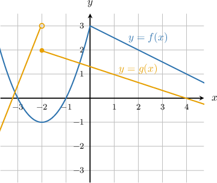

# The Sum Rule for Limits

Source: https://www.mathacademy.com/topics/1914?courseId=105
Topic ID: 1914

## Prerequisites

- [Limits of Power Functions, and the Constant Rule for Limits](./1716-limits-of-power-functions-and-the-constant-rule-for-limits.md)

## Lesson

### Introduction

The **sum rule** states that the limit of the sum of two functions equals the sum of the limits (provided that those limits exist).

More precisely, if $\lim\limits_{x\rightarrow a}f(x)=L$ and $\lim\limits_{x\rightarrow a}g(x)=K$, then

$$

\begin{aligned}\underset{𝑥→𝑎}{lim}(𝑓(𝑥)+𝑔(𝑥)) & =\underset{𝑥→𝑎}{lim}𝑓(𝑥)+\underset{𝑥→𝑎}{lim}𝑔(𝑥) \\ & =𝐿+𝐾.\end{aligned}

$$

For example, to compute $\lim\limits_{x \rightarrow \,-3} \left(5x^2+2x\right),$ we can first apply the sum rule, followed by the constant rule, and compute the limits of the power functions.

$$

\begin{aligned}\underset{𝑥→\,−3}{lim}(5𝑥^{2}+2𝑥) & =\underset{𝑥→\,−3}{lim}5𝑥^{2}+\underset{𝑥→\,−3}{lim}2𝑥 \\ & =5⋅\underset{𝑥→\,−3}{lim}𝑥^{2}+2⋅\underset{𝑥→\,−3}{lim}𝑥 \\ & =5⋅(−3)^{2}+2⋅(−3) \\ & =45−6 \\ & =39\end{aligned}

$$

There is a shortcut: in general, to find the limit of a polynomial $f(x)$ at some point $x=c,$ all we need to do is evaluate the polynomial at $c.$

$$

\lim_{x\to c} f(x) = f(c)

$$

**Warning!** If one of $\lim\limits_{x\rightarrow a}f(x)$ or $\lim\limits_{x\rightarrow a}g(x)$ exists while the other does not exist, then $\lim\limits_{x\rightarrow a}\Bigl(f(x)+g(x) \Bigr)$ does not exist either.

### Example: Applying the Sum Rule to Compute a Limit

#### Question

Evaluate $\lim\limits_{x \rightarrow \,1} \left(6x^2+x\right).$

#### Explanation

We first apply the sum rule, and then apply the constant rule and compute the limits of the power functions.

$$

\begin{aligned}\underset{𝑥→\,1}{lim}(6𝑥^{2}+𝑥) & =\underset{𝑥→\,1}{lim}6𝑥^{2}+\underset{𝑥→\,1}{lim}𝑥 \\ & =6⋅\underset{𝑥→\,1}{lim}𝑥^{2}+\underset{𝑥→\,1}{lim}𝑥 \\ & =6⋅1^{2}+1 \\ & =6+1 \\ & =7\end{aligned}

$$

### Example: Applying the Sum Rule to Compute A Limit Given a Graph

#### Question

The figure below shows the graphs of $y=f(x)$ and $y=g(x).$ Evaluate $\lim\limits_{x \rightarrow \,-2} \Bigl(3f(x) - g(x)\Bigr).$

#### Explanation

According to the sum and constant multiple rules, we can compute the required limit as follows:

$$

\lim\limits_{x \rightarrow \,-2} \Bigl(3f(x) - g(x)\Bigr) = 3 \lim\limits_{x \rightarrow \,-2} f(x) - \lim\limits_{x \rightarrow \,-2} g(x)

$$

The above assumes that $\lim\limits_{x \rightarrow \,-2} f(x)$ and $\lim\limits_{x \rightarrow \,-2} g(x)$ both exist.

In the graph, we see that $\lim\limits_{x \rightarrow \,-2} f(x) =-1.$ However, $\lim\limits_{x \rightarrow \,-2} g(x) = \text{DNE}$ because the left and right limits are not equal:

$$

\lim\limits_{x\rightarrow {-2}^{-}}g(x)=3, \qquad \lim\limits_{x\rightarrow -2^{+}}g(x)=2 \,.

$$

Because $\lim\limits_{x \rightarrow \,-2} f(x)$ exists while $\lim\limits_{x \rightarrow \,-2} g(x)$ does not, the overall limit $\lim\limits_{x \rightarrow \,-2} \Bigl(3f(x) - g(x)\Bigr)$ does not exist either:

$$

\lim\limits_{x \rightarrow \,-2} \Bigl(3f(x) - g(x)\Bigr) = \text{DNE}

$$
