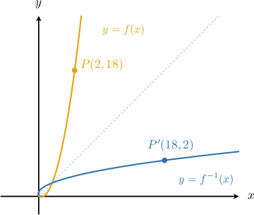
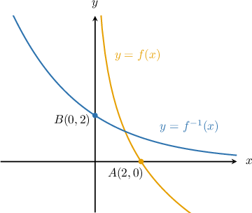

# Differentiating an Inverse Function at a Point

Source: https://www.mathacademy.com/topics/291?courseId=105
Topic ID: 291

## Prerequisites

- [Solving Radical Equations](../../../high-school/traditional/lessons/algebra-i/116-solving-radical-equations.md)
- [Solving Polynomial Equations Using the GCF](../../../high-school/traditional/lessons/algebra-ii/480-solving-polynomial-equations-using-the-gcf.md)
- [Solving Equations Containing the Exponential Function](../../../high-school/traditional/lessons/algebra-ii/870-solving-equations-containing-the-exponential-function.md)
- [Selecting Procedures for Calculating Derivatives](./1115-selecting-procedures-for-calculating-derivatives.md)
- [Calculating Derivatives From Graphs](./1117-calculating-derivatives-from-graphs.md)
- [Solving Logarithmic Equations Containing the Natural Logarithm](../../../high-school/traditional/lessons/algebra-ii/1551-solving-logarithmic-equations-containing-the-natural-logarithm.md)
- [Differentiating Inverse Functions](./1785-differentiating-inverse-functions.md)

## Lesson

### Introduction

Consider the following function:

$$

f(x)= 4x^2+x, \qquad x \gt 0

$$

The domain restriction $x > 0$ means that $f$ is invertible on its entire domain.

The point $P$ with coordinates $(2,18)$ lies on the curve $y = f(x).$ This means that the point $P'$ with coordinates $(18,2)$ lies on the curve of the inverse function $y=f^{-1}(x),$ as shown below.

How do we find $\dfrac{\textrm d y}{\textrm d x}$ at the point $P'?$

For this, we will use the fact that the slope of the tangent to the curve $y=f^{-1}(x)$ at $P'$ is the *reciprocal* of the slope of the tangent to the curve $y=f(x)$ at $P.$

$$

\begin{aligned}\frac{d𝑦}{d𝑥}_{𝑃^{′}}=\frac{1}{(\frac{d𝑦}{d𝑥}_{𝑃})}\end{aligned}

$$

Calculating $\dfrac{\textrm d y}{\textrm d x}$ at $P$ is straightforward. First, we differentiate $y=f(x).$ This gives

$$

\dfrac{\textrm{d}y}{\textrm{d}x} = 8x + 1,

$$

and then plugging in $x=2$ gives

$$

\left.\dfrac{\textrm{d}y}{\textrm{d}x}\right|_P = 8(2)+1 = 17.

$$

Finally, we take the reciprocal:

$$

\left.\dfrac{\textrm{d}y}{\textrm{d}x}\right|_{P'}= \dfrac{1}{17}

$$

We can summarize this process using the following formula:

$$

\left(f^{-1}\right)'(x) = \dfrac{1}{f'(f^{-1}(x))}

$$

To help remember this formula, note that it's okay to swap the derivative symbol (the prime) with the inverse symbol (the exponent of $-1$) as long as we take the reciprocal afterward.

### Example: Calculating the Derivative of an Inverse Function From a Graph

#### Question

The figure above shows the graph of a function $y=f(x)$ and its inverse $y=f^{-1}(x).$ The point $A$ has coordinates $(2, 0)$ and lies on $y=f(x).$ The point $B$ has coordinates $(0,2)$ and lies on $y=f^{-1}(x).$ If $f'(2)=-\dfrac{3}{2},$ what is $(f^{-1})'(0)?$

#### Explanation

Since $B \,(0,2)$ lies on $f^{-1},$ we have $f^{-1}(0) = 2.$ We're also told that $f'(2)=-\dfrac{3}{2}.$

The formula for the derivative of the inverse function is

$$

\begin{aligned}\begin{aligned}(𝑓^{−1})^{′}(𝑥) & =\frac{1}{𝑓^{′}(𝑓^{−1}(𝑥))}.\end{aligned}\end{aligned}

$$

Evaluating at $x=0,$ we have

$$

\begin{aligned}\begin{aligned}(𝑓^{−1})^{′}(0) & =\frac{1}{𝑓^{′}(𝑓^{−1}(0))} \\ & =\frac{1}{𝑓^{′}(2)} \\ & =\frac{1}{(−\frac{3}{2})} \\ & =−\frac{2}{3}.\end{aligned}\end{aligned}

$$

### Example: Calculating the Derivative of an Inverse Function

#### Question

Consider the function $f(x) = \dfrac{2-3x}{4+5x}$ and the point $P\left(-1,-5\right)$ that lies on $y=f(x).$ Given that $f(x)$ is invertible in the vicinity of $P,$ determine the slope of $y=f^{-1}(x)$ at the point $\left(-5,-1\right).$

#### Explanation

We start by calculating the derivative of $f$ at the point $(-1, -5).$

$$

\begin{aligned}\begin{aligned}𝑓(𝑥) & =\frac{2−3𝑥}{4+5𝑥} \\ 𝑓^{′}(𝑥) & =−\frac{22}{(4+5𝑥)^{2}} \\ 𝑓^{′}(−1) & =−22\end{aligned}\end{aligned}

$$

Since $(-1, -5)$ lies on $y=f(x),$ we know that the corresponding point $(-5, -1)$ lies on $y=f^{-1}(x).$

Furthermore, the slopes of the tangents to the two respective points are reciprocals. Therefore,

$$

\begin{aligned}\begin{aligned}(𝑓^{−1})^{′}(−5) & =\frac{1}{𝑓^{′}(𝑓^{−1}(−5))} \\ & =\frac{1}{𝑓^{′}(−1)} \\ & =\frac{1}{(−22)} \\ & =−\frac{1}{22}.\end{aligned}\end{aligned}

$$

### Calculating Derivatives Using Tables

The following table gives the values of functions $f(x)$ and $f'(x)$ at some points.

Let's use this data to find $(f^{-1})'(1).$

Recall that the formula for the derivative of the inverse is

$$

(f^{-1})'(x) = \dfrac{1}{f'(f^{-1}(x))}.

$$

Substituting $x=1,$ we have

$$

(f^{-1})'(1) = \dfrac{1}{f'(f^{-1}(1))}.

$$

From the table, we see that $f(2)=1$, hence $f^{-1}(1)=2$, and also $f'(2)=12$. Therefore

$$

\begin{aligned}(𝑓^{−1})^{′}(1) & =\frac{1}{𝑓^{′}(𝑓^{−1}(1))} \\ & =\frac{1}{𝑓^{′}(2)} \\ & =\frac{1}{12}.\end{aligned}

$$

We can also use the rule for calculating derivatives of inverse functions in conjunction with other rules of differentiation. Let's see an example.

### Example: Calculating the Derivative of an Inverse Function Using a Table

#### Question

The following table gives the values of $f(x), f'(x),g(x),$ and $g'(x)$ at some points. Find $(f^{-1}\cdot g)'(1)$ of the product of functions.

#### Explanation

The formula for the derivative of the inverse $f^{-1}(x)$ is

$$

(f^{-1})'(x) = \dfrac{1}{f'(f^{-1}(x))}.

$$

Using this, and the product rule, the derivative of the function $f^{-1}(x)g(x)$ is

$$

(f^{-1}\cdot g)'(x)=\dfrac{g(x)}{f'(f^{-1}(x))}+g'(x)f^{-1}(x).

$$

Substituting $x=1,$ we have

$$

(f^{-1}\cdot g)'(1) =\dfrac{g(1)}{f'(f^{-1}(1))}+g'(1)f^{-1}(1).

$$

From the table, we obtain $f^{-1}(1)=2,$ $g(1)=-3,$ $g'(1)=1,$ and $f'(2)=-1.$ Therefore,

$$

\begin{aligned}(𝑓^{−1}⋅𝑔)^{′}(1) & =\frac{𝑔(1)}{𝑓^{′}(𝑓^{−1}(1))}+𝑔^{′}(1)𝑓^{−1}(1) \\ & =\frac{−3}{𝑓^{′}(2)}+1⋅2 \\ & =\frac{−3}{−1}+2 \\ & =5.\end{aligned}

$$

### Example: Finding a Derivative Using Properties of Inverse Functions

#### Question

Consider the function $f(x) =3e^{x}-1.$ Given that $y = f(x)$ is invertible throughout its domain, determine $(f^{-1})'(2).$

#### Explanation

To determine $(f^{-1})'(2),$ we use the following formula:

$$

\left(f^{-1}\right)'(2) = \dfrac{1}{f'(f^{-1}(2))}

$$

First, we calculate the value of $f^{-1}(2).$ To do this, we solve the equation $f^{-1}(2) = x.$ This gives

$$

\begin{aligned}𝑓^{−1}(2) & =𝑥 \\ 𝑓(𝑥) & =2 \\ 3𝑒^{𝑥}−1 & =2 \\ 3𝑒^{𝑥} & =3 \\ 𝑒^{𝑥} & =1 \\ 𝑥 & =0.\end{aligned}

$$

Therefore, $f^{-1}(2) = 0.$

Now, we calculate $f'(0),$ as follows:

$$

\begin{aligned}𝑓(𝑥) & =3𝑒^{𝑥}−1 \\ 𝑓^{′}(𝑥) & =3𝑒^{𝑥} \\ 𝑓^{′}(0) & =3𝑒^{0} \\ 𝑓^{′}(0) & =3\end{aligned}

$$

Finally, we get

$$

\begin{aligned}(𝑓^{−1})^{′}(2) & =\frac{1}{𝑓^{′}(𝑓^{−1}(2))} \\ & =\frac{1}{𝑓^{′}(0)} \\ & =\frac{1}{3}.\end{aligned}

$$
