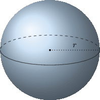

# Interpreting the Meaning of the Derivative in Context

Source: https://www.mathacademy.com/topics/296?courseId=105
Topic ID: 296

## Prerequisites

- [Defining the Derivative Using Derivative Notation](./812-defining-the-derivative-using-derivative-notation.md)

## Lesson

### Introduction

Derivatives naturally occur in many real-world situations, so it's essential to know their units of measurement. The key is to remember that the derivative represents a rate of change.

For instance, suppose that the temperature of a pizza $t$ minutes after coming out of a hot oven is $T(t)$ degrees Fahrenheit. What are the units of $\dfrac{\text{d}T}{\text{d}t}?$

First, we have that the temperature $T(t)$ is measured in degrees Fahrenheit and the time $t$ is measured in minutes.

$$

\begin{aligned}𝑇(𝑡): & degrees Fahrenheit \\ 𝑡: & minutes\end{aligned}

$$

The derivative $\dfrac{\text{d}\color{black}T}{\text{d}\color{black}t}$ measures a change in ${\color{black}T}$ over a change in ${\color{black}t}.$ So, it represents a ratio of the units:

$$

\begin{aligned}\frac{d𝑇}{d𝑡}: & \frac{degrees Fahrenheit}{minutes}\end{aligned}

$$

Therefore, $\dfrac{\text{d}\color{black}T}{\text{d}\color{black}t}$ is measured in "degrees Fahrenheit per minute", or $^\circ \textrm F / \textrm {min}.$

### Example: Determining the Units of a Derivative

#### Question

A rocket is at a distance of $r(t)$ meters from the ground $t$ seconds after it is launched. What are the units of $\dfrac{\text{d}r}{\text{d}t}?$

#### Explanation

We have that the height $r(t)$ is measured in meters and the time is measured in seconds.

$$

\begin{aligned}𝑟(𝑡): & meters \\ 𝑡: & seconds\end{aligned}

$$

The derivative $\dfrac{\text{d}r}{\text{d}t}$ measures a change in $r(t)$ over a change in $t.$ So, it represents a ratio of the units:

$$

\begin{aligned}\frac{d𝑟}{d𝑡}: & \frac{meters}{seconds}\end{aligned}

$$

Therefore, $\dfrac{\text{d}r}{\text{d}t}$ is measured in "meters per second".

### Example: Interpreting the Derivative of a Function

#### Question

Consider a spherical balloon with radius $r.$ As the balloon loses air, its volume $V$ decreases. What is the best interpretation of $V'(r)?$

#### Explanation

The function $V(r)$ gives the volume of a sphere with radius $r.$ So

$$

V'(r) = \dfrac{\text{d}V}{\text{d}r} = \dfrac{\text{Change in }V}{\text{Change in }r}.

$$

Therefore, $V'(r)$ is the rate at which the volume changes as the radius changes.

### Example: Interpreting the Derivative of a Function in a Given Context

#### Question

The function $B(s)$ models a school's budget, in dollars, given the average number of students $s$ in each grade. What is the best interpretation of $B'(30)=2\,000?$

#### Explanation

The function $B'(s)$ represents the rate at which the budget is changing at the moment when the school has an average of exactly $s$ students in each grade.

Therefore, $B'(30) = 2\,000$ means:

**

### Example: Determining a Rate of Change

#### Question

On a particular day, the rate $E$ at which tourists enter a small country can be modeled as $E(t) = 50\cdot 3^{0.2t}$ tourists per hour, where $t$ is the time, in hours, after midnight. The rate at which tourists leave the country can be modeled as $L(t)=100\cdot 2^{0.2t}$ tourists per hour, where $t$ is also the time in hours after midnight.

What is the rate of change in the number of tourists in the country at $10\text{:}00\,\text{am}?$

#### Explanation

The rate of change of the number of tourists in the country at time $t$ is equal to the entry rate minus the exit rate at time $t,$ that is,

$$

E(t)-L(t).

$$

Since $10\text{:}00\,\text{am}$ is ten hours after midnight, we have $t=10.$ Substituting $t=10,$ the rate of change in the number of tourists in the country at $10\text{:}00\,\text{am}$ is

$$

\begin{aligned}𝐸(10)−𝐿(10) & =50⋅3^{0.2(10)}−100⋅2^{0.2(10)} \\ & =450−400 \\ & =50.\end{aligned}

$$

Therefore, the rate of change in the number of tourists in the country at $10\text{:}00\,\text{am}$ is $50$ tourists per hour.

### Example: Relating a Derivative to a Rate of Change

#### Question

Howard, the manager of a sci-fi convention, uses the following three functions to model the daily number of visitors to the convention, $t$ minutes after the convention has opened.

- $N(t)$ - the number of people inside the convention

- $E(t)$ - the rate at which people enter the convention

- $L(t)$ - the rate at which people leave the convention

What is the relationship between the three functions above?

#### Explanation

The function $N(t)$ gives the number of people inside the convention $t$ minutes after opening. Then,

$$

N'(t) = \dfrac{\text{d}N(t)}{\text{d}t} = \dfrac{\text{Change in }N}{\text{Change in }t}.

$$

Thus, $N'(t)$ gives the rate at which the number of people inside the convention changes $t$ minutes after opening.

In addition, we can compute the rate of change of the number of people inside the convention at time $t$ by finding the difference between the entry and exit rates at time $t.$ That is,

$$

N'(t) = E(t) - L(t).

$$
