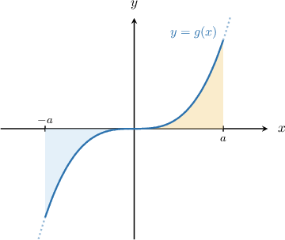
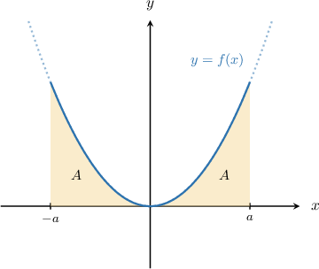
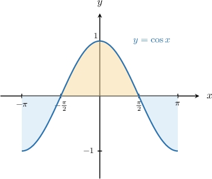
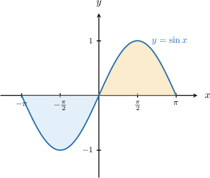
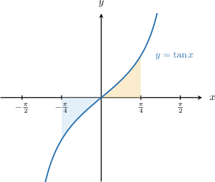
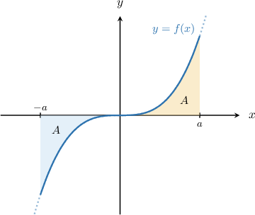

# Evaluating Definite Integrals Using Symmetry

Source: https://www.mathacademy.com/topics/2975?courseId=105
Topic ID: 2975

## Prerequisites

- [Properties of Definite Integrals Involving the Limits of Integration](./632-properties-of-definite-integrals-involving-the-limits-of-integration.md)
- [The Area Bounded by a Curve and the X-Axis](./1040-the-area-bounded-by-a-curve-and-the-x-axis.md)

## Lesson

### Introduction

Recall that $f(x)$ is an **even function** if

$$

f(-x) = f(x).

$$

The graph of an even function is always symmetric about the $y$-axis.

Also recall that $g(x)$ is an **odd function** if

$$

g(-x) = -g(x).

$$

The graph of an odd function always has rotational symmetry of order $2$ about the origin. In other words, if we rotate the graph $180^\circ$ about the origin, the resulting graph looks the same.

### Integrals of Even Functions

Let's consider our even function $f(x)$ once more.

When we have a definite integral of an even function, we can often use symmetry to simplify it.

From the picture above, we have that

$$

\int_{-a}^0 f(x) \, \textrm dx = \int_{0}^a f(x) \, \textrm dx = A.

$$

Therefore,

$$

\begin{aligned}∫_{𝑎−𝑎}𝑓(𝑥)\,d𝑥 & =𝐴+𝐴 \\ & =2𝐴 \\ & =2∫_{𝑎0}𝑓(𝑥)\,d𝑥.\end{aligned}

$$

To summarize, if $f(x)$ is even, then

$$

\int_{-a}^a f(x) \, \textrm dx = 2\int_{0}^a f(x) \, \textrm dx .

$$

This rule is helpful because definite integrals where one of the integration limits is zero are often easier to evaluate.

### Trigonometric Functions

Throughout this lesson, it's worth remembering that the basic trigonometric functions can be classified as even or odd.

- $\cos x$ is an even function: This function is symmetric about the $y$-axis.

- $\sin x$ is an odd function: This function has rotational symmetry of order $2$ about the origin.

- $\tan x$ is an odd function: This function has rotational symmetry of order $2$ about the origin.

### Example: Simplifying Definite Integrals of Even Functions

#### Question

Simplify the integral $\displaystyle \int_{-2}^2 x \sin{x} \, \textrm dx$ using symmetry.

#### Explanation

Recall the following:

- a function $f(x)$ is ** if $f(-x) = f(x)$

- a function $f(x)$ is ** if $f(-x) = -f(x)$

Moreover, for any even function $f(x),$ the graph of $y=f(x)$ is symmetric across the $y$-axis, so we have

$$

\int_{-a}^a f(x) \, \textrm dx = 2\int_{0}^a f(x) \, \textrm dx .

$$

Notice that $f(x) = x \sin{x}$ is an even function. Indeed, we have

$$

\begin{aligned}𝑓(−𝑥) & =(−𝑥)sin⁡(−𝑥) \\ & =−𝑥(−sin⁡𝑥) \\ & =𝑥sin⁡𝑥 \\ & =𝑓(𝑥).\end{aligned}

$$

So, because $f(x) = x \sin{x}$ is an even function, we have

$$

\int_{-2}^2 x \sin{x} \, \textrm dx = 2 \int_{0}^2 x \sin{x} \, \textrm dx.

$$

### Integrals of Odd Functions

Let's consider the odd function $f(x)$ shown below.

From the diagram, we see that

$$

\int_{-a}^a f(x) \, \textrm dx = 0

$$

because the positive and negative areas cancel each other out.

Furthermore, by the adjacent intervals rule, we can write

$$

\int_{-a}^0 f(x) \, \textrm dx + \int_{0}^a f(x) \, \textrm dx = 0,

$$

which means that

$$

\int_{-a}^0 f(x) \, \textrm dx = - \int_{0}^a f(x) \, \textrm dx.

$$

### Example: Identifying Integrals That Evaluate to Zero

#### Question

Which of the following integrals evaluate to zero due to symmetry?

1. $\displaystyle \int_{-3}^3 4x^3 \, \textrm dx$

2. $\displaystyle \int_{-2}^2 (e^x+e^{-x}) \, \textrm dx$

3. $\displaystyle \int_{-\pi}^{2\pi} \sin(2x) \, \textrm dx$

#### Explanation

Recall the following:

- a function $f(x)$ is ** if $f(-x) = f(x)$

- a function $f(x)$ is ** if $f(-x) = -f(x)$

Moreover, for any odd function $f(x),$ the graph of $y=f(x)$ has rotational symmetry of order $2$ about the origin, so we have

$$

\int_{-a}^a f(x) \, \textrm dx = 0.

$$

So, to determine which integrals evaluate to $0$ due to symmetry, we have to determine which integrands are odd functions.

- The function $f(x) = 4x^3$ is an odd function: Therefore, by symmetry, we can conclude that

- The function $g(x) = e^x+e^{-x}$ is ** an odd function:

- The function $h(x) = \sin(2x)$ is an odd function, but integral III is not of the form $\displaystyle \int_{-a}^a h(x)\,\textrm d x$ since the upper and lower limits are not opposites. So, we cannot use symmetry to simplify the integral.

Therefore, the correct answer is "I only."

### Example: Simplifying Definite Integrals of Odd Functions

#### Question

Given that $\displaystyle \int_{0}^{1} x\cos x \, \textrm dx = A,$ what is the value of $\displaystyle \int_{-1}^0 x\cos x \, \textrm dx?$

#### Explanation

Recall the following:

- a function $f(x)$ is ** if $f(-x) = f(x)$

- a function $f(x)$ is ** if $f(-x) = -f(x)$

Moreover, for any odd function $f(x),$ the graph of $y=f(x)$ has rotational symmetry of order $2$ about the origin, so we have

$$

\int_{-a}^a f(x) \, \textrm dx = 0.

$$

Notice that $f(x) = x\cos x$ is an odd function. Indeed, we have

$$

\begin{aligned}𝑓(−𝑥) & =(−𝑥)cos⁡(−𝑥) \\ & =−𝑥cos⁡𝑥 \\ & =−(𝑥cos⁡𝑥) \\ & =−𝑓(𝑥).\end{aligned}

$$

So, because $f(x) = x\cos x$ is an odd function, we have

$$

\int_{-1}^{1} x\cos x \, \textrm dx = 0.

$$

Finally, using the adjacent intervals rule for integration, we obtain

$$

\begin{aligned}∫_{1−1}𝑥cos⁡𝑥\,d𝑥 & =0 \\ ∫_{0−1}𝑥cos⁡𝑥\,d𝑥+∫_{10}𝑥cos⁡𝑥\,d𝑥 & =0 \\ ∫_{0−1}𝑥cos⁡𝑥\,d𝑥+𝐴 & =0 \\ ∫_{0−1}𝑥cos⁡𝑥\,d𝑥 & =−𝐴.\end{aligned}

$$
